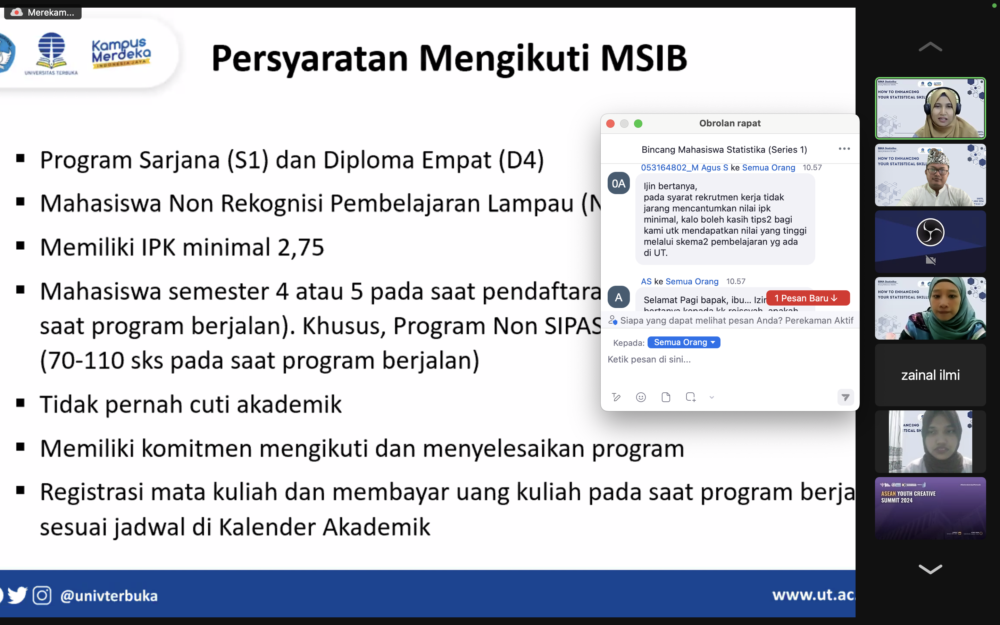
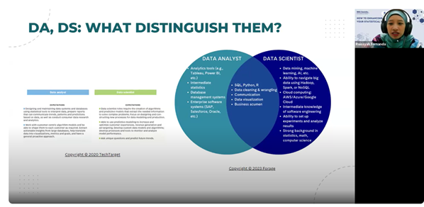
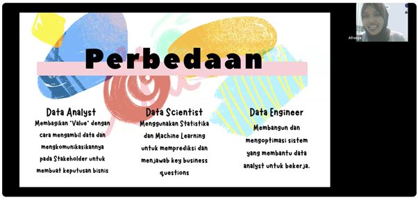
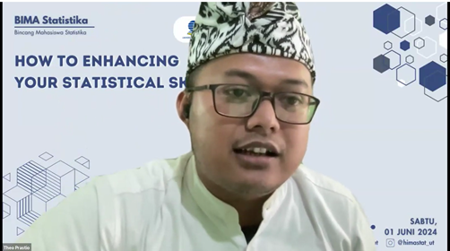
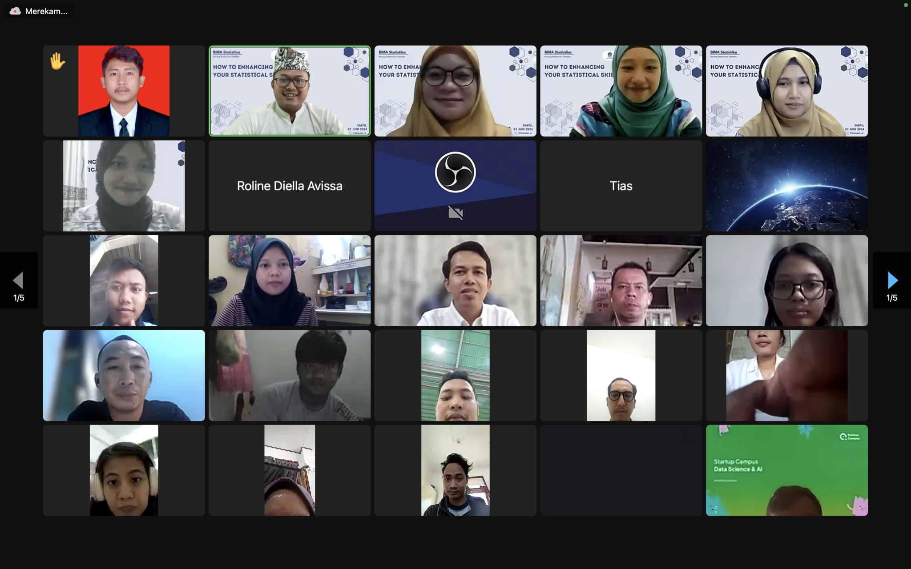

--- 
title: Series 1 - How to Enhancing Your Statistical Skills
date: 2024-06-05
icon: book
author:
  - name: "Firmansyah Mukti Wijaya"
    email: "ikimukti@gmail.com"
    url: "https://ikimukti.com"
  - name: "Himastatut Docs"
    email: "himastatut@gmail.com"
    url: "https://himastatut.my.id/article/"
category:
  - Archive
  - Bima
--- 

# Bincang Mahasiswa (BIMA) Statistika Series 1: How to Enhancing Your Statistical Skills

## Detil Pertemuan

- **Hari/Tanggal**: Sabtu, 1 Juni 2024
- **Waktu**: 09.00 - 11.00 WIB
- **Moderator**: Kak Theo Prastio, S.Stat (Alumni Statistika UT)
- **Pemateri**:
  - Ibu Dr. Dewi Juliah Ratnaningsih, S.Si., M.Si. (Wakil Dekan 3 FST UT)
  - Ibu Siti Hadijah Hasanah, S.Si., M.Si. (Kaprodi Statistika FST UT)
  - Roissyah Fernanda Khoiroh (Data Science Expert)
  - Al Afra Rasya Syakura (Alumni Statistika UT)

### Ringkasan Materi

Pada sesi perdana **Bincang Mahasiswa (BIMA) Statistika**, topik yang dibahas adalah **"How to Enhancing Your Statistical Skills"**. Kegiatan ini diselenggarakan dengan tujuan untuk membantu mahasiswa dalam meningkatkan keterampilan statistika mereka serta mempersiapkan mereka menghadapi dunia data science dan karir profesional. Berikut adalah ringkasan materi yang dibahas:

#### 1. **Pentingnya Keterampilan Statistika dalam Berbagai Bidang**
   - **Ibu Dr. Dewi Juliah Ratnaningsih** memberikan semangat kepada mahasiswa untuk terus berjuang dalam program studi Statistika dan pentingnya meningkatkan softskills dalam menggunakan berbagai alat statistik. Beliau menekankan bahwa statistika merupakan alat yang sangat penting yang digunakan dalam berbagai bidang, dari bisnis hingga ilmu kesehatan.
   - **Ibu Siti Hadijah Hasanah** menginformasikan berbagai program yang tersedia di Statistika UT, termasuk program Merdeka Belajar Kampus Merdeka (MBKM) yang dapat dimanfaatkan mahasiswa untuk memperluas peluang akademik dan karir mereka selama masa studi di UT.

   

#### 2. **Data Science dan Statistika**
   - **Roissyah Fernanda Khoiroh** menyampaikan materi berjudul **"Level Up Your Stats: Stepping into Data Science World"**. Dalam sesinya, Roissyah menguraikan bagaimana keterampilan statistika dapat menjadi fondasi yang kuat untuk berkarir di dunia data science. Ia juga memberikan tips praktis mengenai cara meningkatkan keterampilan statistika melalui penerapan dalam analisis data dan pemodelan statistik.
   
   

   

#### 3. **Masa Depan Statistika: Berkarir di Dunia Profesional**
   - **Al Afra Rasya Syakura** berbagi pengalamannya mengenai berbagai jalur karir yang dapat diambil oleh mahasiswa statistika. Ia juga memberikan panduan praktis mengenai bagaimana mempersiapkan diri untuk memasuki dunia profesional, termasuk keterampilan tambahan yang diperlukan di luar statistik dasar.
   
   

### Sesi Tanya Jawab

Pada sesi tanya jawab, para peserta menunjukkan antusiasme yang tinggi dengan mengajukan berbagai pertanyaan terkait materi yang telah dibahas. Beberapa pertanyaan mencakup cara meningkatkan keterampilan analisis data, aplikasi statistik dalam dunia industri, serta langkah-langkah yang perlu diambil untuk berkarir di data science.

**Berikut beberapa pertanyaan yang diajukan oleh peserta:**
- *"Apa saja keterampilan tambahan yang harus dikuasai selain statistik dasar untuk memulai karir di data science?"*
- *"Bagaimana cara terbaik untuk mempelajari pemrograman statistik di R dan Python?"*

Para narasumber menjawab dengan jelas dan memberikan solusi praktis. Mereka juga berbagi berbagai sumber daya dan kursus yang dapat diikuti untuk meningkatkan keterampilan lebih lanjut.

--- 

### Video Rekaman Kelas
Jika Anda ingin lebih memahami materi yang disampaikan, tonton rekaman **Bincang Mahasiswa (BIMA) Statistika Series 1** melalui video berikut ini:

<VidStack
  src="youtube/hapPJgTc24w&t=483s"
  title="Bincang Mahasiswa (BIMA) Statistika Series 1"
/>

--- 

### Kesimpulan
Kegiatan **Bincang Mahasiswa (BIMA) Statistika** dengan tema **"How to Enhancing Your Statistical Skills"** berjalan dengan sukses. Acara ini memberikan wawasan yang sangat berguna bagi mahasiswa dalam mengembangkan keterampilan statistika mereka. Selain itu, acara ini juga membuka banyak peluang bagi mahasiswa untuk mengeksplorasi jalur karir di dunia data science dan profesional. Partisipasi aktif dari peserta serta pemaparan yang mendalam dari para narasumber membuat acara ini sangat bermanfaat dan informatif.

**Panitia BIMA** mengucapkan terima kasih kepada seluruh peserta yang telah berpartisipasi aktif. Kami berharap kegiatan serupa dapat terus dilakukan di masa mendatang untuk terus meningkatkan kompetensi dan pengetahuan mahasiswa di bidang statistika.

### Sumber Informasi

Informasi terkait kegiatan **Bincang Mahasiswa (BIMA) Statistika** dapat ditemukan di situs resmi Himpunan Mahasiswa Statistika UT:

> "Kegiatan Bincang Mahasiswa (BIMA) Statistika ini berlangsung pada Sabtu, 1 Juni 2024, dengan topik **"How to Enhancing Your Statistical Skills"** dan diadakan secara daring melalui platform Zoom. Acara ini dibuka oleh Ibu Dr. Dewi Juliah Ratnaningsih, S.Si., M.Si., Wakil Dekan 3 FST UT."  
> (Sumber: [Statistika FST UT](https://statistika-fst.ut.ac.id/berita/bincang-mahasiswa-bima-statistika-series-1-how-to-enhance-your-statistical-skills/))

--- 

> "Tidak ada kata terlambat untuk belajar. Mari cerdas bersama HIMASTAT!"

#bima #statistika #data_science #himastatut

## Bagikan
<Share colorful />
<GitContributors />
<GitChangelog />