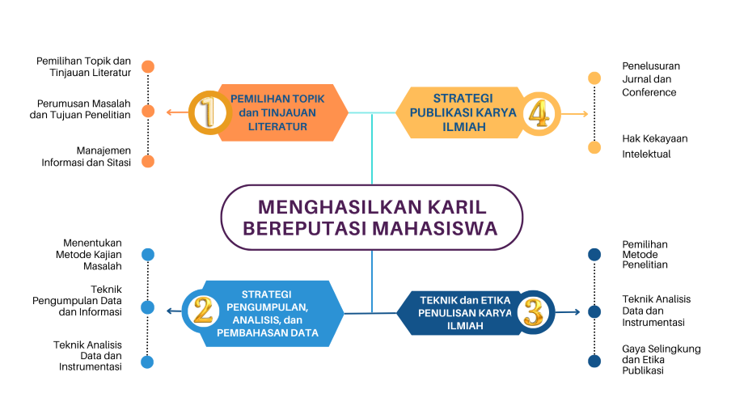

--- 
title: SATS4560 – Karya Ilmiah
icon: fa-solid:book
order: 7
category:
  - Course
  - Semester 7
tag:
  - Karya Ilmiah
  - SATS4560
author:
  - name: "Firmansyah Mukti Wijaya"
    email: "ikimukti@gmail.com"
    url: "https://ikimukti.com"
  - name: "Himastatut Docs"
    email: "himastatut@gmail.com"
    url: "https://himastatut.my.id/article/"
date: 2023-01-01
--- 

## Karya Ilmiah (SATS4560)

**Karya Ilmiah**  
Edisi 1 / 3 SKS  
Tangerang Selatan: Universitas Terbuka, 2023  
Kelas DDC: 378.243

--- 

### Tujuan Pembelajaran

Mata kuliah **Karya Ilmiah (KARIL)** bertujuan untuk membantu mahasiswa dalam menyusun dan mempublikasikan artikel ilmiah yang sesuai dengan ketentuan-ketentuan tertentu terkait isi, bahasa, penalaran, sistematika, format, dan konvensi lainnya. Pembelajaran ini merupakan bagian penting dari kelulusan mahasiswa di akhir program studi. Proses pembelajaran mencakup kegiatan belajar mandiri, tugas-tugas, dan bimbingan oleh tutor atau pembimbing berkompeten.

Karya ilmiah yang dimaksud adalah artikel ilmiah yang disusun dengan memperhatikan berbagai ketentuan khusus yang berkaitan dengan: **isi**, **bahasa**, **penalaran**, **sistematika dan format**, serta **konvensi lainnya**. Mahasiswa diwajibkan untuk mengikuti proses pembelajaran yang dilakukan melalui kegiatan belajar mandiri, pengerjaan tugas-tugas, dan bimbingan oleh para tutor atau pembimbing yang berkompeten.

### Kompetensi

Melalui **Panduan Mata Kuliah Karya Ilmiah Universitas Terbuka**, mahasiswa akan mendapatkan pemahaman mengenai:

1. **Konsep, fokus, mekanisme, dan ketentuan** terkait dengan mata kuliah karya ilmiah yang harus dikuasai mahasiswa.
2. **Rangkaian kegiatan belajar** yang harus dilakukan mahasiswa, seperti belajar mandiri, pengerjaan tugas, dan luaran yang dihasilkan mahasiswa.
3. **Penyelenggaraan dan pengelolaan pembelajaran mata kuliah Karil**.

--- 

### Alur Kerja Kegiatan Bimbingan Karil

Proses penulisan **Karya Ilmiah** dilakukan melalui sesi pembimbingan online dan webinar. Mahasiswa diwajibkan untuk melakukan registrasi pada laman [elearning.ut.ac.id](https://elearning.ut.ac.id) untuk memperoleh layanan bimbingan.

Setiap kelas pembimbingan KARIL akan memiliki maksimal **15 mahasiswa** dengan 1 orang pembimbing. Mahasiswa yang sudah melakukan registrasi mata kuliah KARIL, harus melakukan konsultasi Topik artikel KARIL dengan pembimbing melalui laman tersebut.

Artikel ilmiah yang ditulis bisa bersumber dari kajian pustaka atau hasil penelitian. Bagi mahasiswa FKIP, artikel ilmiah dapat bersumber dari kajian pustaka atau laporan penelitian mata kuliah Pemantapan Kemampuan Profesional (PKP).

--- 

### Pedoman Penulisan Karya Ilmiah

Penulisan **Karya Ilmiah** harus mengikuti pedoman yang telah ditentukan oleh Universitas Terbuka. Panduan ini mencakup ketentuan penulisan yang berlaku, termasuk format, sistematika, dan standar-standar lain yang harus dipatuhi. Karya ilmiah yang dihasilkan juga harus menghindari plagiat dan harus merupakan karya asli yang belum pernah dipublikasikan di media lain. Setiap artikel yang dihasilkan akan menjalani pengecekan plagiasi, dan tingkat kemiripannya tidak boleh lebih dari 30%, namun sangat disarankan agar tidak melebihi 25%.

--- 

### Syarat Lulus

Untuk lulus mata kuliah **Karya Ilmiah** (KARIL), mahasiswa harus memenuhi syarat berikut:

- **Artikel ilmiah** yang ditulis harus merupakan karya asli, bukan plagiat, dengan kemiripan tidak lebih dari **30%** (disarankan tidak melebihi **25%**).
- **Skor kelulusan minimal 75** dari artikel ilmiah yang dihasilkan oleh mahasiswa.
- Artikel yang dikumpulkan harus memenuhi kaidah-kaidah yang ada dalam pedoman penulisan karya ilmiah Universitas Terbuka.
- **Tugas 3 dan 4** yang akan dinilai, sedangkan **Tugas 1 dan 2** tidak dinilai.

### Alur Bimbingan

1. Mahasiswa melakukan registrasi mata kuliah KARIL dan melakukan konsultasi dengan pembimbing tentang topik artikel melalui [elearning.ut.ac.id](https://elearning.ut.ac.id).
2. Selama proses bimbingan, mahasiswa akan mengikuti **8 sesi pembimbingan**.
3. Artikel ilmiah yang telah selesai disusun akan diunggah dalam format PDF sesuai dengan jadwal yang telah ditentukan. Artikel tidak dapat diunggah di luar jadwal yang telah ditetapkan.

--- 

### Link Tambahan

- [Halaman Resmi Universitas Terbuka](https://www.ut.ac.id)
- [Elearning UT](https://elearning.ut.ac.id)

--- 

## Diskusi dan Tanya Jawab

Jika Anda memiliki pertanyaan mengenai materi atau ingin berdiskusi lebih lanjut mengenai **Karya Ilmiah (SATS4560)**, silakan gunakan fitur komentar di bawah atau hubungi pembimbing melalui UT-Online.

--- 

<footer>
  
© 2023 Universitas Terbuka

</footer>

## Bagikan
<Share colorful />
<GitContributors />
<GitChangelog />