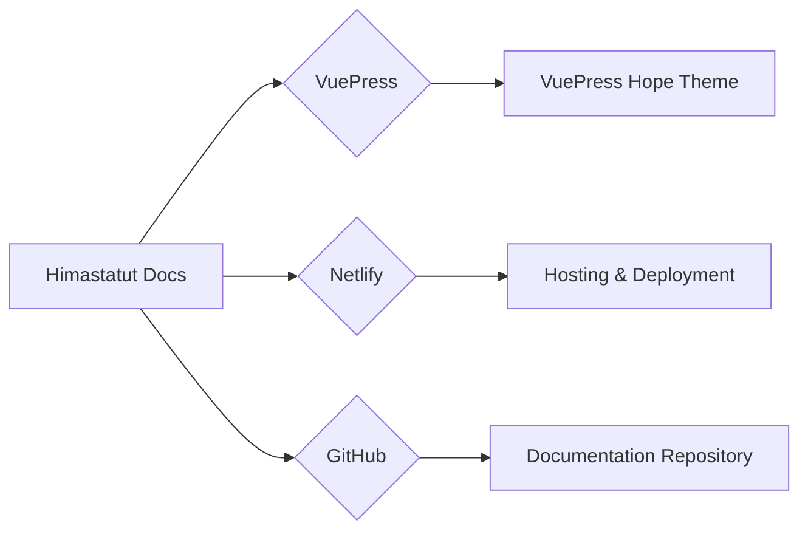

--- 
title: Himastatut Docs - Dokumentasi Kegiatan HIMASTAT
index: true
icon: book
category:
  - Documentation
author:
  - name: "Firmansyah Mukti Wijaya"
    email: "ikimukti@gmail.com"
    url: "https://ikimukti.com"
  - name: "Himastatut Docs"
    email: "himastatut@gmail.com"
    url: "https://himastatut.my.id/article/"
--- 

# Himastatut Docs

Selamat datang di **Himastatut Docs**, platform dokumentasi resmi dari **Himpunan Mahasiswa Statistika Universitas Terbuka (HIMASTAT)**. Inisiasi ini bertujuan untuk mendokumentasikan seluruh kegiatan yang telah atau sedang dilakukan oleh HIMASTAT, termasuk program kerja yang sedang berlangsung, tantangan yang dihadapi, serta rencana kegiatan di masa depan. Semua informasi ini akan terdokumentasi dengan baik untuk keperluan referensi bagi dosen, alumni, mahasiswa aktif, dan siapa saja yang tertarik dengan kegiatan HIMASTAT dan Program Studi Statistika Universitas Terbuka.

## Gambaran Umum

**Himastatut Docs** adalah sebuah situs dokumentasi yang menyimpan informasi penting mengenai setiap kegiatan HIMASTAT sejak tahun ajaran 2024/2025. Platform ini dibangun menggunakan **VuePress**, sebuah generator situs statis berbasis Markdown yang memudahkan pembuatan dan pengelolaan dokumentasi. Dengan menggunakan VuePress dan **theme VuePress Hope**, dokumentasi ini diharapkan dapat memberikan kemudahan akses dan keterbacaan yang lebih baik bagi seluruh anggota HIMASTAT, mahasiswa aktif Prodi Statistika Universitas Terbuka, serta masyarakat umum.

Platform ini dihosting di **https://himastatut.my.id/** dan menyediakan dokumentasi lengkap yang dapat diakses oleh siapa saja, termasuk dosen, mahasiswa, alumni, dan masyarakat umum. Ke depannya, HIMASTAT berharap untuk memperoleh domain dari Universitas Terbuka seperti **https://statistika-fst.ut.ac.id/**, dengan harapan menjadi **https://himastatut.statistika-fst.ut.ac.id/**.

## Tujuan Himastatut Docs

Tujuan utama dari Himastatut Docs adalah untuk menyediakan platform dokumentasi yang komprehensif dan mudah diakses yang berisi berbagai informasi terkait kegiatan HIMASTAT. Hal ini akan memberikan manfaat sebagai berikut:

- **Pendokumentasian Kegiatan**: Menyimpan catatan semua kegiatan HIMASTAT yang telah, sedang, dan akan dilakukan.
- **Akses Informasi yang Transparan**: Memberikan akses mudah kepada dosen, alumni, mahasiswa aktif, dan masyarakat umum tentang rencana program kerja dan hasil kegiatan sebelumnya.
- **Meningkatkan Kolaborasi**: Dengan memiliki dokumentasi yang terpusat, HIMASTAT dapat berkolaborasi dengan lebih baik dalam perencanaan dan pelaksanaan kegiatan.
- **Keterlibatan Mahasiswa dan Masyarakat**: Memperkenalkan program kerja HIMASTAT dan aktivitas lainnya kepada mahasiswa dan masyarakat, serta memberikan wawasan tentang cara mereka dapat terlibat dan berpartisipasi.

## Platform yang Digunakan

### VuePress
**VuePress** adalah generator situs statis yang dibangun dengan **Vue.js** dan **Markdown**. Dengan menggunakan **VuePress Hope**, tema default yang disediakan oleh VuePress, Himastatut Docs dapat menampilkan dokumentasi dengan tampilan yang bersih, mudah dinavigasi, dan menarik. VuePress juga memungkinkan pengguna untuk menulis dokumentasi dalam format Markdown, yang merupakan cara yang efisien dan mudah digunakan untuk menyusun konten situs ini.

#### Fitur Utama VuePress:
- **Markdown-centered**: Menulis konten dalam format Markdown yang mudah dibaca dan dipelajari.
- **Plugin-rich**: Dilengkapi dengan plugin-plugin yang memungkinkan penyesuaian fitur, seperti SEO, peta situs, dan pengaturan visual.
- **Fast**: Dengan menggunakan rendering Vue.js, situs ini bisa dimuat dengan sangat cepat.

### Netlify
**Netlify** adalah platform hosting yang digunakan untuk mendistribusikan situs web secara statis. Netlify menyederhanakan proses pembuatan dan pengelolaan situs web dengan infrastruktur yang mudah diakses dan terintegrasi. Melalui Netlify, Himastatut Docs dapat di-host secara efisien dengan kecepatan tinggi dan tanpa kesulitan manajemen server.

#### Manfaat Netlify:
- **Hosting Gratis**: Menyediakan hosting gratis untuk proyek kecil dan dokumentasi.
- **Pengelolaan Mudah**: Proses integrasi yang mudah untuk update otomatis dari GitHub.
- **Continuous Deployment**: Setiap kali ada pembaruan di repositori GitHub, Netlify otomatis membangun dan memperbarui situs.

## Repositori GitHub
Himastatut Docs disimpan dan dikelola di **GitHub** dengan repositori yang dapat diakses oleh siapa saja. Repositori ini bertujuan untuk mengelola seluruh dokumentasi yang diperlukan dalam pengelolaan kegiatan HIMASTAT.

- **Repositori GitHub**: [https://github.com/himastat-ut/himastatut_docs](https://github.com/himastat-ut/himastatut_docs)

## Dimulai dengan Himastatut Docs

Himastatut Docs dimulai pada tahun ajaran 2024/2025 sebagai inisiatif oleh **Divisi IT HIMASTAT Universitas Terbuka**. Platform ini akan berkembang seiring dengan berjalannya waktu, mencakup lebih banyak kegiatan dan program kerja HIMASTAT, serta berfungsi sebagai referensi bagi dosen, alumni, mahasiswa aktif, dan masyarakat umum untuk melacak dan mendokumentasikan seluruh kegiatan.

## Struktur Dokumentasi

Himastatut Docs terdiri dari berbagai bagian yang membahas berbagai kegiatan, program kerja, dan pencapaian HIMASTAT. Beberapa topik yang dapat ditemukan di dalamnya adalah:
- **Program Kerja HIMASTAT**: Penjelasan mengenai program kerja yang dijalankan oleh HIMASTAT setiap tahunnya.
- **Kegiatan Akademik**: Dokumentasi mengenai seminar, lomba, dan kegiatan akademik lainnya yang diselenggarakan oleh HIMASTAT.
- **Evaluasi dan Umpan Balik**: Penilaian terhadap kegiatan yang telah dilakukan serta masukan dan kritik untuk kegiatan yang akan datang.

## Mengakses Himastatut Docs

Untuk mengakses Himastatut Docs, Anda dapat mengunjungi situs yang di-host di **Netlify** di **https://himastatut.my.id/** atau mengakses repositori GitHub. Setiap perubahan atau pembaruan di repositori GitHub akan otomatis diperbarui pada situs yang dihosting di Netlify, memastikan dokumentasi tetap up-to-date dan dapat diakses kapan saja.

--- 

Mari bersama-sama kita dokumentasikan setiap langkah perjalanan HIMASTAT untuk masa depan yang lebih terorganisir dan transparan.

::: tip
Himastatut Docs adalah platform yang terbuka untuk semua orang, termasuk dosen, alumni, mahasiswa aktif, dan siapa saja yang tertarik dengan kegiatan HIMASTAT dan Prodi Statistika Universitas Terbuka.
:::

