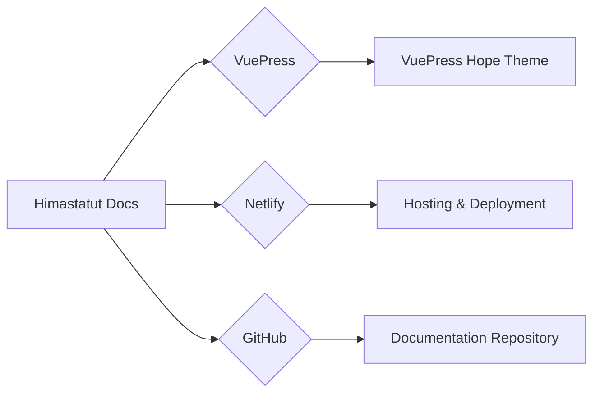

@slidestart

## Himastatut Docs

Selamat datang di **Himastatut Docs**, platform dokumentasi resmi dari **Himpunan Mahasiswa Statistika Universitas Terbuka (HIMASTAT)**. Kami mendokumentasikan seluruh kegiatan HIMASTAT termasuk program kerja, tantangan, dan rencana kegiatan di masa depan.

---

## Gambaran Umum

**Himastatut Docs** adalah situs dokumentasi yang menyimpan informasi tentang kegiatan HIMASTAT. Dibangun menggunakan **VuePress** dan **theme VuePress Hope**, dokumentasi ini mudah diakses dan dioperasikan.

- **Platform Hosting**: [https://himastatut.my.id/](https://himastatut.my.id/)

---

## Tujuan Himastatut Docs

Tujuan utama adalah untuk menyediakan platform dokumentasi yang transparan, terorganisir, dan mudah diakses oleh seluruh anggota HIMASTAT, mahasiswa, dosen, alumni, dan masyarakat umum.

- **Pendokumentasian Kegiatan**
- **Akses Informasi yang Transparan**
- **Meningkatkan Kolaborasi**
- **Keterlibatan Mahasiswa dan Masyarakat**

---

## Platform yang Digunakan

### VuePress

**VuePress** adalah generator situs statis berbasis **Vue.js** dan **Markdown** yang digunakan untuk menulis dokumentasi.

#### Fitur Utama VuePress:
- Markdown-centered
- Plugin-rich
- Fast and efficient

---

### Netlify

**Netlify** adalah platform hosting untuk situs web statis yang memungkinkan pengelolaan dan update otomatis.

#### Manfaat Netlify:
- **Hosting Gratis**
- **Pengelolaan Mudah**
- **Continuous Deployment**

---

## Repositori GitHub

Himastatut Docs disimpan di **GitHub** yang memungkinkan pengelolaan dokumentasi secara kolaboratif dan transparan.

- **Repositori GitHub**: [https://github.com/himastat-ut/himastatut_docs](https://github.com/himastat-ut/himastatut_docs)

---

## Mengakses Himastatut Docs

Untuk mengakses Himastatut Docs, kunjungi situs [Netlify](https://himastatut.my.id/) atau GitHub.

---

## Struktur Dokumentasi

Berisi informasi mengenai kegiatan, program kerja, dan pencapaian HIMASTAT, termasuk:
- Program Kerja HIMASTAT
- Kegiatan Akademik
- Evaluasi dan Umpan Balik

---

## Diagram Sistem

---

## Conclusion

Himastatut Docs adalah platform yang terbuka untuk semua pihak yang tertarik dengan kegiatan HIMASTAT dan Prodi Statistika Universitas Terbuka.

::: tip 
Himastatut Docs memberikan kemudahan dalam mendokumentasikan dan mengakses seluruh kegiatan HIMASTAT. 
:::

@slideend
