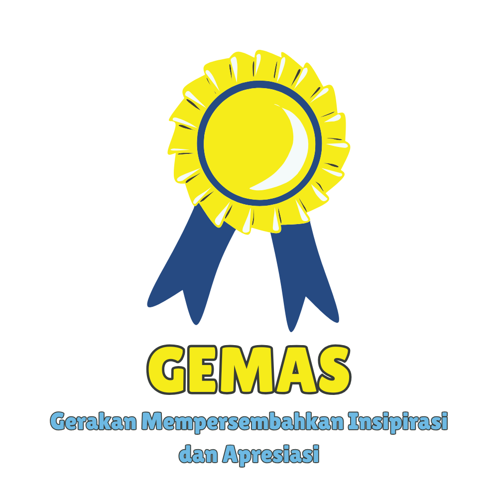
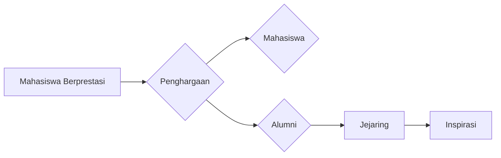

--- 
title: GEMAS (Gerakan Mempersembahkan Inspirasi dan Apresiasi)
index: true
icon: trophy
image: "./gemas.png"
description: "GEMAS adalah program penghargaan untuk mahasiswa dan alumni yang berprestasi di Universitas Terbuka."
category:
  - GEMAS
date: 2025-03-16
author:
  - name: "Firmansyah Mukti Wijaya"
    email: "ikimukti@gmail.com"
    url: "https://ikimukti.com"
  - name: "Himastatut Docs"
    email: "himastatut@gmail.com"
    url: "https://himastatut.my.id/article/"
--- 

# GEMAS - Gerakan Mempersembahkan Inspirasi dan Apresiasi

Selamat datang di program **GEMAS**! Program ini bertujuan untuk memberikan penghargaan dan apresiasi kepada mahasiswa yang telah meraih prestasi luar biasa, serta alumni yang telah berhasil menyelesaikan studi mereka. Di bawah ini, Anda akan menemukan rincian dan struktur program ini.

## Gambaran Umum Program

**GEMAS** (Gerakan Mempersembahkan Inspirasi dan Apresiasi) adalah program yang mengakui prestasi luar biasa mahasiswa dan alumni. Program ini bertujuan untuk memperkuat ikatan antara organisasi mahasiswa Statistika (HIMASTAT), mahasiswa aktif, dan alumni. Inisiatif ini tidak hanya merayakan pencapaian akademik dan ekstrakurikuler, tetapi juga menginspirasi orang lain untuk berusaha mencapai keunggulan.

## Tujuan
- Memberikan pengakuan dan penghargaan kepada mahasiswa yang berprestasi dalam bidang akademik atau kegiatan ekstrakurikuler.
- Merayakan alumni yang telah menyelesaikan studi dan memberikan kontribusi bagi bidang mereka.
- Membangun rasa kebersamaan antara mahasiswa aktif, alumni, dan organisasi HIMASTAT.

## Rincian Program
- **Sasaran**: Mahasiswa dan alumni program Statistika di Universitas Terbuka.
- **Penghargaan**: Penghargaan untuk prestasi akademik, kontribusi pada masyarakat, dan peran kepemimpinan.
- **Acara**: Diselenggarakan sebagai acara tahunan untuk memamerkan pencapaian mahasiswa dan alumni.

### Fitur Program
- **Inspirasi**: Mengakui prestasi untuk memotivasi mahasiswa lain agar berprestasi.
- **Apresiasi**: Menghargai kerja keras dan dedikasi mahasiswa serta alumni.
- **Jejaring**: Memperkuat hubungan antara mahasiswa aktif dan alumni melalui pengakuan bersama.

## Struktur Program
### 1. **Pencapaian Mahasiswa**
- Penghargaan untuk mahasiswa dengan prestasi akademik terbaik, kontribusi di masyarakat, serta inisiatif dalam kepemimpinan.
  
### 2. **Penghargaan untuk Alumni**
- Alumni yang telah memberikan kontribusi signifikan di dunia profesional dan komunitas akademik akan diakui.

### 3. **Sesi Networking dan Kolaborasi**
- Mahasiswa dan alumni akan diberi kesempatan untuk berjejaring dan berbagi pengalaman melalui sesi networking.
  
## Interaktif dan Visual
> **Infografis**: Program ini menggabungkan berbagai cara untuk menyebarluaskan pengaruh positif, dengan menggunakan **infografis** untuk menyajikan data tentang pencapaian mahasiswa dan alumni.

### Visualisasi Program

## Bagikan
<Share colorful />
<GitContributors />
<GitChangelog />