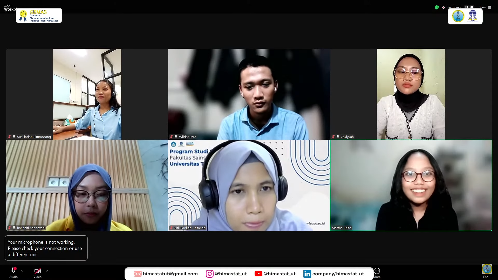
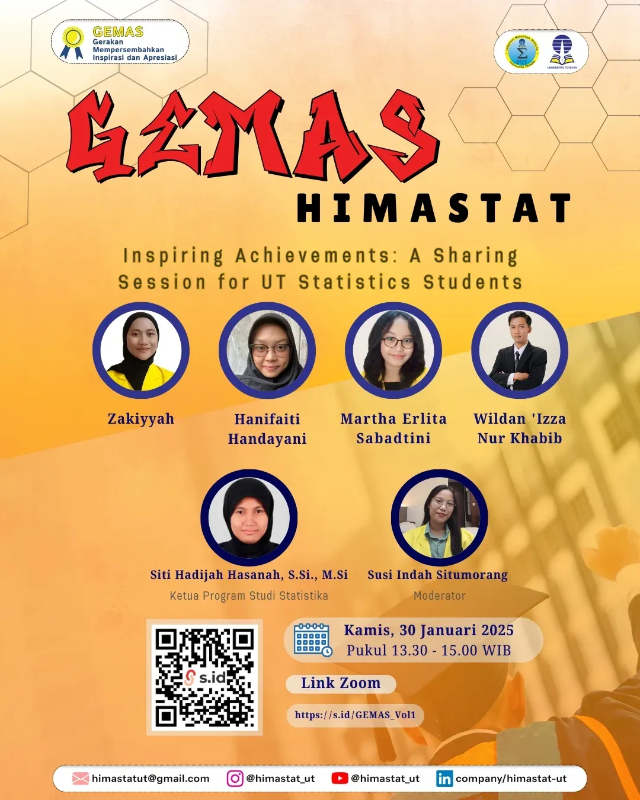

--- 
title: Inspiring Achievements - A Sharing Session for UT Statistics Students
date: 2025-01-30
author:
  - name: "Firmansyah Mukti Wijaya"
    email: "ikimukti@gmail.com"
    url: "https://ikimukti.com"
  - name: "Himastatut Docs"
    email: "himastatut@gmail.com"
    url: "https://himastatut.my.id/article/"
category: GEMAS
tags: 
 - sharing session
 - statgen
 - inspiring achievements
 - mahasiswa statistika
 - HIMASTAT
icon: chart-line
--- 

# Inspiring Achievements - A Sharing Session for UT Statistics Students

## Rekap Acara

Pada **30 Januari 2025**, HIMASTAT Universitas Terbuka menggelar acara **Inspiring Achievements** yang menjadi momen spesial bagi mahasiswa Statistika UT. Acara ini bertujuan untuk berbagi kisah-kisah sukses yang menginspirasi, serta memberikan wawasan berharga bagi mahasiswa tentang bagaimana mereka bisa mencapai tujuan mereka, baik di dunia akademik maupun di luar sana. Tema acara kali ini adalah "**Pencapaian yang Menginspirasi: Sesi Berbagi Untuk Mahasiswa Statistika UT**". 

Acara ini menjadi platform untuk mendengarkan pengalaman luar biasa dari narasumber yang berkompeten dan berpengalaman di bidangnya. Tidak hanya berbicara tentang kesuksesan, namun juga tantangan yang mereka hadapi, serta bagaimana mereka mengatasi hambatan untuk mencapai tujuan mereka.

### Rundown Acara
- **13:30 - 13:35 WIB**: Pembukaan oleh Kaprodi Statistika Universitas Terbuka  
- **13:35 - 13:45 WIB**: Perkenalan moderator dan narasumber
- **13:45 - 13:55 WIB**: Presentasi oleh **Hanifaiti Handayani**: *Pesta Ilmu Panen Sertifikat Internasional dengan Qlict*  
- **14:00 - 14:15 WIB**: Presentasi oleh **Wildan I Nurabib**: *Membuat Keputusan Berdasarkan Data*  
- **14:15 - 14:30 WIB**: Presentasi oleh **Marta Erlita**: *ime Management dan Komunikasi Efektif*  
- **14:30 - 14:45 WIB**: Presentasi oleh **Zakiah**: *Mengatasi Rasa Takut dan Keraguan*  
- **14:45 - 15:00 WIB**: Sesi tanya jawab dan penutupan

### Highligh Pemateri dan Kisah Sukses

#### 1. **Hanifaiti Handayani - "Pesta Ilmu Panen Sertifikat Internasional dengan Qlict"**
   **Hanifaiti Handayani** berbagi tentang perjalanan luar biasa dalam meraih sertifikat internasional dari berbagai kursus online yang berguna untuk meningkatkan wawasan, keterampilan, dan kredibilitas di dunia profesional. Hanifaiti menyarankan mahasiswa untuk tidak hanya terpaku pada pendidikan formal, tetapi juga untuk memperkaya diri dengan mengikuti berbagai kursus yang dapat membuka peluang lebih luas, terutama dalam dunia kerja global.

   **Apa yang bisa diambil dari Hanifaiti?**
   - **Manfaatkan waktu luang untuk mengikuti kursus online**: Jangan biarkan waktu luang menjadi sia-sia. Manfaatkan platform online untuk memperdalam keterampilan dan memperoleh sertifikat internasional.
   - **Jangan takut untuk berinvestasi pada diri sendiri**: Meskipun ada biaya yang perlu dikeluarkan untuk beberapa kursus, nilai yang diperoleh lebih dari sekadar sertifikat—ia membuka banyak pintu peluang di dunia kerja.

#### 2. **Wildan I Nurabib - "Publikasi Jurnal Internasional di Tengah Kesibukan Pekerjaan"**
   **Wildan I Nurabib** menceritakan pengalamannya dalam mempublikasikan penelitiannya di jurnal internasional sambil bekerja penuh waktu. Wildan menekankan pentingnya konsistensi, manajemen waktu, dan ketekunan untuk mencapai tujuan besar meskipun dibatasi oleh waktu. Di tengah kesibukannya bekerja di sektor lain, Wildan tetap mampu membagi waktu dan fokus untuk menyelesaikan tugas akademik dan penelitian.

   **Apa yang bisa diambil dari Wildan?**
   - **Manajemen waktu adalah kunci**: Bekerja sambil kuliah bukan hal yang mudah. Prioritaskan tugas dan manfaatkan waktu luang dengan efektif.
   - **Jangan pernah ragu untuk mencoba publikasi internasional**: Memulai publikasi jurnal internasional memang tidak mudah, tetapi setiap langkah kecil dalam proses tersebut memberikan pembelajaran berharga.

#### 3. **Marta Erlita - "Menjadi Pengusaha dan Akademisi Sukses Sambil Kuliah"**
   **Marta Erlita** berbagi kisahnya tentang bagaimana ia memulai karier sebagai pengusaha sambil menempuh pendidikan di Universitas Terbuka. Dalam presentasinya, Marta menceritakan tantangan yang ia hadapi dalam mengatur waktu antara kuliah dan menjalankan bisnis. Namun, ia juga menekankan bahwa keduanya—bisnis dan pendidikan—saling melengkapi dan saling mendukung.

   **Apa yang bisa diambil dari Marta?**
   - **Jangan takut untuk berwirausaha**: Pendidikan dan bisnis tidak harus dipisahkan. Justru, keduanya dapat berjalan bersama untuk mendukung kesuksesan di masa depan.
   - **Kerja keras dan konsistensi membawa hasil**: Menjalani keduanya memang menantang, tetapi dengan konsistensi dan dedikasi, kita dapat meraih kesuksesan dalam dua bidang sekaligus.

#### 4. **Zakiah - "Menyatukan Passion dan Pendidikan dalam Karir"**
   **Zakiah** mengungkapkan bagaimana ia menggabungkan passion untuk statistika dengan dunia kerja sambil kuliah. Zakiah menekankan pentingnya memiliki **growth mindset** dalam menghadapi tantangan kuliah dan pekerjaan. Dengan terus belajar dan beradaptasi, kita bisa membuat keputusan yang lebih baik dalam memilih karir yang sesuai dengan keahlian dan minat kita.

   **Apa yang bisa diambil dari Zakiah?**
   - **Gabungkan passion dengan pendidikan**: Temukan cara untuk menggabungkan apa yang kita cintai dengan apa yang kita pelajari. Ini akan membuat kita lebih semangat dan tidak merasa terbebani.
   - **Terapkan growth mindset**: Jangan terjebak pada batasan kemampuan saat ini. Percayalah bahwa dengan usaha yang terus menerus, kemampuan kita bisa berkembang.

--- 
### Highlight Acara
Acara ini menekankan pentingnya keberanian untuk keluar dari zona nyaman dan mengejar peluang meski dihadapkan pada tantangan. Melalui cerita dari para narasumber, mahasiswa diberi pemahaman bahwa kesuksesan tidak hanya ditentukan oleh kecerdasan akademis, tetapi juga oleh kemampuan untuk beradaptasi, berkomunikasi dengan efektif, dan mengelola waktu dengan baik.

- **Komunikasi efektif**: Pengaruhnya terhadap pekerjaan tim dan presentasi.
- **Manajemen waktu**: Bagaimana memprioritaskan tugas untuk mencapai lebih banyak hasil dengan stres yang lebih sedikit.

--- 

> *"Bukan hanya tentang mempelajari materi kuliah, tetapi bagaimana kita bisa menggunakan ilmu tersebut dalam kehidupan sehari-hari untuk membuat keputusan yang lebih baik dan lebih efektif."*

--- 
# Galeri & Dokumentasi

--- 

## Kesimpulan
Acara **Inspiring Achievements** ini memberikan wawasan yang sangat berharga bagi mahasiswa Statistika UT untuk tidak hanya fokus pada pendidikan akademik, tetapi juga mencari pengalaman di luar kampus yang bisa meningkatkan kualitas diri, kemampuan, dan keterampilan mereka. Beberapa hal yang bisa diambil dari sesi ini adalah pentingnya:
- **Manajemen waktu yang efektif** untuk menyeimbangkan akademik dan kehidupan profesional.
- **Komunikasi efektif** untuk mencapai tujuan bersama dalam tim dan dalam kehidupan pribadi.
- **Mentalitas berkembang (growth mindset)** yang akan membantu kita mengatasi tantangan dan terus berkembang meskipun menghadapi kesulitan.

> *"Dengan dedikasi dan kemauan untuk terus belajar, kita semua bisa mencapai tujuan luar biasa."*

--- 

--- 

## Video Acara
Jangan lupa untuk menonton rekaman acara ini di **Youtube Himastat UT** dan dapatkan berbagai insight menarik dari para narasumber yang telah berbagi kisah inspiratif mereka. Klik video berikut untuk menonton sesi lengkap:

<VidStack
  src="youtube/1JPRbv8onF0"
  title="Inspiring Achievements - A Sharing Session for UT Statistics Students"
/>

### Ayo Bergabung
Jangan lupa untuk bergabung dengan channel **HIMASTAT Universitas Terbuka** untuk mendapatkan berbagai keuntungan dan akses eksklusif mengenai kegiatan seru lainnya. Klik di sini untuk bergabung: [HIMASTAT UT](https://www.youtube.com/channel/UC8OfoydcuT_DpT5z-hYQkmQ)

--- 

Mari bersama-sama menciptakan komunitas yang lebih inspiratif dan bermanfaat bagi sesama mahasiswa Statistika. Sampai jumpa di acara live streaming berikutnya!

#GEMAS #InspiringAchievements #HIMASTAT #StatistikaUT #StatGen #MahasiswaStatistika #SharingSession #PencapaianMenginspirasi #Statistik

## Bagikan
<Share colorful />
<GitContributors />
<GitChangelog />