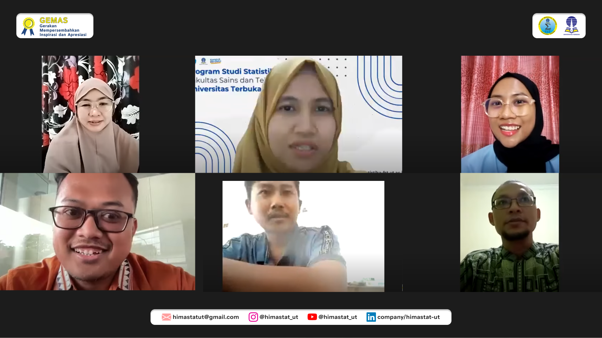
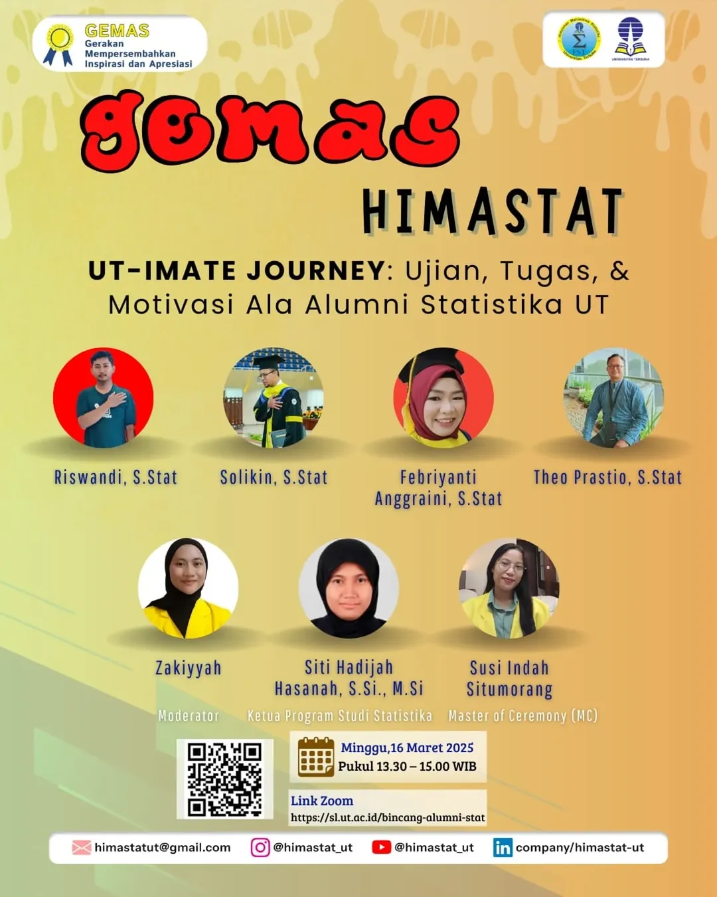

--- 
title: UT-IMATE JOURNEY - Ujian, Tugas, & Motivasi Ala Alumni Statistika UT
date: 2025-03-16
author:
  - name: "Firmansyah Mukti Wijaya"
    email: "ikimukti@gmail.com"
    url: "https://ikimukti.com"
  - name: "Himastatut Docs"
    email: "himastatut@gmail.com"
    url: "https://himastatut.my.id/article/"
category: GEMAS
tags:
 - sharing session
 - alumni
 - motivasi
 - mahasiswa statistika
icon: chart-line
--- 

# UT-IMATE JOURNEY: Ujian, Tugas, & Motivasi Ala Alumni Statistika UT

## Rekap Acara

Pada **16 Maret 2025**, HIMASTAT Universitas Terbuka menggelar acara **UT-IMATE JOURNEY** yang mengangkat tema **Ujian, Tugas, & Motivasi Ala Alumni Statistika UT**. Acara ini bertujuan untuk berbagi pengalaman dan memberikan motivasi dari alumni Program Studi Statistika dalam menghadapi ujian dan tugas selama perkuliahan di Universitas Terbuka. Tema acara kali ini adalah "**UT-IMATE JOURNEY: Ujian, Tugas, & Motivasi Ala Alumni Statistika UT**".

Acara ini dihadiri oleh alumni yang telah berhasil menyelesaikan studinya di Program Studi Statistika dan siap berbagi tips serta pengalaman untuk membantu mahasiswa UT dalam meraih keberhasilan akademik.

### Rundown Acara
- **13:30 - 13:35 WIB**: Pembukaan oleh Kaprodi Statistika Universitas Terbuka  
- **13:35 - 13:45 WIB**: Perkenalan moderator dan narasumber  
- **13:45 - 14:00 WIB**: Presentasi oleh **Solikin, S.Stat**  
- **14:00 - 14:15 WIB**: Presentasi oleh **Febriyanti Anggraini, S.Stat**  
- **14:15 - 14:30 WIB**: Presentasi oleh **Theo Prasetio, S.Stat**  
- **14:30 - 14:45 WIB**: Presentasi oleh **Riswandi, S.Stat**  
- **14:45 - 15:00 WIB**: Sesi tanya jawab dan penutupan

### Highligh Pemateri dan Kisah Sukses

#### 1. **Solikin, S.Stat - "Menghadapi Tantangan Kuliah dengan Semangat dan Dedikasi"**
   **Solikin** berbagi kisahnya tentang bagaimana ia mengatasi tantangan selama kuliah di UT, dari proses belajar hingga ujian yang penuh tantangan. Ia menekankan pentingnya memulai lebih awal dan melakukan persiapan dengan baik, termasuk menghadapi ujian dengan mental yang kuat.  
   **Apa yang bisa diambil dari Solikin?**
   - **Registrasi lebih awal**: Memulai persiapan lebih awal akan memberikan waktu yang cukup untuk belajar.
   - **Percaya pada kemampuan diri sendiri**: Jangan takut untuk menghadapi ujian atau tugas, yakinlah dengan usaha dan kerja keras kita.

#### 2. **Febriyanti Anggraini, S.Stat - "Menghadapi Tantangan Kuliah di Usia Dewasa"**
   **Febriyanti** berbagi tentang bagaimana ia menjalani kuliah di usia yang lebih dewasa sambil menghadapi berbagai tantangan, termasuk bekerja dan merawat anak kecil. Meskipun merasa kesulitan, Febriyanti menunjukkan bahwa semangat dan dedikasi pada hobi akan membawa hasil.  
   **Apa yang bisa diambil dari Febriyanti?**
   - **Hobi sebagai motivasi**: Jika kita mencintai apa yang kita pelajari, semua tantangan menjadi lebih mudah dihadapi.
   - **Jangan mudah menyerah**: Meski banyak rintangan, tetaplah berjalan menuju tujuan kita.

#### 3. **Theo Prasetio, S.Stat - "Menghadapi Ujian dan Tugas dengan Manajemen Waktu yang Baik"**
   **Theo** berbicara tentang pentingnya manajemen waktu yang baik dalam menghadapi ujian dan tugas yang banyak. Ia menekankan bahwa walaupun ada banyak tantangan, dengan pengelolaan waktu yang baik, semua bisa diselesaikan dengan optimal.  
   **Apa yang bisa diambil dari Theo?**
   - **Manajemen waktu**: Belajarlah untuk mengatur waktu dengan baik antara kuliah dan pekerjaan.
   - **Mencari referensi tambahan**: Gunakan berbagai sumber, seperti YouTube dan jurnal, untuk mendalami materi yang sulit.

#### 4. **Riswandi, S.Stat - "Menghadapi Rasa Bosan dan Jenuh dalam Perkuliahan"**
   **Riswandi** menyampaikan tentang pentingnya menjaga semangat meskipun perkuliahan terasa monoton. Ia mengingatkan mahasiswa untuk tetap fokus pada tujuan akhir dan jangan biarkan rasa bosan menghalangi perjalanan akademik mereka.  
   **Apa yang bisa diambil dari Riswandi?**
   - **Jaga semangat**: Meskipun perkuliahan terasa membosankan, teruslah fokus pada tujuan untuk lulus dengan gelar sarjana.
   - **Buat rencana yang taktis**: Tentukan strategi belajar yang sesuai dengan kebutuhan dan kondisi masing-masing.

--- 

### Highlight Acara
Acara ini menekankan pentingnya menjaga motivasi dan semangat dalam menjalani perkuliahan di Universitas Terbuka. Melalui cerita-cerita inspiratif dari para alumni, mahasiswa diberikan pemahaman bahwa untuk sukses, mereka harus mengelola waktu, mempercayai diri sendiri, dan tidak mudah menyerah meski dihadapkan dengan berbagai rintangan.

- **Manajemen waktu**: Kunci utama dalam menyelesaikan tugas dan ujian dengan baik.
- **Mental yang kuat**: Menghadapi ujian dan tugas dengan semangat serta keyakinan pada kemampuan diri.

--- 

> *"Kesuksesan tidak hanya ditentukan oleh nilai akademik, tetapi juga oleh ketekunan dan kemampuan kita untuk tetap berdiri tegak meskipun menghadapi tantangan."*

--- 

# Galeri & Dokumentasi

--- 

## Kesimpulan
Acara **UT-IMATE JOURNEY** ini memberikan banyak pelajaran berharga bagi mahasiswa Statistika UT untuk tidak hanya fokus pada ujian dan tugas, tetapi juga untuk mengelola waktu, menjaga semangat, dan terus belajar. Beberapa hal yang bisa diambil dari sesi ini adalah pentingnya:
- **Manajemen waktu yang efektif** dalam menyelesaikan tugas dan ujian.
- **Mental yang kuat** dalam menghadapi tantangan akademik.
- **Semangat untuk terus belajar** dan optimalkan diri meskipun menghadapi kesulitan.

> *"Dengan usaha yang maksimal, kita semua bisa meraih gelar sarjana dan mencapai tujuan kita."*

--- 

--- 

## Video Acara
Jangan lupa untuk menonton rekaman acara ini di **Youtube Himastat UT** dan dapatkan berbagai insight menarik dari para narasumber yang telah berbagi kisah inspiratif mereka. Klik video berikut untuk menonton sesi lengkap:

<VidStack
  src="https://www.youtube.com/watch?v=P37Sc32DfzI"
  title="UT-IMATE JOURNEY: Ujian, Tugas, & Motivasi Ala Alumni Statistika UT"
/>

--- 

### Ayo Bergabung
Jangan lupa untuk bergabung dengan channel **HIMASTAT Universitas Terbuka** untuk mendapatkan berbagai keuntungan dan akses eksklusif mengenai kegiatan seru lainnya. Klik di sini untuk bergabung: [HIMASTAT UT](https://www.youtube.com/channel/UC8OfoydcuT_DpT5z-hYQkmQ)

--- 

Mari bersama-sama menciptakan komunitas yang lebih inspiratif dan bermanfaat bagi sesama mahasiswa Statistika. Sampai jumpa di acara live streaming berikutnya!

#GEMAS #UTIMATEJOURNEY #HIMASTAT #StatistikaUT #StatGen #MahasiswaStatistika #SharingSession #MotivasiAlumni #Statistik

## Bagikan
<Share colorful />
<GitContributors />
<GitChangelog />