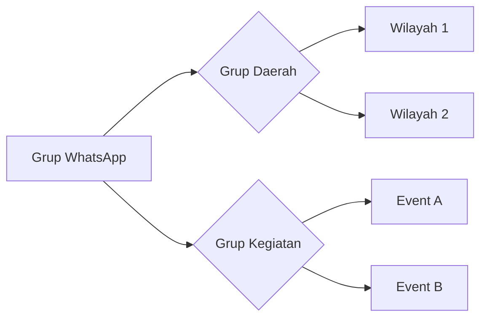

--- 
title: HANGAT (Hubungan Aktif dan Komunikasi Terpadu)
index: true
icon: comments
category:
  - HANGAT
author:
  - name: "Firmansyah Mukti Wijaya"
    email: "ikimukti@gmail.com"
    url: "https://ikimukti.com"
  - name: "Himastatut Docs"
    email: "himastatut@gmail.com"
    url: "https://himastatut.my.id/article/"
--- 

# HANGAT - Hubungan Aktif dan Komunikasi Terpadu

Selamat datang di program **HANGAT**! Program ini fokus pada pembentukan saluran komunikasi aktif dan terintegrasi untuk mahasiswa Statistika. Di bawah ini Anda akan menemukan detail dan struktur program ini.

## Gambaran Program

HANGAT (Hubungan Aktif dan Komunikasi Terpadu) membentuk grup WhatsApp untuk mahasiswa Statistika yang diorganisasi berdasarkan wilayah, mendukung kegiatan resmi. Dari 50 grup, 39 grup diperuntukkan bagi mahasiswa di wilayah tertentu, sedangkan grup sisanya didedikasikan untuk kegiatan resmi Statistika atau kegiatan di Universitas Terbuka.

## Tujuan
- Meningkatkan komunikasi antar mahasiswa Statistika di berbagai wilayah.
- Mendukung kegiatan dan acara resmi melalui saluran komunikasi yang didedikasikan.
- Membangun rasa kebersamaan dan kolaborasi di antara mahasiswa.

## Detail Program
- **Jumlah Grup WhatsApp**: 50
- **Grup Wilayah**: 39 grup yang dialokasikan untuk wilayah tertentu.
- **Grup Kegiatan Resmi**: 11 grup untuk acara resmi Statistika.

### Fitur-Fitur Program
- **Komunikasi Aktif**: Pembaruan rutin dan komunikasi dalam setiap grup.
- **Dukungan Resmi**: Grup untuk koordinasi acara resmi, pengumuman, dan umpan balik.
- **Konektivitas Wilayah**: Menghubungkan mahasiswa dari wilayah yang sama untuk berkolaborasi dalam kegiatan akademik dan ekstrakurikuler.

## Struktur Program
<Catalog />

### Tabulasi Program

::: tabs
@tab Grup Daerah
- 39 grup untuk mahasiswa di daerah tertentu, memudahkan komunikasi antar mahasiswa di wilayah yang sama.

@tab Grup Kegiatan Resmi
- 11 grup untuk kegiatan resmi yang mendukung acara atau kegiatan Statistika Universitas Terbuka.

@tab Fitur Program
- Komunikasi aktif dan terintegrasi dalam setiap grup.
- Dukungan resmi untuk koordinasi acara, pengumuman, dan umpan balik.
- Konektivitas regional untuk kolaborasi antar mahasiswa dalam kegiatan akademik maupun ekstrakurikuler.
:::

## Informasi Penting

::: tip
Jangan lupa untuk bergabung dengan grup WhatsApp sesuai wilayah kalian untuk mendapatkan pembaruan informasi yang relevan.
:::

::: warning
Patuhi aturan grup WhatsApp agar komunikasi tetap efektif dan terorganisir.
:::

## Visualisasi Program

Untuk memberikan gambaran lebih jelas tentang struktur grup dan hubungan antar wilayah dan kegiatan, berikut adalah diagram alur program HANGAT:

## Bagikan
<Share colorful />
<GitContributors />
<GitChangelog />