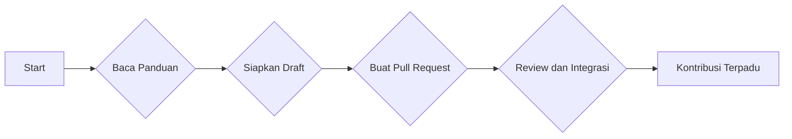

--- 
title: How to Contribute - Berkontribusi untuk Pengembangan Himastatut Docs
index: true
icon: user-plus
category:
  - How To
  - Contributes
author:
  - name: "Firmansyah Mukti Wijaya"
    email: "ikimukti@gmail.com"
    url: "https://ikimukti.com"
  - name: "Himastatut Docs"
    email: "himastatut@gmail.com"
    url: "https://himastatut.my.id/article/"
--- 

# How to Contribute - Berkontribusi untuk Pengembangan Himastatut Docs

Selamat datang di halaman **How to Contribute**! Halaman ini bertujuan untuk memberikan panduan kepada Anda yang ingin berkontribusi dalam mengembangkan Himastatut Docs, sebuah platform dokumentasi untuk Himpunan Mahasiswa Statistika Universitas Terbuka (HIMASTAT). Dengan berkontribusi, Anda tidak hanya membantu memperkaya dokumentasi, tetapi juga turut serta dalam menciptakan ekosistem yang bermanfaat untuk seluruh komunitas.

## Tujuan Kontribusi

Bergabung dalam pengembangan Himastatut Docs adalah kesempatan untuk berkolaborasi, belajar bersama, dan memberikan dampak positif bagi komunitas HIMASTAT. Beberapa manfaat utama yang dapat Anda peroleh dengan berkontribusi antara lain:

- **Meningkatkan Keterampilan Teknis**: Anda akan memperdalam pemahaman tentang VuePress, TypeScript, Markdown, Git, dan GitHub[^1].
- **Berpartisipasi dalam Pengembangan HIMASTAT**: Anda turut serta dalam membangun ekosistem HIMASTAT yang lebih terorganisir, terstruktur, dan berguna bagi mahasiswa dan anggota HIMASTAT[^2].
- **Peningkatan Kolaborasi dan Keterlibatan**: Memberikan kontribusi adalah cara yang efektif untuk membangun hubungan dan keterlibatan antara mahasiswa, dosen, dan alumni dalam komunitas HIMASTAT[^3].
- **Mengembangkan Soft Skills**: Proses berkontribusi ini dapat membantu Anda meningkatkan keterampilan komunikasi, kolaborasi, dan manajemen proyek[^4].

## Cara Berkontribusi

Untuk memulai kontribusi Anda, berikut adalah beberapa langkah yang perlu diikuti:

1. **Pahami Teknologi yang Digunakan**
   - **VuePress**: Platform ini dibangun dengan Vue.js dan menggunakan **VuePress Hope** theme untuk tampilan yang menarik dan mudah digunakan[^5].
   - **TypeScript**: Digunakan untuk menulis komponen interaktif dalam VuePress[^6].
   - **Markdown**: Semua dokumentasi ditulis menggunakan sintaks Markdown yang mudah dipahami dan dikelola[^7].
   - **Git & GitHub**: Semua kontribusi dilakukan melalui GitHub dengan membuat PR (Pull Request) dan menggunakan fitur branch untuk pengembangan[^8].

2. **Siapkan Draft Anda**
   - Anda bisa mulai dengan memberikan draft isi informasi ke [link kontribusi](#) yang sudah disediakan.
   - Gunakan format yang telah ditentukan di [formulir kontribusi](#).

3. **Proses Pengajuan**
   - Setiap kontributor dapat mengirimkan pull request setelah membuat branch sendiri di GitHub. Pastikan konten Anda sesuai dengan panduan dan format yang telah disediakan.
   - Setelah pull request diajukan, Anda bisa menunggu proses review dan penggabungan ke branch utama (main).

4. **Standar Penulisan Footnote**
   - Semua konten harus relevan dengan topik **Himastatut Docs**, **Statistika**, dan **Universitas Terbuka**.
   - Format dokumen harus sesuai dengan standar Markdown yang telah ditentukan.
   - Pastikan kontribusi Anda memberi manfaat untuk komunitas HIMASTAT dan mahasiswa Program Studi Statistika Universitas Terbuka.

## Kategori Kontribusi

Berikut adalah kategori kontribusi yang bisa Anda pilih untuk fokuskan:

::: tabs
@tab **Tutorial**
- Berikan tutorial langkah demi langkah yang berkaitan dengan statistika, seperti penggunaan software statistik (R, Python, SPSS, dll.) atau konsep-konsep penting dalam statistika.

@tab **Pengembangan Kode**
- Jika Anda memiliki keterampilan dalam pengembangan perangkat lunak, Anda dapat membantu mengembangkan atau memperbaiki kode untuk platform Himastatut Docs.

@tab **Saran untuk Pengembangan Situs**
- Berikan saran dan ide untuk meningkatkan fungsi, tampilan, atau struktur dari situs Himastatut Docs agar lebih bermanfaat bagi pengguna.

@tab **Dokumentasi Program Kerja HIMASTAT**
- Kontribusi dalam mendokumentasikan program kerja HIMASTAT dan berbagai kegiatan yang telah dan akan dilakukan oleh organisasi ini.
:::

## Informasi Penting

Untuk mempermudah Anda dalam berkontribusi, silakan perhatikan beberapa hal penting berikut:

- Semua kontribusi akan melalui proses review sebelum diintegrasikan ke dalam repositori GitHub.
- Jika Anda baru pertama kali berkontribusi, pastikan untuk membaca panduan [GitHub](https://git-scm.com/doc) dan [VuePress Documentation](https://vuejs.org/guide/quick-start.html).
- Jangan lupa untuk menambahkan **footnote** atau referensi jika diperlukan, seperti pada contoh yang terdapat dalam [tutorial sebelumnya](#).

## Menjadi Bagian dari HIMASTAT

Dengan berkontribusi, Anda tidak hanya membantu memperkaya dokumentasi, tetapi juga dapat mempererat hubungan antara mahasiswa, alumni, dan dosen. Kami berharap Anda dapat bergabung dalam inisiatif ini dan menjadi bagian dari komunitas HIMASTAT yang lebih kuat dan berdaya.

### Referensi untuk Kontribusi

[^1]: **VuePress Documentation** – *Panduan Penggunaan VuePress*, [online] tersedia: <https://vuejs.org/guide/quick-start.html>.
[^2]: **VuePress Hope Theme** – *Desain Tema VuePress*, [online] tersedia: <https://theme-hope.vuejs.press/guide/>.
[^3]: **GitHub Docs** – *Panduan GitHub*, [online] tersedia: <https://docs.github.com/en>.
[^4]: **Git-SCM** – *Panduan Penggunaan Git*, [online] tersedia: <https://git-scm.com/doc>.
[^5]: **VuePress Documentation** – *VuePress untuk Dokumentasi*, [online] tersedia: <https://vuejs.org/guide/quick-start.html>.
[^6]: **TypeScript Documentation** – *Panduan TypeScript*, [online] tersedia: <https://www.typescriptlang.org/docs/>.
[^7]: **Markdown Guide** – *Panduan Sintaks Markdown*, [online] tersedia: <https://www.markdownguide.org/basic-syntax/>.
[^8]: **GitHub for Beginners** – *Cara Berkontribusi pada GitHub*, [online] tersedia: <https://guides.github.com/activities/hello-world/>.

::: tip
Pastikan Anda mengikuti panduan dan format yang telah ditentukan untuk memastikan kontribusi Anda dapat diterima dan berguna bagi komunitas.
:::

## Visualisasi Panduan Kontribusi

Untuk lebih memahami bagaimana kontribusi dilakukan di platform Himastatut Docs, berikut adalah diagram alur proses kontribusi:

<GitContributors />
<GitChangelog />