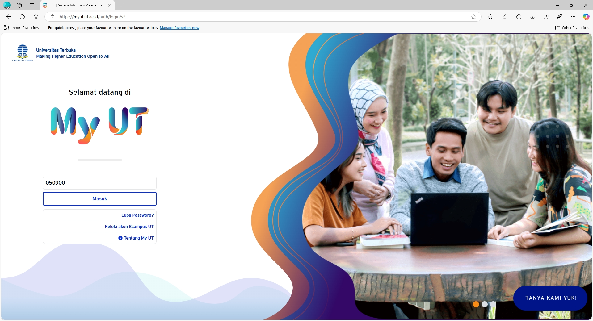
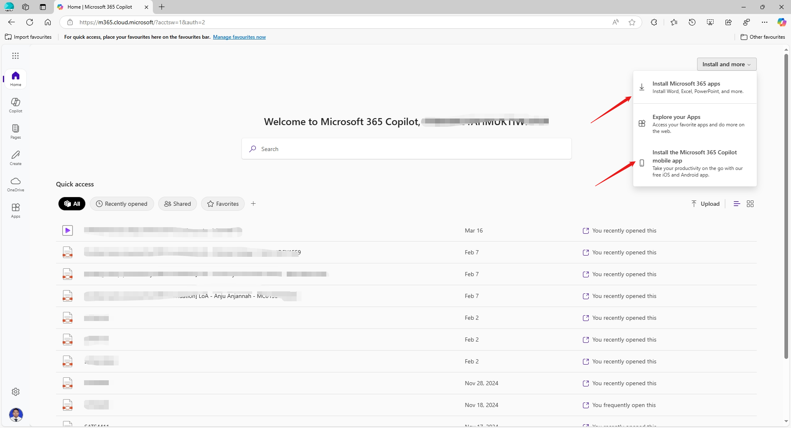
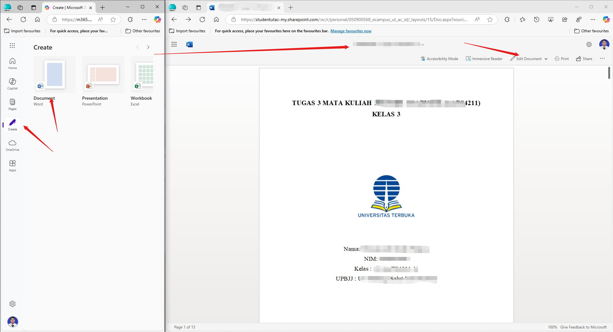
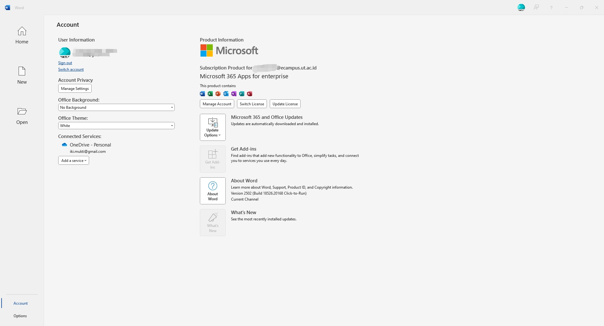

--- 
title: Aktivasi dan Penggunaan Office 365 dengan Email Kampus UT
date: 2024-04-02
image: "./tutorial02.png"
description: "Panduan langkah-demi-langkah untuk mengaktifkan dan menggunakan Office 365 dengan email kampus UT."
tags:
  - Office 365
  - Email Kampus
  - Microsoft
  - Tutorial
  - Panduan
category:
  - How To
  - Tutorials
icon: fa-brands:microsoft
index: true
author:
  - name: "Firmansyah Mukti Wijaya"
    email: "ikimukti@gmail.com"
    url: "https://ikimukti.com"
  - name: "Himastatut Docs"
    email: "himastatut@gmail.com"
    url: "https://himastatut.my.id/article/"
--- 

# Tutorial 02: Aktivasi dan Penggunaan Office 365 dengan Email Kampus UT

**Pengantar:** Email kampus UT tidak hanya untuk surat-menyurat, tetapi juga memberikan akses gratis ke **Microsoft Office 365** (Word, Excel, PowerPoint, dan layanan lainnya) bagi mahasiswa UT. Layanan Office 365 ini merupakan fasilitas resmi yang disediakan untuk mendukung pembelajaran daring [^1]. Setiap mahasiswa dapat mengaktifkan lisensi Office 365 menggunakan akun email UT mereka dan memasang aplikasi Office di beberapa perangkat (hingga 3 perangkat desktop dan 3 perangkat mobile). Tutorial ini akan membahas cara klaim lisensi Office 365, langkah aktivasi melalui portal MyUT, serta tips menggunakan aplikasi Office secara online dan offline.

## Langkah 1: Aktivasi Akun Office 365 Mahasiswa UT melalui MyUT

Akun Office 365 mahasiswa UT terintegrasi dengan sistem Single Sign-On UT. Untuk aktivasi awal dan memastikan akun Office 365 Anda aktif, ikuti langkah berikut:

1. **Buka portal MyUT atau Admisi** – Kunjungi portal mahasiswa UT di [MyUT](https://myut.ut.ac.id) atau laman admisi (`admisi-sia.ut.ac.id`) [^3].
2. **Pilih login Office 365** – Pada halaman login MyUT, klik tombol **"Login dengan Office 365"** (berwarna oranye) [^3]. Ini akan mengarahkan Anda ke halaman login Microsoft.
3. **Masukkan akun email UT** – Ketik alamat email kampus UT Anda (format NIM@ecampus.ut.ac.id) beserta password akun tersebut [^2]. Gunakan password terbaru yang telah Anda setel (atau password awal sesuai format Ut+tgl lahir jika belum pernah mengubahnya).
4. **Sukses masuk MyUT** – Setelah autentikasi berhasil, Anda akan masuk ke dashboard MyUT. Hal ini menandakan akun Office 365 Anda sudah aktif dan terhubung dengan sistem UT [^3]. Sekarang akun tersebut siap digunakan untuk mengunduh aplikasi Office maupun mengakses layanan Office 365 lainnya.

  

*Gambar 1.* Tampilan portal MyUT dengan opsi **Login dengan Office 365**. Klik tombol tersebut untuk login menggunakan akun email UT.

> **Tip:** Jika langkah di atas gagal, periksa kembali NIM dan password Anda. Pastikan akun email sudah aktif. Untuk mahasiswa baru, aktivasi akun email biasanya dilakukan beberapa waktu setelah registrasi. Apabila masih bermasalah, hubungi *helpdesk* UT untuk konfirmasi status akun.

## Langkah 2: Mengunduh dan Menginstal Microsoft Office 365 (Klaim Lisensi)

Setelah akun Office 365 Anda aktif, Anda dapat mengklaim lisensi Office dan memasang aplikasi Microsoft Office (Word, Excel, PowerPoint, dll.) di perangkat pribadi Anda secara gratis [^1]. Ikuti langkah berikut untuk **mengunduh dan menginstal** Office 365:

1. **Masuk ke portal Office 365** – Buka [office.com](https://www.office.com/) dan login dengan akun email UT Anda (jika belum login).
2. **Buka halaman install** – Pada halaman utama Office 365, klik menu **Account** (akun) atau pilih profil Anda, lalu cari opsi **“Instal Office”**. Di beberapa tampilan, tombol *Install Office* juga langsung tersedia di pojok kanan atas dashboard Office.com.
3. **Unduh installer** – Pilih paket aplikasi Office 365 yang tersedia untuk diunduh. Biasanya, ini akan mengunduh file installer Office 365 (Office Apps) yang mencakup Word, Excel, PowerPoint, Outlook, Teams, dll.
4. **Jalankan instalasi** – Buka file installer yang telah diunduh, lalu ikuti petunjuk pemasangan hingga selesai. Pastikan perangkat terhubung internet saat instalasi agar semua komponen terunduh dengan benar.
5. **Aktivasi lisensi di perangkat** – Setelah terpasang, buka salah satu aplikasi Office (misal Word). Anda mungkin diminta **login**. Masukkan akun email UT Anda saat diminta aktivasi. Setelah login, Office akan mendeteksi lisensi kampus Anda dan mengaktifkan semua fiturnya secara penuh (proses ini menjadikan perangkat tersebut terhitung menggunakan 1 lisensi Anda).

Anda dapat menginstal Office 365 ini hingga di **3 perangkat PC/Laptop** dan **3 perangkat mobile (smartphone/tablet)** milik Anda. Misalnya, Office bisa dipasang di komputer rumah, laptop, dan PC kantor, serta di ponsel dan tablet Anda. Jika ingin memasang di perangkat ke-4, Anda mungkin perlu *deactivate* salah satu perangkat sebelumnya melalui portal akun Microsoft. Namun, batas tersebut biasanya cukup untuk kebutuhan mahasiswa.

  

*Gambar 2.* Halaman akun Office 365 dengan opsi **Install Office**. Klik tombol tersebut untuk mengunduh aplikasi Office 365 ke perangkat Anda.

## Langkah 3: Menggunakan Office 365 secara Online (Word, Excel, PowerPoint di Web)

Salah satu keunggulan Office 365 untuk mahasiswa adalah kemampuan menggunakan aplikasi **Word, Excel, PowerPoint langsung di browser (Office 365 Online)** tanpa perlu instalasi. Setelah login ke Office 365, Anda bisa:

- **Mengakses aplikasi Office Online** – Dari portal [office.com](https://www.office.com/), klik ikon aplikasi seperti **Word**, **Excel**, atau **PowerPoint** untuk membuka versi web dari aplikasi tersebut. Antarmukanya mirip dengan versi desktop, dan Anda dapat membuat atau mengedit dokumen langsung di browser.
- **Membuat dokumen baru** – Pilih template **Blank Document** (dokumen kosong) atau template lain untuk memulai dokumen baru. Setiap dokumen yang Anda buat di versi web akan otomatis tersimpan ke OneDrive akun Anda.
- **Menyunting dokumen** – Gunakan fitur pengeditan seperti biasa. Setiap perubahan akan tersimpan *otomatis* (AutoSave aktif) ke OneDrive. Anda dapat melihat indikator penyimpanan di bar atas (tertulis “Saved” setiap kali penyimpanan selesai).
- **Kolaborasi real-time** – Bagikan dokumen kepada rekan (dengan fitur *Share* di OneDrive/Office online) untuk mengedit bersama. Versi web mendukung kolaborasi waktu nyata, di mana beberapa pengguna dapat mengerjakan dokumen yang sama secara simultan [^4].

Dengan Office versi web, Anda dapat mengakses pekerjaan Anda dari komputer manapun tanpa perlu menginstal software. Cukup login ke akun Office 365 UT, dan semua aplikasi Office siap digunakan. Pastikan koneksi internet stabil saat menggunakan Office Online, karena pengeditan berlangsung di cloud.

  

*Gambar 3.* Microsoft Word versi web di Office 365 Online. Antarmukanya familier dan dokumen tersimpan otomatis ke OneDrive.

## Langkah 4: Menggunakan Office 365 secara Offline (Desktop & Mobile)

Selain versi web, Anda tentunya dapat menggunakan aplikasi Office 365 secara **offline** di perangkat yang sudah diinstal pada Langkah 2. Berikut beberapa tips penggunaan offline:

- **Buka aplikasi dan login** – Jalankan aplikasi (Word, Excel, dll.) di PC atau laptop Anda. Pada penggunaan pertama, masuk dengan akun email UT jika diminta, untuk memverifikasi lisensi. Setelah itu, aplikasi akan tetap **aktif** tanpa perlu koneksi internet, kecuali untuk verifikasi berkala.
- **Bekerja tanpa internet** – Anda bisa membuat dan mengedit dokumen tanpa koneksi internet. Simpanlah dokumen di komputer seperti biasa (format .docx, .xlsx, .pptx). Selanjutnya, saat internet tersedia, Anda dapat mengunggah file tersebut ke OneDrive untuk backup atau berbagi.
- **Integrasi OneDrive** – Ketika login dengan akun UT, aplikasi Office desktop akan terhubung ke OneDrive Anda. Anda dapat langsung **Save** atau **Save As** ke OneDrive dari menu aplikasi. Ini memudahkan sinkronisasi dokumen antara perangkat offline dan penyimpanan cloud.
- **Aplikasi Mobile** – Untuk perangkat seluler, unduh aplikasi Microsoft Office (atau Word, Excel, PowerPoint mobile) dari Play Store/App Store. Login dengan akun UT Anda untuk memperoleh fitur premium. Aplikasi mobile memungkinkan Anda membaca dan mengedit dokumen saat mobile. Anda dapat menyimpan file ke OneDrive atau perangkat lokal. 
- **Sinkronisasi** – Jika Anda mengedit dokumen yang sama di beberapa perangkat, perhatikan untuk menyimpan perubahan ke OneDrive. OneDrive akan menyinkronkan versi terbaru ke semua perangkat saat terhubung internet, sehingga Anda selalu melanjutkan pada versi dokumen terkini.

  

*Gambar 4.* Microsoft Word 365 di desktop Windows setelah aktivasi. Pastikan akun Anda (NIM@ecampus.ut.ac.id) tertaut di pojok kanan atas aplikasi untuk menikmati fitur Office 365 penuh.

## Tips Penggunaan Office 365 bagi Mahasiswa UT

- **Gunakan Akun UT untuk Semua Layanan:** Akun Office 365 (@ecampus.ut.ac.id) Anda juga berfungsi sebagai login ke berbagai layanan UT (single sign-on). Cukup dengan satu akun, Anda bisa mengakses email, OneDrive, Teams, dan juga login ke sistem UT seperti elearning tanpa perlu akun terpisah [^3].
- **Manfaatkan OneDrive sebagai Penyimpanan Utama:** Simpan dokumen kuliah di OneDrive agar aman dan mudah diakses di mana saja. Dengan menyimpan di OneDrive, Anda juga bisa berbagi file tugas ke tutor atau teman dengan cepat, cukup kirim link tanpa perlu flashdisk.
- **Selalu Online vs Offline:** Gunakan **Office Online** saat Anda di komputer umum atau sekadar perlu edit ringan dengan cepat. Gunakan **Office Offline (Desktop)** untuk pekerjaan intensif atau saat koneksi internet tidak tersedia. Keduanya saling melengkapi – versi desktop memiliki fitur lengkap dan bisa offline, sedangkan versi web memudahkan kolaborasi dan akses tanpa instalasi.
- **Atur Sinkronisasi di Beberapa Perangkat:** Jika memasang Office di banyak perangkat, atur agar file tersimpan ke OneDrive secara default. Dengan demikian, dokumen yang diedit di laptop dapat dilanjutkan di PC lain atau di ponsel. Cek menu **Account > Services & Subscriptions** di portal Office untuk melihat perangkat apa saja yang terhubung dengan lisensi Anda, dan lepaskan perangkat yang sudah tidak digunakan.
- **Update dan Keamanan:** Pastikan perangkat Anda rutin tersambung internet minimal sekali setiap 30 hari. Lisensi Office 365 akan melakukan pengecekan berkala. Selain itu, selalu logout dari Office 365 di perangkat publik dan jaga kerahasiaan password akun UT Anda. Aktifkan verifikasi keamanan tambahan jika disediakan.

[^1]: UT Palabuhanratu (2024), *[Ecampus UT – Microsoft 365 Gratis untuk Mahasiswa](https://www.salutpalabuhanratu.com/ecampus-ut-sepowerfull-itukah-microsoft-365-gratisan-untuk-mahasiswa)* – Email Ecampus (@ecampus.ut.ac.id) merupakan akun Office 365 berlisensi resmi untuk mahasiswa UT.
[^2]: Universitas Terbuka (2022), *[Panduan Aktivasi Email Office365 Mahasiswa](https://www.instagram.com/ut_bogor/p/C4zsFLDrjnT/?img_index=1)* – Format login awal akun Office 365 mahasiswa UT: NIM@ecampus.ut.ac.id dan password default “Ut+TanggalLahir” (contoh: UtDDMMYYYY).
[^3]: Media Sosial UT (2023) – *[Panduan Login MyUT dengan Akun Office 365](https://www.instagram.com/ut_sorong/reel/C_ceOmoNPpI/)*: Akses myut.ut.ac.id atau admisi-sia.ut.ac.id, klik tombol “Office365”, lalu login dengan akun email UT Anda.
[^4]: Universitas Terbuka (2021), *[Membangun SDM Unggul melalui Digital Learning Ecosystem](https://repository.ut.ac.id/9499/1/BP0018-21.pdf.pdf)*, hal. 14 – Office 365 memungkinkan mahasiswa menggunakan Word, Excel, PowerPoint secara **online** dan berkolaborasi real-time dalam dokumen yang sama.

## Bagikan
<Share colorful />
<GitContributors />
<GitChangelog />