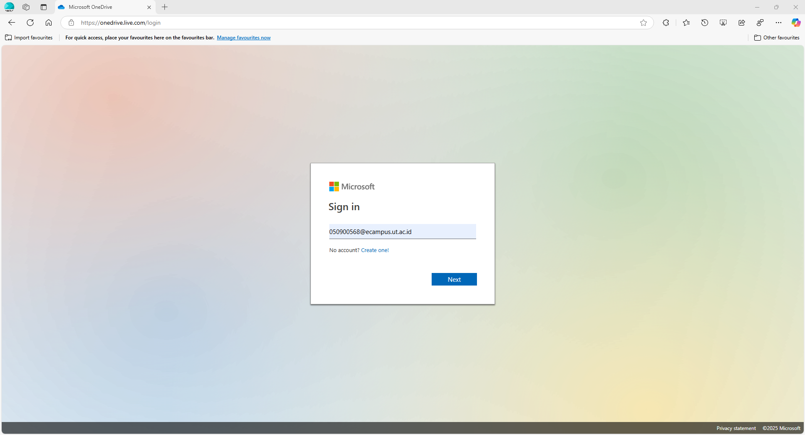
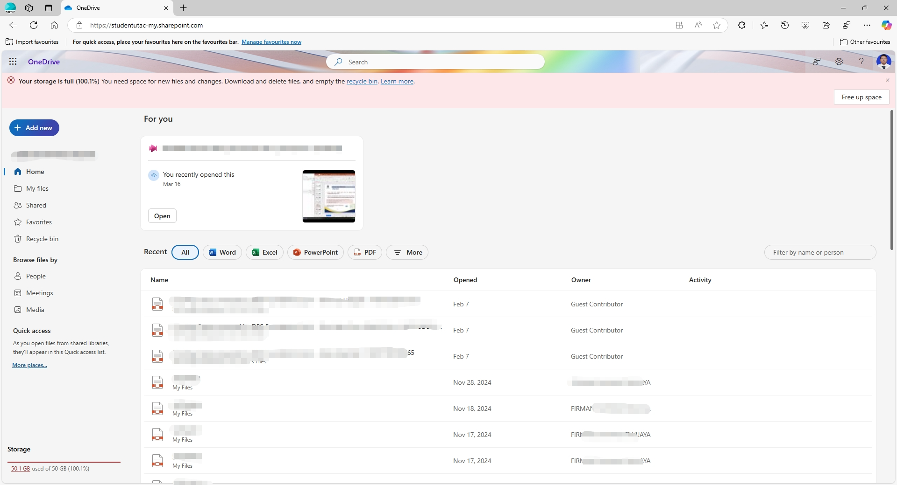
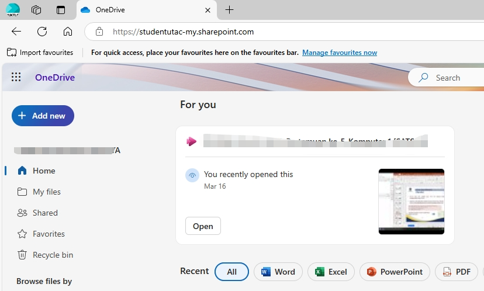
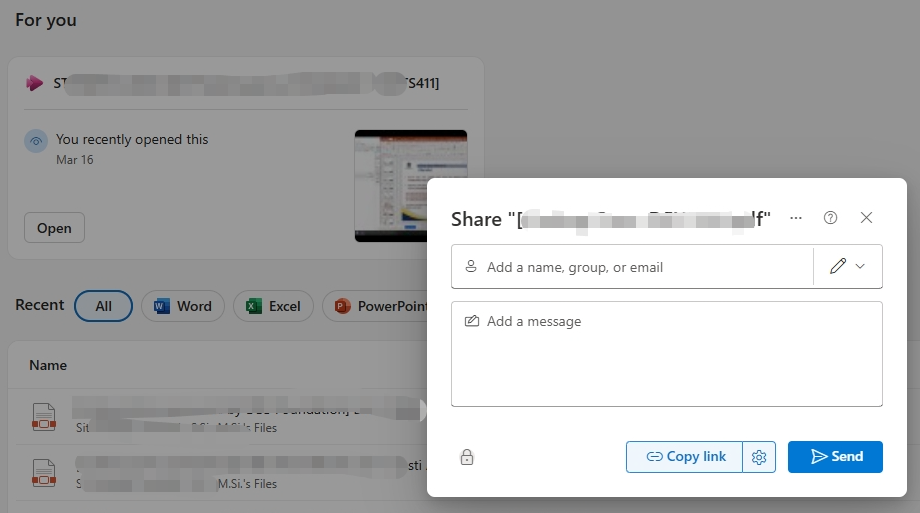

--- 
title: Menggunakan Email Kampus UT untuk OneDrive
date: 2024-04-02
category:
  - How To
  - Tutorials
icon: hard-drive
index: true
author:
  - name: "Firmansyah Mukti Wijaya"
    email: "ikimukti@gmail.com"
    url: "https://ikimukti.com"
  - name: "Himastatut Docs"
    email: "himastatut@gmail.com"
    url: "https://himastatut.my.id/article/"
--- 

# Tutorial 01: Menggunakan Email Kampus UT untuk OneDrive

**Pengantar:** Mahasiswa Universitas Terbuka (UT) mendapatkan fasilitas email kampus dengan domain `@ecampus.ut.ac.id`. Email ini terintegrasi dengan layanan **Microsoft Office 365**, termasuk **OneDrive** dengan kapasitas penyimpanan cloud yang besar (hingga 1 TB) untuk setiap pengguna [^1]. Dengan OneDrive, Anda dapat menyimpan file secara online, mengaksesnya di mana saja, serta berbagi dan berkolaborasi dengan mudah bersama rekan atau tutor [^2]. Tutorial berikut menjelaskan langkah-langkah mengakses dan memanfaatkan OneDrive menggunakan email kampus UT.

## Langkah 1: Aktivasi dan Login Akun Email UT

Untuk menggunakan OneDrive, pertama-tama pastikan akun email UT Anda telah aktif. Setiap mahasiswa baru menerima akun email dengan format **NIM@ecampus.ut.ac.id** (misal: `012345678@ecampus.ut.ac.id`). Gunakan format tersebut sebagai **username** saat login. 

1. **Buka halaman Office 365** – Kunjungi portal Office 365 di [office.com](https://www.office.com/) atau [OneDrive website](https://www.onedrive.com/). Anda juga bisa mengakses laman email UT melalui `ecampus.ut.ac.id` [^3].
2. **Masukkan kredensial akun** – Pada halaman login Microsoft, masukkan alamat email UT Anda (NIM@ecampus.ut.ac.id) dan **password awal**. Password default akun email UT biasanya terdiri dari kombinasi kata **"Ut"** (huruf U dan t) diikuti tanggal lahir Anda dalam format DDMMYYYY [^3]. Contoh: jika tanggal lahir 5 Agustus 2001, maka password awal = `Ut05082001`. 
3. **Ubah password jika diminta** – Pada login pertama, Anda mungkin akan diminta mengganti password. Buatlah password baru yang kuat dan mudah diingat.
4. **Login berhasil** – Setelah proses di atas, Anda akan masuk ke beranda Office 365. Ini berarti akun email UT Anda sudah aktif dan siap digunakan.

  

*Gambar 1.* Halaman login Office 365. Masukkan email `NIM@ecampus.ut.ac.id` dan password untuk mengakses akun.

## Langkah 2: Mengakses OneDrive melalui Office 365

Setelah berhasil login, Anda dapat mengakses OneDrive dari portal Office 365. Pada beranda Office 365, cari dan klik ikon **OneDrive** (berlogo awan berwarna biru). OneDrive akan terbuka menampilkan direktori penyimpanan cloud pribadi Anda.

Jika menggunakan antarmuka web Office 365:
- Klik tombol **App Launcher** (ikon kotak titik sembilan di sudut kiri atas) untuk menampilkan menu aplikasi.
- Pilih **OneDrive** dari daftar aplikasi Microsoft yang tersedia.

OneDrive akan memuat tampilan **My Files** (Berkas Saya), di mana Anda dapat mulai mengelola file. Pastikan Anda melihat nama akun Anda di pojok kanan atas (misalnya nama Anda atau NIM@ecampus.ut.ac.id) yang menandakan Anda sedang menggunakan OneDrive dengan akun kampus UT.

  

*Gambar 2.* Beranda OneDrive milik mahasiswa UT di browser, menampilkan menu **My Files** dan opsi unggah.

## Langkah 3: Mengunggah dan Mengatur Berkas di OneDrive

Anda kini siap memanfaatkan OneDrive untuk menyimpan dokumen kuliah, tugas, atau file lainnya. Berikut beberapa hal yang dapat dilakukan:
- **Unggah berkas** – Klik tombol **Upload** (Unggah) dan pilih *Files* atau *Folders* untuk mengunggah berkas dari komputer Anda ke OneDrive. Anda juga dapat **drag-and-drop** (menyeret file) langsung ke jendela OneDrive di browser.
- **Membuat folder** – Untuk menjaga kerapian, buat folder-folder sesuai kebutuhan (misalnya *Tugas*, *Materi Kuliah*, dll.) dengan mengklik **New** > *Folder*. Atur berkas Anda ke dalam folder yang relevan.
- **Menyimpan dokumen Office** – Anda dapat membuat dokumen Word, Excel, atau PowerPoint langsung di OneDrive dengan klik **New** lalu pilih jenis dokumen. Dokumen yang dibuat akan otomatis tersimpan di OneDrive.

Setiap file yang diunggah akan tersimpan di cloud OneDrive UT Anda (kapasitas hingga ~1 TB, sangat lapang). OneDrive juga menjaga *history* (riwayat) versi dokumen secara otomatis, sehingga Anda dapat memulihkan versi sebelumnya jika diperlukan.

  

*Gambar 3.* Contoh proses unggah file ke OneDrive. Pilih file dari komputer, lalu unggah ke folder tujuan di OneDrive.

## Langkah 4: Berbagi Berkas dan Kolaborasi dengan OneDrive

Salah satu manfaat utama OneDrive adalah kemudahan berbagi file dengan orang lain dan berkolaborasi secara **real-time**. Dengan email UT (Office 365), Anda dapat mengedit dokumen secara bersamaan dengan sesama mahasiswa atau dosen tanpa harus bertemu langsung [^4]. Berikut cara berbagi dan berkolaborasi:
- **Berbagi tautan (link)** – Pilih file atau folder yang ingin dibagikan, lalu klik **Share** (Bagikan). Atur izin akses (hanya lihat atau boleh edit), kemudian salin tautan yang dihasilkan. Kirimkan tautan tersebut ke rekan yang Anda ajak berbagi.
- **Berbagi ke email UT lain** – Anda juga bisa langsung mengundang pengguna lain (misalnya sesama mahasiswa UT) dengan memasukkan alamat email **@ecampus.ut.ac.id** mereka pada menu berbagi. Mereka akan menerima notifikasi dan dapat mengakses file yang Anda bagikan.
- **Kolaborasi waktu nyata** – Jika file Office (Word, Excel, PowerPoint) dibuka bersamaan oleh beberapa orang melalui OneDrive, setiap orang dapat melihat perubahan yang dilakukan secara langsung (real-time co-editing). Fitur ini mempermudah kerja kelompok dan revisi tugas bersama [^4].

Untuk menghentikan berbagi, Anda dapat mengelola *permissions* pada file tersebut (misalnya menghapus tautan berbagi atau mengubah izin menjadi read-only). Selalu periksa izin sebelum berbagi file sensitif.

  

*Gambar 4.* Menu berbagi file di OneDrive. Anda dapat menyalin tautan atau mengundang pengguna lain dengan mengatur izin akses.

## Tips Pemanfaatan OneDrive

- **Manfaatkan Kapasitas Besar:** Dengan kapasitas hingga 1 TB, OneDrive dapat menyimpan ribuan dokumen, foto, atau video. Gunakan penyimpanan cloud ini untuk *backup* data penting kuliah Anda, sehingga aman jika laptop/PC bermasalah [^1].
- **Atur Folder Secara Terstruktur:** Buat struktur folder berdasarkan mata kuliah atau kategori file. Penamaan dan pengorganisasian yang baik akan memudahkan pencarian di kemudian hari.
- **Akses di Berbagai Perangkat:** OneDrive dapat diakses melalui browser, aplikasi desktop, maupun aplikasi mobile. Anda bisa memasang aplikasi OneDrive di smartphone untuk membuka file saat bepergian. Sinkronisasi otomatis memastikan file selalu **up-to-date** di semua perangkat.
- **Gunakan Fitur Pencarian:** OneDrive memiliki fitur pencarian yang canggih. Cukup ketik kata kunci pada kotak *Search* untuk menemukan dokumen tanpa harus mencari manual di banyak folder.
- **Perhatikan Koneksi Internet:** Saat mengunggah file besar atau banyak file sekaligus, pastikan koneksi internet stabil. Untuk penggunaan offline, unduh file yang dibutuhkan terlebih dahulu, lalu unggah kembali versi terbaru ke OneDrive setelah selesai diedit.

[^1]: Universitas Terbuka (2021), *[Membangun SDM Unggul melalui Digital Learning Ecosystem](https://repository.ut.ac.id/9499/1/BP0018-21.pdf.pdf)*, hal. 14 – Layanan email e-campus UT menyediakan kapasitas inbox 50 GB dan penyimpanan OneDrive 1 TB terintegrasi Office 365.
[^2]: Universitas Terbuka (2022), *[Panduan Aktivasi Email Office365 bagi Mahasiswa UT](https://palembang.ut.ac.id/article/pengumuman/pengenalan-fitur-baru-sia-ut-dengan-nama-baru-my-ut#:~:text=Diinformasikan%20untuk%20masuk%20ke%20halaman,silahkan%20merubah%20password%20default%20tersebut.)* – Format akun mahasiswa: **NIM@ecampus.ut.ac.id** dengan password awal *Ut+tglblnthnlahir* (mis. Ut01012000 untuk 1 Jan 2000).
[^3]: Universitas Terbuka (2021), *[Membangun SDM Unggul melalui Digital Learning Ecosystem](https://repository.ut.ac.id/9499/1/BP0018-21.pdf.pdf)*, hal. 14 – Dengan Office 365, mahasiswa dapat menggunakan Microsoft Office secara online dan berkolaborasi/sharing dokumen dengan mahasiswa lain maupun tutor.
[^4]: Universitas Terbuka (2021), *[Membangun SDM Unggul melalui Digital Learning Ecosystem](https://repository.ut.ac.id/9499/1/BP0018-21.pdf.pdf)*, hal. 14 – Dengan Office 365, mahasiswa dapat menggunakan Microsoft Office secara online dan berkolaborasi/sharing dokumen dengan mahasiswa lain maupun tutor.

## Bagikan
<Share colorful />
<GitContributors />
<GitChangelog />