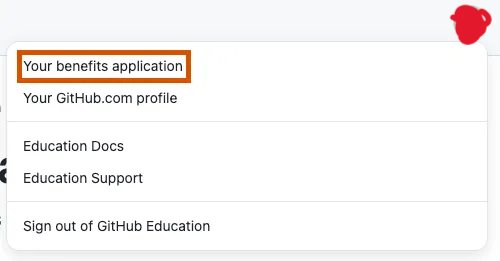

--- 
title: Mendaftar GitHub Education dengan Email Kampus UT
date: 2024-04-02
category:
  - How To
  - Tutorials
icon: book-open
index: true
author:
  - name: "Firmansyah Mukti Wijaya"
    email: "ikimukti@gmail.com"
    url: "https://ikimukti.com"
  - name: "Himastatut Docs"
    email: "himastatut@gmail.com"
    url: "https://himastatut.my.id/article/"
--- 

# Tutorial 03: Mendaftar GitHub Education dengan Email Kampus UT

**Pengantar:**  
GitHub Education adalah program dari GitHub yang memberikan akses gratis ke berbagai tools dan layanan developer bagi pelajar dan pengajar. Salah satu fitur utamanya adalah **GitHub Student Developer Pack**, yaitu paket benefit gratis dari GitHub dan mitra-mitranya yang biasanya berbayar. Dengan mendaftar GitHub Education menggunakan email kampus Universitas Terbuka (format `NIM@ecampus.ut.ac.id`), mahasiswa dapat memperoleh akses ke paket ini secara **gratis** selama masa studi (umumnya berlaku 1 tahun dan dapat diperpanjang hingga lulus selama status mahasiswa masih aktif) [^1].

GitHub Education memberikan berbagai keuntungan yang sangat bermanfaat bagi mahasiswa Statistika UT. Misalnya, Anda bisa mendapatkan akses gratis ke **GitHub Pro**, **GitHub Copilot**, berbagai layanan cloud seperti **Microsoft Azure**, **DigitalOcean**, serta akses ke berbagai platform pembelajaran dan tools untuk data science seperti **Deepnote**, **DataCamp**, dan **JetBrains** [^2]. Semua ini bisa mendukung Anda dalam mengembangkan keterampilan analisis data, machine learning, dan kolaborasi dalam proyek riset atau tugas kuliah [^3].

Dalam tutorial ini, Anda akan dipandu untuk mendaftar GitHub Education menggunakan email kampus UT, lengkap dengan langkah-langkah detail, serta manfaat yang bisa Anda peroleh.

## Apa itu GitHub Education dan Student Developer Pack?

**GitHub Education** adalah inisiatif GitHub yang mendukung mahasiswa dan pengajar dengan memberikan akses gratis ke berbagai tools profesional yang biasanya berbayar. Melalui program ini, Anda dapat memperoleh **GitHub Pro** secara gratis serta akses ke berbagai layanan dan software penting untuk pengembangan software [^4].

**GitHub Student Developer Pack** adalah paket berisi lebih dari 100 penawaran gratis atau berlisensi pendidikan dari berbagai platform dan layanan yang sangat relevan untuk pengembangan keterampilan programming, data science, dan machine learning. Berikut adalah beberapa benefit yang termasuk dalam Student Developer Pack:

- **GitHub Pro Gratis**: Memberikan akses ke fitur premium GitHub, seperti private repositories tanpa batas, kolaborasi lanjutan, dan pengelolaan kode tingkat lanjut [^5].
- **GitHub Copilot Gratis**: Sebuah AI yang membantu Anda menulis kode dengan memberikan saran kode otomatis yang kontekstual [^6].
- **Kredit Cloud Gratis**: Kredit untuk layanan cloud seperti **Microsoft Azure**, **AWS**, dan **DigitalOcean** yang memungkinkan Anda menjalankan server atau melakukan analisis data besar tanpa biaya [^7].
- **Platform Pembelajaran**: Akses gratis ke platform seperti **DataCamp**, **Educative**, dan **FrontendMasters**, yang menyediakan pelatihan langsung di bidang programming, data science, dan machine learning [^8].

## Manfaat Student Developer Pack bagi Mahasiswa Statistika UT

Mahasiswa Statistika UT dapat sangat diuntungkan dari manfaat GitHub Education, terutama dalam hal pengembangan keterampilan di bidang statistik, data science, dan machine learning. Beberapa manfaat utama yang relevan adalah:

- **Pengelolaan Kode dengan Git & GitHub:** Sebagai mahasiswa statistika, Anda akan sering bekerja dengan kode untuk analisis data dan eksperimen. Dengan **GitHub Pro**, Anda bisa menyimpan kode Anda di repository pribadi tanpa batas dan mengatur versi kode yang lebih efisien, serta berkolaborasi dengan teman atau dosen dalam proyek analisis [^9].
- **GitHub Copilot:** Membantu Anda menulis kode lebih cepat dengan memberikan saran otomatis. Misalnya, saat menulis kode Python untuk analisis data atau menggunakan R, Copilot bisa memberi potongan kode atau algoritma statistik yang berguna [^10].
- **Tools Data Science & Cloud Computing:** Manfaatkan kredit cloud untuk menjalankan model machine learning atau mengolah dataset besar. Platform seperti **Deepnote** dan **DataCamp** akan membantu Anda mengasah kemampuan dalam analisis data dan statistik dengan menyediakan akses ke notebook kolaboratif serta kursus pemrograman dan statistik yang praktis [^11].

## Langkah-Langkah Mendaftar GitHub Education dengan Email Kampus UT

### Langkah 1: Buat atau Masuk ke Akun GitHub

Jika Anda belum memiliki akun GitHub, buka situs [GitHub.com](https://github.com) dan daftar akun baru. Isi username, email pribadi, dan kata sandi sesuai petunjuk hingga akun Anda terbentuk. Setelah itu, login (sign in) ke akun GitHub Anda.  
**Gambar 1:** Tampilan halaman depan GitHub untuk Sign Up / Sign In.  

### Langkah 2: Tambahkan Email Kampus UT ke Akun GitHub

Setelah login, klik foto profil Anda di pojok kanan atas, pilih **Settings**, lalu pilih **Emails**. Pada bagian **Add email address**, masukkan email kampus UT Anda (`NIM@ecampus.ut.ac.id`), lalu klik **Add**. GitHub akan mengirimkan tautan verifikasi ke email tersebut. Buka inbox email kampus Anda dan klik tautan verifikasi untuk mengonfirmasi email kampus UT tersebut.  
**Gambar 2:** Halaman pengaturan untuk menambahkan email kampus UT ke akun GitHub.  

### Langkah 3: Buka Halaman GitHub Education Pack

Kunjungi laman [GitHub Student Developer Pack](https://education.github.com/pack) dan klik tombol **Get your Student Developer Pack**. Anda akan dibawa ke formulir aplikasi GitHub Education.  
**Gambar 3:** Halaman GitHub Education Pack dan tombol untuk mendapatkan akses.  

### Langkah 4: Verifikasi Status Mahasiswa

Pada halaman aplikasi, pilih **Email Institusi** untuk verifikasi. GitHub akan mendeteksi email kampus UT yang sudah Anda tambahkan. Klik kirim kode verifikasi, dan buka email kampus UT untuk mendapatkan kode verifikasi. Masukkan kode yang diterima untuk memverifikasi status mahasiswa Anda.  
**Gambar 4:** Formulir verifikasi status mahasiswa dengan email kampus.  

### Langkah 5: Isi Informasi Institusi dan Tujuan

Isi data seperti nama universitas, jurusan, dan tahun lulus. Pilih **Universitas Terbuka** sebagai institusi Anda, lalu jelaskan tujuan penggunaan GitHub, misalnya: *"Untuk pengelolaan proyek analisis data dan penelitian dalam statistika."*  
**Gambar 5:** Halaman untuk mengisi informasi institusi dan tujuan penggunaan.  

### Langkah 6: Kirim Aplikasi dan Tunggu Persetujuan

Setelah semua data terisi dengan benar, klik **Submit** untuk mengirim aplikasi. GitHub akan memproses aplikasi Anda. Proses verifikasi biasanya memakan waktu beberapa menit hingga beberapa hari kerja.  
**Gambar 6:** Notifikasi aplikasi GitHub Education telah dikirim.  

### Langkah 7: Konfirmasi Persetujuan

Setelah disetujui, Anda akan menerima email konfirmasi dari GitHub yang memberitahukan bahwa aplikasi Anda telah diterima dan akun GitHub Anda telah di-upgrade menjadi akun **Student**.  
**Gambar 7:** Contoh email konfirmasi bahwa GitHub Education Pack disetujui.  

### Langkah 8: Aktivasi Benefit Student Developer Pack

Setelah akun Anda terverifikasi sebagai mahasiswa, Anda dapat mengakses berbagai benefit dalam Student Developer Pack. Kunjungi [GitHub Education Pack](https://education.github.com/pack) dan pilih penawaran yang ingin Anda klaim. Klik **Activate** pada penawaran yang sesuai dengan kebutuhan Anda.  
**Gambar 8:** Daftar benefit yang dapat diaktivasi dalam GitHub Education Pack.  

## Tips dan Catatan Penting

- **Status Mahasiswa Aktif:** GitHub Education hanya berlaku untuk mahasiswa aktif. Pastikan Anda masih terdaftar sebagai mahasiswa Universitas Terbuka pada saat mendaftar.
- **Manfaatkan Semua Benefit:** Manfaatkan semua benefit yang ada untuk memperkaya keterampilan Anda, terutama di bidang data science dan statistik.
- **Verifikasi Alternatif:** Jika email kampus tidak diterima otomatis, Anda dapat menggunakan dokumen tambahan untuk memverifikasi status mahasiswa Anda.

--- 

[^1]: "GitHub Education for Students", GitHub Docs, [online] Available: https://docs.github.com/en/education/explore-the-benefits-of-teaching-and-learning-with-github-education/github-education-for-students/apply-to-github-education-as-a-student.
[^2]: "GitHub Student Developer Pack Overview", GitHub Docs, [online] Available: https://github.com/education/students.
[^3]: "GitHub Pro", GitHub Docs, [online] Available: https://education.github.com/pack.
[^4]: "GitHub Education Overview", GitHub Docs, [online] Available: https://github.com/education.
[^5]: "GitHub Pro Features", GitHub Docs, [online] Available: https://education.github.com/pack.
[^6]: "GitHub Copilot Overview", GitHub Docs, [online] Available: https://github.com/copilot.
[^7]: "Microsoft Azure for Students", Microsoft, [online] Available: https://azure.microsoft.com/en-us/free/students/.
[^8]: "DataCamp for Students", DataCamp, [online] Available: https://www.datacamp.com/.
[^9]: "GitHub Repositories", GitHub Docs, [online] Available: https://github.com.
[^10]: "GitHub Copilot", GitHub Docs, [online] Available: https://github.com/copilot.
[^11]: "Deepnote", Deepnote, [online] Available: https://www.deepnote.com/.

## Bagikan
<Share colorful />
<GitContributors />
<GitChangelog />