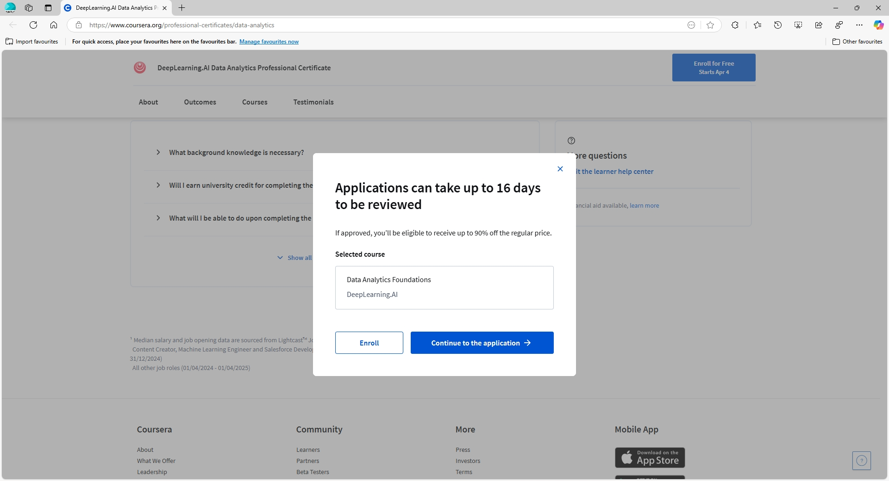

--- 
title: Mengajukan Financial Aid di Coursera untuk Mahasiswa Statistika UT
date: 2025-04-04
category:
  - How To
  - Tutorials
icon: fa-brands:discourse
index: true
author:
  - name: "Firmansyah Mukti Wijaya"
    email: "ikimukti@gmail.com"
    url: "https://ikimukti.com"
  - name: "Himastatut Docs"
    email: "himastatut@gmail.com"
    url: "https://himastatut.my.id/article/"
--- 

# Tutorial 04: Mengajukan Financial Aid di Coursera untuk Mahasiswa Statistika UT

Coursera adalah platform kursus online (Massive Open Online Course/MOOC) yang bekerja sama dengan ratusan universitas dan perusahaan terkemuka di dunia, menawarkan ribuan kursus di berbagai bidang[^36] [^37]. Bagi mahasiswa Statistika UT (Universitas Terbuka) dan masyarakat umum, Coursera memberikan kesempatan untuk belajar fleksibel kapan saja dan di mana saja, **menambah skill** tanpa harus keluar rumah[^36]. Materi yang diajarkan berasal dari pengajar ahli di universitas top (seperti Harvard, Stanford) dan perusahaan besar (Google, IBM, dll)[^36], sehingga kualitasnya **sangat tinggi**. Dengan ribuan pilihan kursus, mahasiswa Statistika UT bisa memperdalam topik statistik dan data science, atau mempelajari keahlian di luar kurikulum formal untuk **memperkaya pengetahuan**. Selain itu, Coursera menyediakan sertifikat bagi yang menyelesaikan kursus, yang dapat menjadi nilai tambah di CV – banyak perusahaan mengakui sertifikat Coursera sebagai bukti keterampilan[^37].

## Apa itu Coursera Financial Aid?

Coursera menyediakan **Financial Aid** (bantuan keuangan) bagi pembelajar yang **tidak mampu membayar** biaya kursus berbayar. Melalui program ini, kita bisa mengajukan permohonan agar biaya kursus ditiadakan atau dikurangi (hingga 100% bebas biaya)[^31]. Financial Aid memungkinkan mahasiswa mengakses *course* berbayar secara penuh – termasuk mengikuti kuis/pekerjaan rumah, proyek, dan mendapatkan sertifikat penyelesaian – **tanpa biaya** apabila pengajuan disetujui[^12]. Untuk mendapatkannya, pelamar harus mengisi formulir aplikasi yang menjelaskan latar belakang pendidikan, kondisi finansial, serta alasan mengikuti kursus[^24]. Coursera akan meninjau aplikasi ini dalam waktu sekitar 15 hari kerja setelah diajukan[^4].

**Mengapa Financial Aid penting?** Bagi banyak mahasiswa Indonesia, biaya kursus Coursera cukup mahal karena menggunakan mata uang USD. Harga berlangganan kursus di Coursera biasanya berkisar antara **USD $39 – $59 per bulan** (sekitar Rp600.000 – Rp900.000)[^21] [^25]. Bagi mahasiswa UT yang mungkin memiliki anggaran terbatas, program Financial Aid adalah solusi agar tetap bisa memperoleh materi dan sertifikat kursus **secara gratis**. Coursera mencatat ratusan ribu orang di seluruh dunia telah terbantu oleh program Financial Aid ini[^24] [^21].

Sebagai contoh, **DeepLearning.AI Data Analytics Professional Certificate** adalah program sertifikasi profesional di Coursera yang terdiri dari beberapa kursus terkait analisis data. Tanpa Financial Aid, program ini berbayar melalui model berlangganan bulanan. Namun, mahasiswa Statistika UT dapat memanfaatkan Financial Aid untuk mengakses kursus-kursus dalam program tersebut. Misalnya, **Course 1: Data Analytics Foundations** dapat diikuti secara gratis dengan mengajukan Financial Aid, sehingga materi fundamental analisis data bisa dipelajari tanpa membayar. Perlu diingat bahwa **Financial Aid diberikan per kursus**, bukan untuk keseluruhan program sekaligus[^23]. Artinya, jika program sertifikat terdiri dari 5 kursus terpisah, Anda perlu mengajukan Financial Aid *lima kali* (satu untuk tiap kursus) agar dapat menyelesaikan seluruh program secara gratis.

## Sertifikat Penyelesaian dari Coursera

Salah satu manfaat utama menyelesaikan kursus Coursera adalah mendapatkan **sertifikat resmi**. Sertifikat Coursera bisa diunduh dalam format PDF dan dibagikan (misalnya di LinkedIn atau dilampirkan pada CV). Jika Anda mengakses kursus melalui Financial Aid dan menyelesaikannya, Anda **tetap menerima sertifikat penyelesaian** yang sama seperti halnya pengguna berbayar. Dengan kata lain, Coursera tidak membedakan peserta Financial Aid – semua fitur kursus tersedia penuh dan sertifikat akan dikeluarkan setelah Anda memenuhi syarat kelulusan[^12]. Sertifikat ini dapat digunakan untuk keperluan akademik maupun portofolio profesional. Misalnya, mahasiswa Statistika UT dapat mencantumkan sertifikat kursus data analytics Coursera sebagai bukti *skill* tambahan di luar kurikulum UT, yang dapat memperkuat aplikasi pekerjaan atau melanjutkan studi. Banyak perusahaan internasional maupun lokal yang mengakui sertifikat Coursera sebagai bukti kompetensi[^37], sehingga hal ini dapat menjadi **nilai tambah** saat memasuki dunia kerja.

## Langkah-langkah Pengajuan Financial Aid di Coursera

Berikut tutorial langkah demi langkah untuk mengajukan Financial Aid di Coursera. Sebagai ilustrasi, kita akan menggunakan *Course 1: Data Analytics Foundations* dari program **DeepLearning.AI Data Analytics Professional Certificate**. Pastikan Anda sudah memiliki akun Coursera. Setiap langkah disertai gambar (placeholder) untuk memudahkan pemahaman.

1. **Buka Halaman Kursus**  
   Kunjungi situs Coursera dan **login** ke akun Anda. Gunakan fitur pencarian untuk menemukan kursus **“Data Analytics Foundations”** yang merupakan Course 1 program DeepLearning.AI Data Analytics Professional Certificate. Setelah masuk ke halaman kursus tersebut, scroll hingga Anda melihat tombol atau tautan bertuliskan **“Financial Aid Available”** di dekat tombol *Enroll*. Klik tautan **Financial Aid Available** tersebut (lihat Gambar 1).

   
   
   

2. **Mulai Pengajuan Financial Aid**  
   Setelah klik Financial Aid, Coursera akan menampilkan laman pengantar Financial Aid. Pada laman ini, klik tombol **“Continue to the Application”** untuk mulai mengisi formulir aplikasi. *Note:* **Jangan** memilih opsi *Start Free Trial* atau *Enroll (bayar)*, karena jika Anda memulai masa trial gratis, pengajuan Financial Aid Anda bisa dibatalkan otomatis[^14]. Pastikan Anda melanjutkan ke formulir Financial Aid sesuai petunjuk (Gambar 2).

   

3. **Mengisi Formulir Financial Aid**  
   Selanjutnya, isi **formulir Financial Aid** yang terdiri dari dua bagian: **Background Information** dan **Help Us Improve**[^9]. Pada bagian *Background Information*, Anda akan diminta memasukkan informasi pribadi dan latar belakang, antara lain: tingkat pendidikan terakhir, status pekerjaan, pendapatan per tahun, dan sebagainya. Isilah sesuai kondisi Anda saat ini. Jika ada pertanyaan “*Annual Income*” dalam USD, Anda bisa mengonversi pendapatan Anda ke dolar (boleh diisi 0 jika Anda belum berpenghasilan). Coursera juga mungkin menanyakan berapa bisa Anda bayar untuk kursus – jika ada kolom seperti ini dan Anda memang tidak mampu membayar, Anda dapat mengisinya dengan **0**.

   Bagian terpenting di *Background Information* adalah **dua pertanyaan esai**. Masing-masing harus dijawab dengan **minimal 150 kata** dalam bahasa Inggris[^9] [^30]. Pertanyaannya yaitu: **1) “Why are you applying for Financial Aid?”** (Alasan Anda mengajukan bantuan finansial) dan **2) “How will taking this course help you achieve your goals?”** (Bagaimana kursus ini akan membantu Anda mencapai tujuan Anda). Tuliskan jawaban secara jujur, jelas, dan meyakinkan. Jelaskan kondisi finansial yang membuat Anda membutuhkan bantuan, serta motivasi dan rencana Anda dengan ilmu dari kursus tersebut. Berikut ini contoh jawaban yang bisa dijadikan referensi pengisian:

   **Contoh jawaban untuk "Reason you applied for aid":**  
   > I am a third-year Statistics student at Universitas Terbuka in Indonesia. I have a strong desire to learn data analytics to support my education and career, but I come from a low-income family. My parents’ income is barely enough to cover daily needs and my college fees. I also work part-time to help with expenses, but I still cannot afford the additional cost of this Coursera course. Given the high exchange rate, the course fee is very expensive for me[^21]. I am applying for Financial Aid because I genuinely cannot pay for this course and I don’t have access to credit. By receiving this aid, I will be able to learn crucial data analytics skills without adding a financial burden on my family. I am committed to finishing the course with excellent results and using the knowledge to give back to my community in the future. I am truly grateful for the opportunity to apply for financial aid and for your consideration in supporting my pursuit of educational excellence.

   **Contoh jawaban untuk "How this course will help with your goals":**  
   > My goal is to build a career as a data analyst, and this course will significantly help me achieve that. As a statistics student, I have learned theory in school, but I lack practical experience in applying data analytics to real projects. This **Data Analytics Foundations**  course covers essential skills like data visualization, statistical analysis, and using tools (including AI-assisted tools) for data processing. Those skills are exactly what I need to bridge the gap between academic knowledge and industry practice. By mastering the course content, I can work on more complex data projects for my final assignment at UT and improve my research quality. This will help me to tackle real-world problems with data and refine my ability to make data-driven decisions. Additionally, the hands-on experience with data processing and analysis will prepare me to handle various datasets and analytics tasks that are required in the workplace. In the long term, the certificate from this course will strengthen my professional portfolio. It will demonstrate to future employers that I have practical analytics skills, thereby increasing my confidence and opportunities in pursuing a data analyst career. I believe this course will equip me with the necessary tools to succeed in my future job and help me make meaningful contributions to the field of data science and analytics.

   Pastikan setiap jawaban esai sudah memenuhi syarat **minimal 150 kata** dan ditulis dalam bahasa Inggris yang mudah dipahami (tidak perlu terlalu rumit, yang penting informatif dan jujur). **Hindari jawaban kosong atau di bawah 150 kata** karena aplikasi Anda tidak akan diterima jika tidak memenuhi syarat minimum ini[^30]. Setelah mengisi kedua esai tersebut, lanjutkan ke bagian *Help Us Improve* (Gambar 3).

   
   

4. **Menyetujui Syarat dan Ketentuan**  
   Langkah berikutnya, Anda akan diminta menyetujui **Honor Code** dan pernyataan kejujuran sebelum mengisi formulir. Centang semua kotak persetujuan yang diminta (misalnya menyatakan bahwa Anda akan mengisi data dengan jujur dan berkomitmen menyelesaikan kursus). Kemudian, Coursera biasanya meminta Anda **mengetik ulang kalimat tertentu** sebagai tanda persetujuan. Ketik kalimat yang diminta, misalnya: *“I agree to the terms above”* pada kolom yang tersedia[^4] [^6]. Setelah itu, klik tombol untuk lanjut ke formulir aplikasi Financial Aid (lihat Gambar 2).

   

5. **Menjawab Pertanyaan Tambahan (Help Us Improve)**  
   Pada seksi **“Help Us Improve”**, biasanya terdapat pertanyaan tambahan dari Coursera. Salah satu pertanyaan penting di bagian ini yaitu tawaran **pinjaman dengan bunga rendah**: *“Would you consider using a low-interest loan to pay for your courses?”* Anda harus memilih **Yes** (Ya) atau **No** (Tidak)[^17]. **Disarankan memilih “No”**, karena tujuan kita mengajukan Financial Aid adalah agar mendapat bantuan 100% (tanpa harus meminjam uang). Jika Anda memilih *No*, akan muncul kolom isian *“If you answered no, please help us understand why.”* Isi kolom tersebut dengan alasan mengapa Anda tidak bisa atau tidak mau mengambil pinjaman. Contoh jawaban singkat: *“Saya belum memiliki cukup uang untuk berinvestasi pada pendidikan. Oleh karena itu, saya tidak sanggup membayar pinjaman dengan bunga sekalipun, namun saya bisa berinvestasi dengan waktu dan usaha yang saya miliki untuk menyelesaikan kursus ini.”*[^28]. Intinya, tekankan bahwa kondisi ekonomi Anda tidak memungkinkan mengambil pinjaman, sehingga Anda mengharapkan bantuan finansial penuh. Selain itu, di bagian *Help Us Improve* mungkin ada pertanyaan opsional seperti *“How did you hear about Coursera?”* – Anda boleh menjawab sesuai kenyataan (misal: via internet, rekomendasi teman, dll) atau melewatinya jika tidak wajib.

   Setelah semua kolom terisi lengkap, **periksa kembali** seluruh jawaban Anda. Pastikan data diri benar dan esai sudah tersusun rapi. Jika sudah yakin, klik tombol **“Submit Application”** untuk mengajukan Financial Aid.

6. **Lihat hasil isian yang telah dibuat di Everything look ok on your application?**
    Sebelum melanjutkan, pastikan Anda memeriksa kembali aplikasi Anda untuk memastikan semua informasi yang Anda berikan sudah benar dan lengkap. Pada halaman ini, Anda akan melihat ringkasan aplikasi yang mencakup data pribadi, pendidikan, pekerjaan, alasan pengajuan bantuan finansial, dan esai yang sudah Anda isi [^4]. Pastikan bahwa semua jawaban sudah sesuai dan tidak ada kesalahan penulisan atau informasi yang kurang. Setelah Anda yakin semua informasi sudah benar, klik **Submit** untuk melanjutkan ke bagian berikutnya (lihat Gambar 6).

    **Bagian ini sangat penting** karena setiap kesalahan kecil bisa menyebabkan aplikasi Anda ditolak. Jika Anda menemukan kesalahan atau ingin memperbaiki informasi, Anda bisa mengeditnya di halaman sebelumnya. Ingat bahwa aplikasi yang akurat dan jujur memiliki peluang lebih besar untuk diterima.

   
   

7. **Menunggu Persetujuan**  
   Setelah menekan Submit, akan muncul notifikasi bahwa aplikasi Financial Aid Anda **sedang diproses**. Proses review oleh Coursera biasanya memakan waktu maksimal **15 hari** kerja[^4]. Anda akan menerima email konfirmasi bahwa aplikasi telah diterima dan sedang ditinjau. Sambil menunggu hasil, **Anda tetap dapat mengikuti kursus dalam mode audit** (gratis) untuk melihat materi video[^12]. Hanya saja, Anda belum bisa mengerjakan kuis atau tugas yang dinilai sebelum Financial Aid disetujui. **Jangan lupa cek email secara berkala**, termasuk folder spam, untuk informasi keputusan. Anda juga bisa memantau status aplikasi di halaman *Updates* pada profil Coursera Anda[^7].

   Dalam kasus Course 1: Data Analytics Foundations ini, misalkan Anda mengajukan pada tanggal 1, maka sekitar tanggal 16 (dua minggu setelahnya) keputusan akan keluar. Apabila Financial Aid **disetujui**, Anda akan otomatis terdaftar di kursus tersebut secara gratis dan mendapat akses penuh, termasuk mengikuti semua penilaian dan proyek serta berhak atas sertifikat setelah lulus. Contoh email persetujuan akan menyebutkan bahwa Anda telah diberi bantuan 100% untuk kursus terkait (Gambar 7). Jika **ditolak** (jarang terjadi jika alasan Anda kuat dan memenuhi syarat), Coursera juga akan mengirim email pemberitahuan. Anda bisa mencoba mengajukan ulang dengan perbaikan pada aplikasi, atau menghubungi *support* Coursera jika diperlukan.

   

## Tips Agar Financial Aid Disetujui

Meskipun sebagian besar pengajuan Financial Aid akan disetujui selama Anda memenuhi syarat (mengisi semua pertanyaan dengan lengkap dan jujur), berikut beberapa **tips tambahan** untuk meningkatkan peluang diterima:

- **Tulis Esai yang Kuat:** Esai adalah komponen terpenting. Jelaskan kondisi finansial Anda dengan **jujur** tanpa rekayasa, dan paparkan **motivasi belajar** Anda secara meyakinkan. Tunjukkan antusiasme bahwa kursus tersebut penting bagi karier/pendidikan Anda. Misalnya, sebagai mahasiswa Statistika UT, tekankan bagaimana kursus akan membantu memahami penerapan statistik di dunia nyata atau menambah keterampilan yang menunjang skripsi dan pekerjaan nantinya. Semakin spesifik dan tulus, semakin baik. Usahakan tidak ada kesalahan ejaan/grammar fatal; tulis dalam Bahasa Inggris sederhana yang baik.

- **Penuhi Batas Minimum Kata:** Pastikan jawaban untuk **setiap** pertanyaan esai melebihi 150 kata (sekitar 10-12 kalimat)[^30]. Aplikasi dengan jawaban singkat di bawah 150 kata **otomatis ditolak** oleh sistem. Gunakan alat penghitung kata jika perlu untuk memastikan tidak kurang. Anda dapat menambahkan detail pengalaman pribadi agar mencapai jumlah kata ini.

- **Jangan Copy-Paste Mentah:** Sebaiknya hindari menyalin mentah contoh jawaban yang beredar di internet. Gunakan contoh sebagai inspirasi saja lalu tulis dengan gaya dan situasi Anda sendiri. Coursera mungkin tidak memeriksa plagiarisme esai secara langsung, tapi jawaban yang terlalu generik bisa kurang meyakinkan. **Personalisasi** alasan Anda sesuai kondisi nyata.

- **Pilih **No** pada Pertanyaan Loan:** Seperti dijelaskan, memilih *No* pada tawaran pinjaman dan memberikan alasan logis akan menegaskan bahwa Anda memang **memerlukan bantuan finansial penuh**. Opsi *Yes* bisa diartikan Anda masih punya sumber pendanaan lain, yang bisa mengurangi peluang aplikasi Anda disetujui.

- **Jangan Mulai Free Trial saat Menunggu:** Setelah submit aplikasi, **jangan klik** “Start Free Trial” atau mendaftar berbayar selama menunggu 15 hari[^14]. Jika Anda mengaktifkan trial, pengajuan Financial Aid Anda bisa hangus. Cukup tunggu keputusan dengan sabar. Sambil menunggu, manfaatkan mode audit untuk mulai belajar materi video.

- **Ajukan untuk Satu Kursus Dulu:** Apabila Anda baru pertama kali mencoba Financial Aid, ajukan untuk satu kursus terlebih dahulu. Setelah disetujui dan Anda berhasil menyelesaikannya, itu bisa menambah **kepercayaan diri** Anda untuk mengajukan kursus berikutnya. Tidak ada batasan resmi berapa kali Financial Aid boleh diajukan, Anda bisa mengajukan untuk banyak kursus (bahkan simultan) asalkan sanggup mengikuti semuanya. Namun, pertimbangkan waktu belajar Anda – jangan mengajukan terlalu banyak kursus sekaligus jika waktu tidak memungkinkan, karena Anda diharapkan **menyelesaikan kursus** yang diberi bantuan. Coursera tidak memberikan batas formal, tetapi tanggung jawab ada pada Anda untuk memanfaatkannya sebaik mungkin.

- **Manfaatkan Komunitas UT:** Jika Anda mahasiswa Statistika UT, cobalah berdiskusi dengan teman-teman atau melalui forum Himpunan Mahasiswa Statistika UT (HIMASTA UT). Mungkin sudah ada yang berpengalaman mengajukan Financial Aid dan bisa berbagi tips (misal: gaya penulisan esai, kursus rekomendasi, dll). Dukungan sesama mahasiswa bisa membantu memperkuat motivasi Anda.

Terakhir, ingatlah bahwa tujuan Coursera menyediakan Financial Aid adalah untuk membantu **pembelajar yang serius** tetapi terkendala dana[^24]. Selama Anda menunjukkan kesungguhan dalam aplikasi dan benar-benar membutuhkan, peluang Anda sangat besar untuk diterima. Setelah mendapatkan Financial Aid, **komitmenlah untuk menyelesaikan kursus** hingga tuntas dan raih sertifikatnya. Sertifikat tersebut dapat Anda gunakan untuk melengkapi portofolio akademik maupun profesional, sebagai bukti bahwa Anda proaktif belajar mandiri di luar kurikulum formal. Selamat mencoba dan semoga sukses meningkatkan keahlian Anda melalui Coursera! 🎓💻

--- 

[^4]: **Muhammad Tahaa Khan** – *Guide for Applying Financial Aid in Coursera*. Medium, 2019.  
[^6]: **GitHub Copilot**, GitHub Docs, [online] tersedia: <https://github.com/copilot>.  
[^7]: **Financial Aid Updates**, Forum Coursera, 2023.  
[^9]: **Coursera Financial Aid Form**, dokumentasi 2020.  
[^12]: **Coursera FAQ** – *Apply for Financial Aid or a Scholarship*. Coursera Support Center.  
[^14]: **Coursera Support** – *Trial and Subscription Policies*.  
[^17]: **Problem with Low-interest Loan Option**, Forum Coursera, 2021.  
[^21]: Reza Dwi Utomo – *Cara Belajar di Coursera Gratis dan Bersertifikat*. Medium, 2020.  
[^23]: **DeepLearning.AI Professional Certificate**, coursera.org.  
[^24]: Coursera Blog – *Coursera’s Financial Aid: What it is and who is benefiting*. 2015.  
[^25]: M. Fauzi – *Bagaimana Saya Mendapatkan Kursus Gratis di Coursera*, 2023.  
[^28]: Testimoni Forum Financial Aid Coursera Indonesia, 2021.  
[^30]: Kebijakan Minimal 150 Kata, doc resmi Coursera.  
[^31]: Penjelasan Financial Aid 100% di blog *The Guiding Boy*, 2025.  
[^36]: Ernawati B. Sinaga – *Manfaat Belajar di Coursera bagi Mahasiswa*. Advan Blog, 2024.  
[^37]: Data Penerimaan Sertifikat Coursera di Industri, 2025.

## Bagikan
<Share colorful />
<GitContributors />
<GitChangelog />