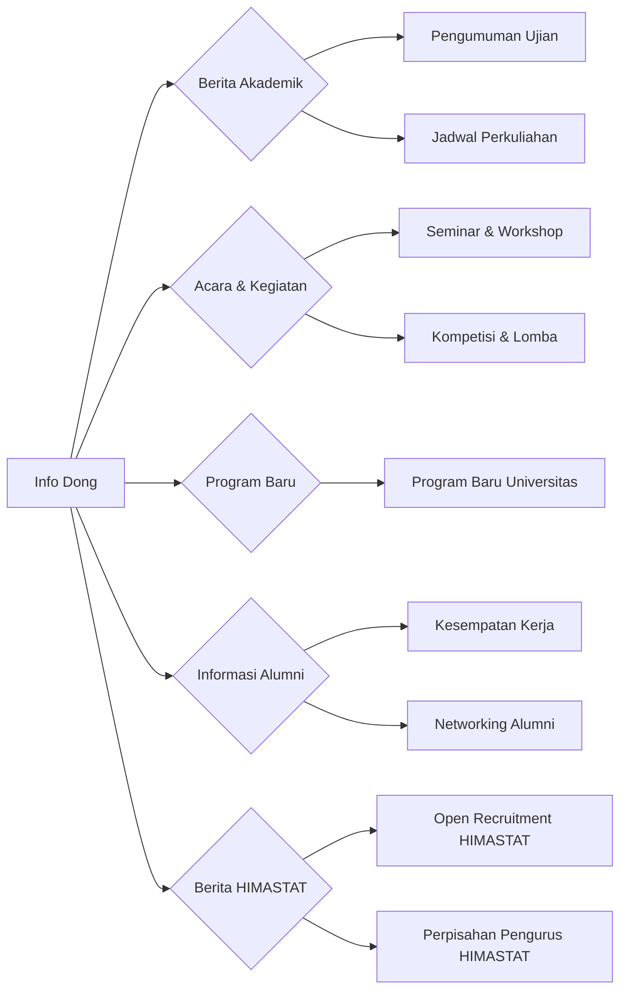

--- 
title: Info Dong - Informasi Terkini untuk Semua
index: true
icon: circle-question
category:
  - Info Dong
author:
  - name: "Firmansyah Mukti Wijaya"
    email: "ikimukti@gmail.com"
    url: "https://ikimukti.com"
  - name: "Himastatut Docs"
    email: "himastatut@gmail.com"
    url: "https://himastatut.my.id/article/"
--- 

# Info Dong - Informasi Terkini untuk Semua

Selamat datang di halaman **Info Dong**! Halaman ini adalah sumber informasi utama yang menyediakan update terkini mengenai **Universitas Terbuka**, **Fakultas Sains dan Teknologi**, **Program Studi Statistika**, dan **Himpunan Mahasiswa Statistika (HIMASTATUT)**. Di sini, Anda akan menemukan informasi yang bermanfaat mengenai perkuliahan, pengumuman program baru, serta acara-acara yang berkaitan dengan mahasiswa Statistika dan umum.

Halaman ini terbuka untuk **mahasiswa aktif**, **alumni**, dan **masyarakat umum** yang tertarik dengan perkembangan terbaru di lingkungan Universitas Terbuka, Fakultas Sains dan Teknologi, serta Program Studi Statistika.

## Gambaran Umum

Halaman **Info Dong** menyajikan berbagai informasi terkini yang relevan untuk semua kalangan, dari mahasiswa aktif hingga alumni, serta masyarakat yang ingin mengetahui lebih lanjut tentang perkembangan dalam dunia pendidikan dan kegiatan yang ada di Universitas Terbuka, khususnya di Program Studi Statistika. Kami menyediakan update acara, pengumuman akademik, serta berbagai informasi yang mendukung kehidupan perkuliahan dan pengembangan diri mahasiswa.

## Tujuan

- Menyediakan informasi terkini mengenai program studi, kegiatan akademik, serta pengumuman penting dari Universitas Terbuka dan Fakultas Sains dan Teknologi.
- Memberikan informasi tentang acara, seminar, workshop, atau kompetisi yang relevan untuk mahasiswa dan alumni Statistika.
- Menyampaikan berita tentang program-program baru dan pengembangan lainnya yang terjadi di lingkungan kampus.

## Kategori

Halaman **Info Dong** dibagi menjadi beberapa kategori untuk memudahkan pencarian informasi. Pilih kategori yang sesuai dengan kebutuhan Anda:

- **Berita Akademik**: Pengumuman terkini terkait perkuliahan, ujian, dan program akademik lainnya.
- **Acara & Kegiatan**: Informasi tentang seminar, workshop, kompetisi, dan acara lain yang relevan dengan mahasiswa dan alumni.
- **Program Baru**: Update mengenai program-program terbaru yang ditawarkan oleh Universitas Terbuka atau Program Studi Statistika.
- **Informasi Alumni**: Berita dan update yang relevan untuk alumni, termasuk kesempatan kerja, networking, dan acara alumni.
- **Berita HIMASTAT**: Berita mengenai kegiatan-kegiatan yang dilakukan oleh Himpunan Mahasiswa Statistika Universitas Terbuka, termasuk open recruitment, perpisahan pengurus, dan acara lainnya yang relevan.

## Struktur Halaman

<Catalog />

### Tabulasi Kategori

::: tabs
@tab Berita Akademik
- Pengumuman perkuliahan terbaru, jadwal ujian, dan informasi akademik lainnya.

@tab Acara & Kegiatan
- Informasi mengenai seminar, lomba, workshop, dan acara yang dapat membantu pengembangan akademik dan karir mahasiswa.

@tab Program Baru
- Informasi mengenai program baru yang tersedia di Universitas Terbuka atau Program Studi Statistika.

@tab Informasi Alumni
- Update untuk alumni, termasuk acara reuni, kesempatan kerja, dan kegiatan lain yang relevan.

@tab Berita HIMASTAT
- Kegiatan dan berita dari Himpunan Mahasiswa Statistika Universitas Terbuka, seperti open recruitment, perpisahan pengurus, dan kegiatan lainnya.
:::

## Informasi Penting

::: tip
Jangan lewatkan informasi terbaru mengenai kegiatan akademik dan acara yang diadakan oleh HIMASTATUT dan Program Studi Statistika!
:::

::: warning
Pastikan Anda selalu mengikuti perkembangan terbaru dengan mengunjungi halaman ini secara berkala.
:::

## Visualisasi Panduan

Untuk memberikan gambaran yang lebih jelas tentang bagaimana konten di halaman ini diorganisasi, berikut adalah diagram alur struktur **Info Dong**:

<GitContributors />
<GitChangelog />