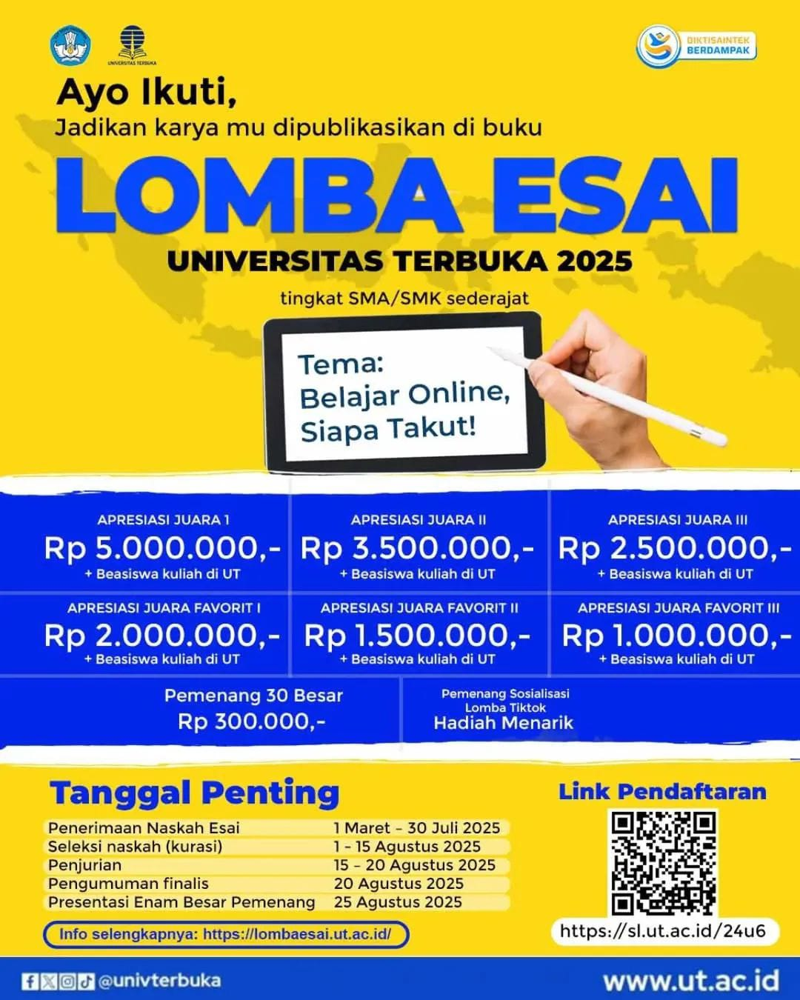

# ✍️ Lomba Esai Universitas Terbuka 2025: Belajar Online, Siapa Takut!

Halo siswa/siswi SMA/SMK sederajat di seluruh Indonesia! 👋

Punya ide cemerlang seputar dunia pendidikan digital? Saatnya tunjukkan kemampuan menulismu! Universitas Terbuka (UT), sebagai Perguruan Tinggi Negeri Berbadan Hukum (PTN-BH) dengan akreditasi institusi "A"[^3], kembali menyelenggarakan **Lomba Esai Universitas Terbuka 2025**.[^1]

Dengan tema yang relevan dan menantang, **"Belajar Online, Siapa Takut!"**, kompetisi ini menjadi wadah untuk menyuarakan gagasan, sekaligus menjadi instrumen strategis UT dalam menjaring talenta muda Indonesia.[^1]

## 🏆 Apresiasi & Beasiswa

Menangkan total dana apresiasi jutaan rupiah dan kesempatan emas meraih beasiswa kuliah di Universitas Terbuka![^1]

-   **Juara I**: Rp 5.000.000,- + Beasiswa Kuliah di UT
-   **Juara II**: Rp 3.500.000,- + Beasiswa Kuliah di UT
-   **Juara III**: Rp 2.500.000,- + Beasiswa Kuliah di UT
-   **Juara Favorit I**: Rp 2.000.000,- + Beasiswa Kuliah di UT
-   **Juara Favorit II**: Rp 1.500.000,- + Beasiswa Kuliah di UT
-   **Juara Favorit III**: Rp 1.000.000,- + Beasiswa Kuliah di UT
-   **30 Karya Terbaik**: Apresiasi masing-masing Rp 300.000,-
-   Hadiah menarik untuk **Pemenang Sosialisasi Lomba TikTok**.

## 🗓️ Tanggal Penting

Catat linimasa penting berikut agar kamu tidak ketinggalan![^1]

-   **Penerimaan Naskah Esai**: 1 Maret - 30 Juli 2025
-   **Seleksi Naskah (Kurasi)**: 1 - 15 Agustus 2025
-   **Penjurian**: 15 - 20 Agustus 2025
-   **Pengumuman Finalis**: 20 Agustus 2025
-   **Presentasi Enam Besar Pemenang**: 25 Agustus 2025

## ✅ Syarat & Ketentuan

-   **Peserta**: Siswa/siswi aktif tingkat SMA/SMK/sederajat, baik individu maupun kelompok (maksimal 3 orang).[^1]
-   **Karya**: Esai harus asli, belum pernah dipublikasikan, dan sesuai tema dengan panjang 750-1.100 kata.[^1]
-   **Promosi**: Peserta wajib mengunggah ulang pamflet lomba di media sosial pribadi dengan tagar #lombaesaiUT2025 dan menandai akun IG & TikTok @lombaesai_ut.[^1]

## 🚀 Cara Mendaftar

1.  Kunjungi situs informasi resmi di **[lombaesai.ut.ac.id](https://lombaesai.ut.ac.id/)** untuk mengunduh templat dan surat pernyataan orisinalitas.[^1]
2.  Lakukan pendaftaran dan unggah naskah esaimu melalui tautan: **[https://sl.ut.ac.id/24u6](https://sl.ut.ac.id/24u6)**.[^4]
3.  Pastikan semua persyaratan, termasuk bukti unggah di media sosial, telah terpenuhi.

Gaskeun daftar sekarang juga dan jadilah bagian dari generasi yang berani menyuarakan gagasan!

---

**#lombaesaiUT2025 #UniversitasTerbuka #LombaEsai #LombaSMA #BeasiswaKuliah #InfoLomba #Menulis**

[^1]: "Lomba Esai Universitas Terbuka 2025," Universitas Terbuka, [Online]. Tersedia: [http://lombaesai.ut.ac.id/](http://lombaesai.ut.ac.id/).
[^2]: "Situs Web Resmi Universitas Terbuka," Universitas Terbuka, [Online]. Tersedia: [https://www.ut.ac.id/](https://www.ut.ac.id/).
[^3]: "Akreditasi Universitas Terbuka," Universitas Terbuka, [Online]. Tersedia: [https://www.ut.ac.id/akreditasi/](https://www.ut.ac.id/akreditasi/).
[^4]: "Tautan Pendaftaran Lomba Esai UT 2025," Universitas Terbuka, [Online]. Tersedia: [https://sl.ut.ac.id/24u6](https://sl.ut.ac.id/24u6).

## Bagikan
<Share colorful />
<GitContributors />
<GitChangelog />