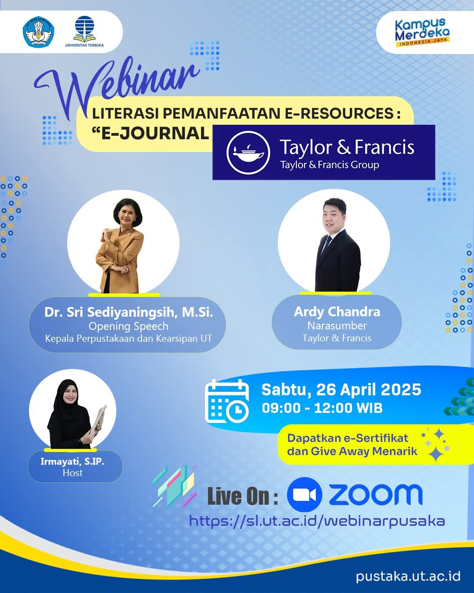

# Webinar Literasi Pemanfaatan Akses E-Resources Perpustakaan UT "e-Journal Taylor & Francis"

**Yuk ikuti acara Webinar Literasi Pemanfaatan Akses E-Resources Perpustakaan UT "e-Journal Taylor & Francis"** yang akan menghadirkan narasumber profesional dan penuh wawasan!

Acara ini akan dibuka oleh **Dr. Sri Sediyaningsih M.Si**, Kepala Perpustakaan dan Kearsipan Universitas Terbuka, dan akan dipandu oleh **Irmayati, S.IP** sebagai host yang akan memandu jalannya acara. Sementara itu, **Ardy Chandra** akan menjadi narasumber utama yang akan membahas pemanfaatan akses e-resources di perpustakaan digital[^1] [^2] [^3].

## Catat Tanggal Pentingnya

🗓️ **Sabtu, 26 April 2025**  
⏳ **09.00-12.00 WIB**  
💻 **Zoom meeting pada link berikut**: [https://sl.ut.ac.id/webinarpusaka](https://sl.ut.ac.id/webinarpusaka)

### Mengapa Anda Harus Mengikuti Webinar Ini?

- **E-Resources** menjadi kunci dalam memperkaya sumber belajar dan riset di era digital.
- Dapatkan **e-sertifikat** sebagai bukti partisipasi yang dapat memperkuat CV Anda.
- Banyak **giveaway menarik** untuk peserta yang aktif selama webinar.

Acara ini cocok untuk Anda yang ingin mengetahui lebih dalam tentang **e-journal** dan bagaimana memanfaatkannya untuk keperluan akademik maupun penelitian. Jangan lewatkan kesempatan untuk memperluas pengetahuan Anda dalam dunia perpustakaan digital dan akses jurnal internasional!

## Pengisi Acara

- **Dr. Sri Sediyaningsih M.Si**: Kepala Perpustakaan dan Kearsipan Universitas Terbuka (Opening Speech)
- **Ardy Chandra**: Narasumber yang akan memaparkan materi utama tentang akses e-resources.
- **Irmayati, S.IP**: Host yang akan memandu acara dengan penuh semangat dan interaktif.

## Detail Acara

- **Tanggal**: Sabtu, 26 April 2025
- **Waktu**: 09.00 - 12.00 WIB
- **Tempat**: Zoom (Link: [https://sl.ut.ac.id/webinarpusaka](https://sl.ut.ac.id/webinarpusaka))

### Gambar Acara

---

[^1]: "Yuk ikuti acara Webinar Literasi Pemanfaatan Akses E-Resources Perpustakaan UT 'e-Journal Taylor & Francis'," Instagram, [Online]. Tersedia: [https://www.instagram.com/p/DIssMeTTraB/](https://www.instagram.com/p/DIssMeTTraB/). [Diakses: Apr. 23, 2025].
[^2]: "Yuk ikuti acara Webinar Literasi Pemanfaatan Akses E-Resources Perpustakaan UT 'e-Journal Taylor & Francis'," Facebook, [Online]. Tersedia: [https://www.facebook.com/perpustakaan.univterbuka/photos/yuk-ikuti-acara-webinar-literasi-pemanfaatan-akses-e-resources-perpustakaan-ut-e/1203843478195146/](https://www.facebook.com/perpustakaan.univterbuka/photos/yuk-ikuti-acara-webinar-literasi-pemanfaatan-akses-e-resources-perpustakaan-ut-e/1203843478195146/). [Diakses: Apr. 23, 2025].
[^3]: "Yuk ikuti acara Webinar Literasi Pemanfaatan Akses E-Resources Perpustakaan UT 'e-Journal Taylor & Francis'," Instagram, [Online]. Tersedia: [https://www.instagram.com/p/DIs236YSeN6/](https://www.instagram.com/p/DIs236YSeN6/). [Diakses: Apr. 23, 2025].

## Bagikan

<Share colorful />
<GitContributors />
<GitChangelog />