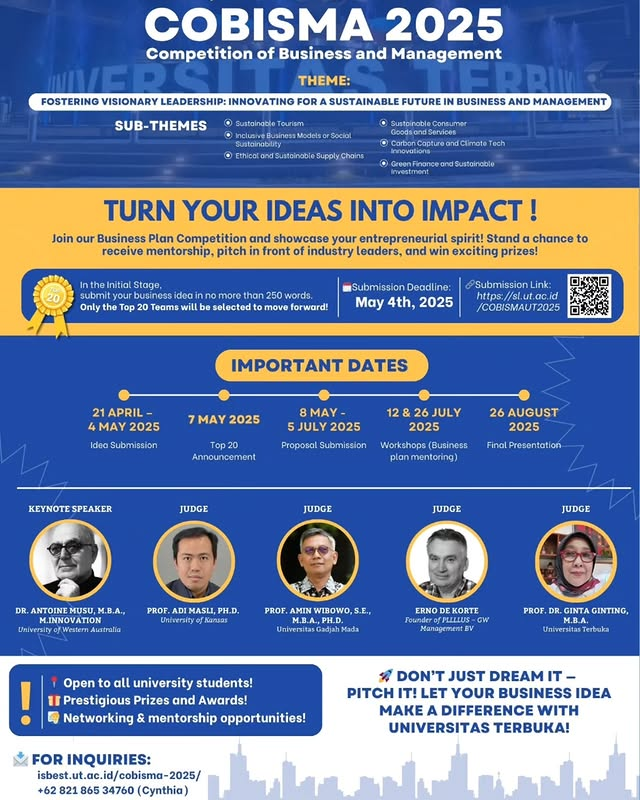

# 🏆 COBISMA 2025 - Kompetisi Bisnis dan Manajemen 2025
## Tema: "Menumbuhkan Kepemimpinan Visioner: Berinovasi untuk Masa Depan Berkelanjutan dalam Bisnis dan Manajemen"

Halo Sahabat UT! 🌟

Universitas Terbuka dengan bangga mempersembahkan **COBISMA 2025 - Kompetisi Bisnis dan Manajemen** dengan tema **"Menumbuhkan Kepemimpinan Visioner: Berinovasi untuk Masa Depan Berkelanjutan dalam Bisnis dan Manajemen"**. Kompetisi ini memberikan kesempatan kepada para mahasiswa, praktisi bisnis, dan pemikir muda untuk menyumbangkan ide bisnis inovatif yang dapat berkontribusi pada keberlanjutan masa depan [^1] [^2]. 🎓

## 📅 Tanggal Penting
- **Pendaftaran & Pengiriman Ide Bisnis**: 21 April – 4 Mei 2025
- **Pengumuman Ide Bisnis yang Terpilih**: 7 Mei 2025
- **Pengiriman Proposal**: 8 Mei - 5 Juli 2025
- **Workshop 1**: 12 Juli 2025
- **Workshop 2**: 26 Juli 2025
- **Presentasi Final**: 26 Agustus 2025
- **Pengumuman Pemenang**: 27 Agustus 2025

## 💬 Sub-Tema:
- Pariwisata Berkelanjutan
- Model Bisnis Inklusif atau Keberlanjutan Sosial
- Rantai Pasokan Etis dan Berkelanjutan
- Barang dan Layanan Konsumen Berkelanjutan
- Penangkapan Karbon dan Inovasi Teknologi Iklim
- Keuangan Hijau dan Investasi Berkelanjutan

## 🎤 Pembicara Utama
- **Dr. Antoine Musu, M.B.A., M.Innovation** (University of Western Australia)

## 👨‍⚖️ Dewan Juri:
- **Prof. Adi Masli, Ph.D.** (University of Kansas)
- **Prof. Amin Wibowo, S.E., M.B.A., Ph.D.** (Universitas Gadjah Mada)
- **Erno de Korte** (Founder of PLLLLUS – GW Management BV)
- **Prof. Dr. Ginta Ginting, M.B.A.** (Universitas Terbuka)

## 📝 Tentang COBISMA 2025
COBISMA 2025 bertujuan untuk menumbuhkan kepemimpinan visioner dalam sektor bisnis dan manajemen, dengan fokus pada keberlanjutan. Acara ini menantang peserta untuk menghasilkan ide bisnis inovatif yang dapat mengatasi tantangan global yang mendesak. Apakah itu menangani perubahan iklim atau menciptakan model bisnis inklusif, COBISMA 2025 adalah platform untuk menginspirasi pemimpin bisnis masa depan.

## 📸 Poster Acara

## 🔗 Tautan Terkait
Untuk informasi lebih lanjut dan pembaruan terbaru, kunjungi:
- [Situs Resmi COBISMA 2025](https://isbest.ut.ac.id/cobisma-2025/)
- [Situs Web Universitas Terbuka](https://www.ut.ac.id)

## 📢 Sebarkan Berita Ini!
Bagikan kesempatan menarik ini dengan teman-teman dan kolega Anda. Gunakan tagar resmi kami untuk tetap terhubung:
- `#COBISMA2025`
- `#KepemimpinanVisioner`
- `#MasaDepanBerkelanjutan`

Kami menantikan ide inovatif Anda dan merayakan pemimpin visioner masa depan! 🌍

---
[^1]: "COBISMA - ISBEST," Website, [Online]. Tersedia: [https://isbest.ut.ac.id/cobisma-2025/](https://isbest.ut.ac.id/cobisma-2025/). [Diakses: Apr. 24, 2025].
[^2]: "Prodi Manajemen UT on Instagram: ‘COBISMA 2025-COMPETITION OF BUSINESS AND MANAGEMENT 2025," Instagram, [Online]. Tersedia: [https://www.instagram.com/p/DIxmWojTKWn/](https://www.instagram.com/p/DIxmWojTKWn/). [Diakses: Apr. 24, 2025].‌

## Bagikan
<Share colorful />
<GitContributors />
<GitChangelog />
