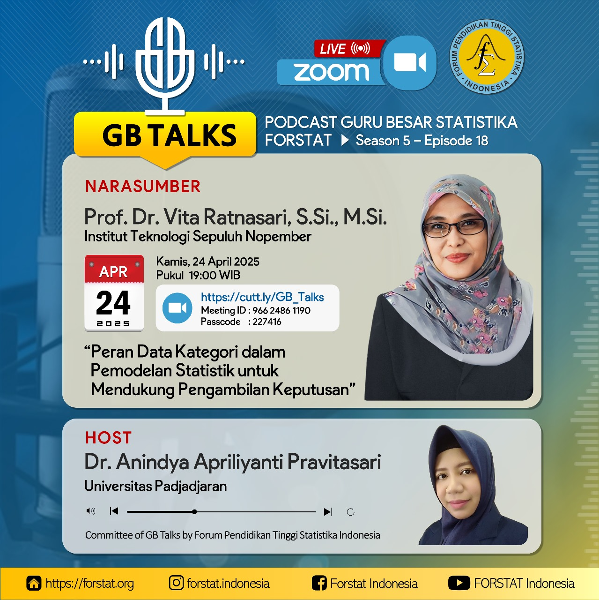

# 🎙️ GB TALKS Season 5 Episode 18
## Tema: "Peran Data Kategori dalam Pemodelan Statistik untuk Mendukung Pengambilan Keputusan"

Halo Sahabat Statistik! 📊

GB TALKS kembali hadir dengan episode spesial! Kali ini, kami mengangkat tema **"Peran Data Kategori dalam Pemodelan Statistik untuk Mendukung Pengambilan Keputusan"**. Jangan lewatkan kesempatan untuk mendengarkan wawasan mendalam dari para ahli di bidang statistik [^1] [^2]. 🎓

## 📅 Detail Acara
- **Tanggal**: Kamis, 24 April 2025
- **Waktu**: 19.00 WIB - Selesai
- **Platform**: Zoom Meeting
- **Link Zoom**: [https://cutt.ly/GB_Talks](https://cutt.ly/GB_Talks)
- **Meeting ID**: 966 2486 1190
- **Passcode**: 227416

## 🎙 Narasumber
- **Prof. Dr. Vita Ratnasari, S.Si., M.Si.**: Profesor di bidang Statistika dari Institut Teknologi Sepuluh Nopember (ITS) [^3].
- **Dr. Anindya Apriliyanti Pravitasari**: Dosen Fakultas MIPA Universitas Padjadjaran (Unpad)[^4].

## 📝 Tentang Tema
Tema kali ini membahas pentingnya pemahaman terhadap data kategori dalam proses pemodelan statistik, serta bagaimana hal tersebut dapat mendukung pengambilan keputusan yang lebih akurat dan efektif di berbagai sektor.

## 🎁 Benefit
- **E-Sertifikat**: Dapatkan sertifikat elektronik sebagai bukti partisipasi.
- **Materi Eksklusif**: Akses materi presentasi dari narasumber.
- **Networking**: Kesempatan untuk berinteraksi dengan para profesional dan akademisi di bidang statistik.

## 📸 Gambar Acara

## 🔗 Tautan Terkait
Untuk informasi lebih lanjut dan pembaruan terkini, kunjungi:
- [Instagram FORSTAT Indonesia](https://www.instagram.com/forstat.indonesia/)
- [Website Resmi FORSTAT Indonesia](https://forstat.id)

## 📢 Sebarkan Berita Ini!
Bagikan kesempatan menarik ini dengan teman-teman dan kolega Anda. Gunakan tagar resmi kami untuk tetap terhubung:
- `#GBTALKS18`
- `#StatistikIndonesia`
- `#PemodelanStatistik`

Kami menantikan partisipasi Anda dalam acara ini! 🌟

[^1]: "GB TALKS Season 5 Episode 18 - 'Peran Data Kategori dalam Pemodelan Statistik untuk Mendukung Pengambilan Keputusan'," Instagram, [Online]. Tersedia: [https://www.instagram.com/p/DIs2mh8ypHp/](https://www.instagram.com/p/DIs2mh8ypHp/). [Diakses: Apr. 24, 2025].
[^2]: "FORSTAT Indonesia Official Instagram," Instagram, [Online]. Tersedia: [https://www.instagram.com/forstat.indonesia/](https://www.instagram.com/forstat.indonesia/). [Diakses: Apr. 24, 2025].
[^3]: "Global Business Talk - Institut Teknologi Sepuluh Nopember," ITS, [Online]. Tersedia: [https://www.its.ac.id/international/e-program/global-business-talk/](https://www.its.ac.id/international/e-program/global-business-talk/). [Diakses: Apr. 24, 2025].
[^4]: "Peneliti Unpad Bikin Nenomimo, Pengubah Citra MRI Jadi 3 Dimensi," Medcom, [Online]. Tersedia: [https://www.medcom.id/pendidikan/riset-penelitian/yNL1L7yb-peneliti-unpad-bikin-nenomimo-pengubah-citra-mri-jadi-3-dimensi](https://www.medcom.id/pendidikan/riset-penelitian/yNL1L7yb-peneliti-unpad-bikin-nenomimo-pengubah-citra-mri-jadi-3-dimensi). [Diakses: Apr. 24, 2025].

<Share colorful />
<GitContributors />
<GitChangelog />
