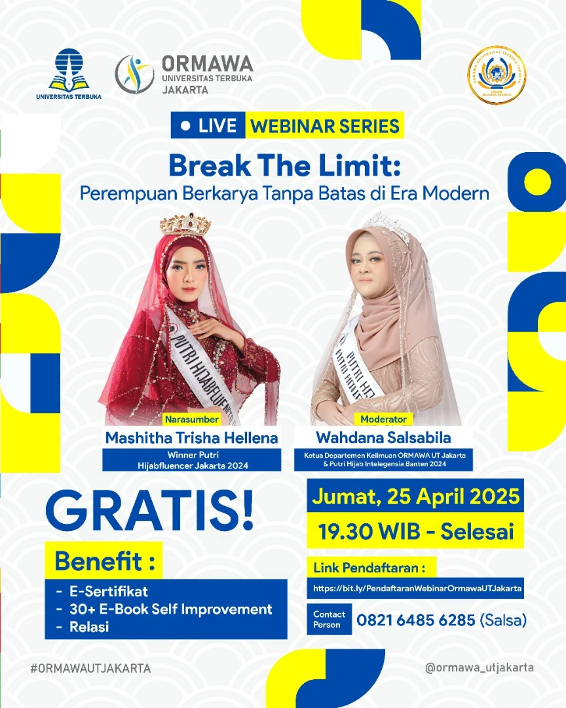

# 🌟 Webinar Series Perempuan Inspiratif 🌟
## Tema: "Break The Limit: Perempuan Berkarya Tanpa Batas di Era Modern"

Saatnya kamu jadi bagian dari generasi perempuan yang berani, cerdas, dan berdampak! 💪✨

Jangan lewatkan kesempatan untuk mengikuti **Webinar Series Perempuan Inspiratif** yang akan membahas bagaimana perempuan dapat berkarya tanpa batas di era modern. Acara ini akan memberikan wawasan baru dan inspirasi dari dua tokoh perempuan luar biasa [^1]. 🎉

## 📅 Tanggal dan Waktu
- **Tanggal**: Jumat, 25 April 2025
- **Waktu**: 19.30 WIB - Selesai
- **Platform**: Via Zoom
- **Link Pendaftaran**: [Daftar sekarang](https://bit.ly/PendaftaranWebinarOrmawaUTJakarta)

## 🎙 Narasumber
- **Mashitha Trisha Hellena**: Winner Putri Hijabfluencer Jakarta 2024
- **Wahdana Salsabila**: Ketua Departemen Keilmuan ORMAWA UT Jakarta, Putri Hijab Intelegensia Banten 2024

## 🎁 Benefit:
- ✅ E-Sertifikat
- ✅ 30+ E-Book Self Improvement
- ✅ Relasi dan Wawasan Baru

## 📱 CP: 
- **Salsa**: 0821 6485 6285

## 📝 Tentang Acara
Webinar ini merupakan kesempatan bagi kamu untuk belajar dan terinspirasi oleh dua sosok perempuan yang telah berhasil membangun karier mereka dengan penuh semangat dan dedikasi. Dapatkan wawasan baru, bangun koneksi, dan jangan lewatkan momen penuh inspirasi ini!

## 📸 Gambar Acara

## 🔗 Tautan Terkait
Untuk informasi lebih lanjut dan pembaruan terbaru, kunjungi:
- [Instagram ORMAWA UT Jakarta](https://www.instagram.com/ormawautjakarta/)
- [Situs Web Universitas Terbuka](https://www.ut.ac.id)

## 📢 Sebarkan Berita Ini!
Bagikan informasi ini kepada teman-teman perempuanmu dan ajak mereka untuk tumbuh bersama! Gunakan tagar resmi kami untuk tetap terhubung:
- `#BreakTheLimit`
- `#WebinarPerempuanHebat`
- `#OrmawaUTJakarta`
- `#UTJakarta`
- `#SelfImprovement`
- `#Hijabfluencer`
- `#KartiniMasaKini`
- `#PerempuanBerkarya`
- `#WebinarGratis`

Sampai jumpa di webinar! 🌸

---
[^1]: "Organisasi Mahasiswa Universitas Terbuka Jakarta di Instagram: ‘. 🌟 WEBINAR SERIES PEREMPUAN INSPIRATIF 🌟 🚺 Break The Limit: Perempuan Berkarya Tanpa Batas di Era Modern Saatnya kamu jadi bagian dari generasi perempuan yang berani, cerdas, dan berdampak!," Instagram, [Online]. Tersedia: [https://www.instagram.com/p/DI0QG9lyCmM/](https://www.instagram.com/p/DI0QG9lyCmM/). [Diakses: Apr. 24, 2025].

## Bagikan
<Share colorful />
<GitContributors />
<GitChangelog />
