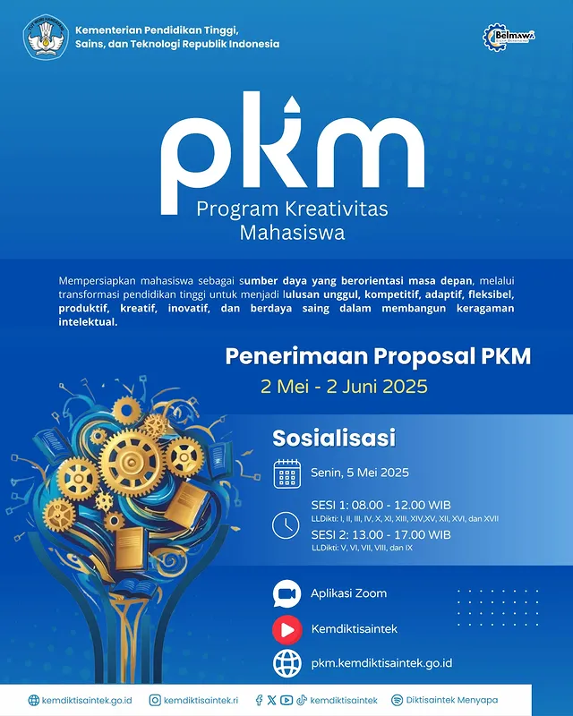

# 🌟 Program Kreativitas Mahasiswa (PKM) Tahun 2025: Penerimaan Proposal PKM

🗓 **Tanggal Penerimaan Proposal**: 2 Mei – 2 Juni 2025  
⏰ **Sosialisasi PKM**: Senin, 5 Mei 2025  
📍 **Platform**: Zoom  
🔗 **Link Pendaftaran Sosialisasi**: [Daftar Sekarang](https://zoom.us/j/1234567890)  

## 📝 Deskripsi Acara:
Program Kreativitas Mahasiswa (PKM) Tahun 2025 telah dibuka untuk penerimaan proposal yang dimulai dari **2 Mei 2025 hingga 2 Juni 2025**. PKM adalah program tahunan yang bertujuan untuk mengembangkan ide-ide kreatif, inovatif, dan solutif mahasiswa yang dapat memberikan kontribusi positif bagi masyarakat dan negara [^1].

Melalui PKM, mahasiswa dapat mengajukan proposal dalam berbagai skema yang meliputi riset, kewirausahaan, pengabdian masyarakat, serta pengembangan inovasi teknologi yang bermanfaat untuk kehidupan sehari-hari. PKM 2025 tidak hanya menjadi wadah untuk menyalurkan kreativitas mahasiswa, tetapi juga bertujuan untuk menciptakan lulusan yang kompetitif, adaptif, produktif, dan berdaya saing global [^2].

### 📅 Jadwal Sosialisasi PKM:
- **Sesi 1**: 08.00 – 12.00 WIB (LLDikti: I, II, III, IV, X, XI, XIII, XV, XVI, XVII)
- **Sesi 2**: 13.00 – 17.00 WIB (LLDikti: V, VI, VII, VIII, IX)

## 🎯 Tujuan PKM:
Program ini bertujuan untuk mempersiapkan mahasiswa sebagai sumber daya yang berorientasi pada masa depan dengan menumbuhkan ide-ide kreatif yang berbasis sains dan teknologi. Selain itu, PKM bertujuan untuk [^3]:
1. Meningkatkan keterampilan mahasiswa dalam pengelolaan proyek.
2. Mendorong terbentuknya budaya riset dan inovasi di kalangan mahasiswa.
3. Membantu mahasiswa untuk mengembangkan kemampuan wirausaha dan memberikan solusi nyata bagi masyarakat melalui penerapan teknologi yang inovatif.

## 🔍 Jenis Kegiatan PKM 2025:
Terdapat beberapa jenis kegiatan dalam PKM 2025 yang dapat diikuti oleh mahasiswa, antara lain:
1. **PKM Riset Eksakta (PKM-RE)**: Fokus pada penelitian dalam bidang eksakta untuk menghasilkan temuan yang baru dan inovatif.
2. **PKM Riset Sosial Humaniora (PKM-RSH)**: Penelitian dalam bidang sosial dan humaniora yang bertujuan untuk menjawab tantangan masyarakat.
3. **PKM Kewirausahaan (PKM-K)**: Pengembangan ide wirausaha yang berbasis pada teknologi dan inovasi.
4. **PKM Pengabdian Kepada Masyarakat (PKM-PM)**: Penerapan ilmu pengetahuan dan teknologi untuk membantu masyarakat dalam memecahkan masalah sosial.
5. **PKM Penerapan Iptek (PKM-PI)**: Pengembangan teknologi yang dapat memberikan dampak langsung kepada masyarakat atau dunia industri.
6. **PKM Karsa Cipta (PKM-KC)**: Karya inovatif berupa produk atau sistem yang bisa digunakan dalam kehidupan sehari-hari.
7. **PKM Karya Inovatif (PKM-KI)**: Menciptakan karya inovatif berbasis teknologi yang dapat diproduksi secara massal.
8. **PKM Video Gagasan Konstruktif (PKM-VGK)**: Membuat video yang berisi gagasan dan solusi untuk masalah sosial atau global.

## 📅 Alur Pengajuan Proposal PKM 2025 [^4]:
1. **Sosialisasi PKM 2025**: 6–7 Mei 2025
2. **Perguruan tinggi melakukan seleksi internal**: 1–23 Mei 2025
3. **Pengajuan Proposal oleh Mahasiswa**: 2 Mei – 2 Juni 2025
4. **Seleksi dan Penilaian Proposal**: 4 Juni – 10 Juni 2025
5. **Pengumuman Hasil Seleksi**: 15 Juni 2025
6. **Pelaksanaan PKM**: 1 Juli – 31 Desember 2025

## 🎁 E-sertifikat:
Peserta yang mengikuti sosialisasi dan mengisi formulir umpan balik setelah acara akan mendapatkan **E-sertifikat** sebagai tanda partisipasi dalam kegiatan ini.

---

## 📸 Gambar Acara

---

## 📋 Agenda:
1. **Pembukaan Sosialisasi oleh Kementerian Pendidikan, Sains, dan Teknologi Republik Indonesia**  
   Pembukaan resmi untuk penerimaan proposal PKM dan pengenalan skema kegiatan PKM 2025
2. **Pemaparan Program PKM Tahun 2025**  
   Penjelasan mengenai jenis kegiatan PKM, cara pengajuan proposal, serta panduan teknis untuk pengusulan
3. **Sesi Tanya Jawab**  
   Diskusi interaktif tentang proses pengajuan proposal, kendala yang sering dihadapi, dan tips sukses dalam pengajuan PKM

---

## 🎉 Pendaftaran:
Untuk mengikuti sosialisasi PKM dan mengetahui lebih lanjut, mahasiswa dapat mendaftar melalui platform Zoom yang telah disediakan. Jangan lewatkan kesempatan untuk mendapatkan informasi yang berguna agar proposal PKM Anda dapat diterima dan didanai.

---

**Kontak**:  
- **Email**: [kemahasiswaan@kemendikbud.go.id](mailto:kemahasiswaan@kemendikbud.go.id)  
- **Website**: [www.kemdikbud.go.id](https://kemdikbud.go.id)

#PKM2025 #ProgramKreativitasMahasiswa #Belmawa #Kemendikbud #MahasiswaIndonesia #Inovasi #KreativitasMahasiswa

---

[^1]: "Tahap Pengajuan Proposal PKM Tahun 2025," Akamawa UNUSA, [Online]. Tersedia: [https://akamawa.unusa.ac.id/tahap-pengajuan-proposal-pkm-tahun-2025/](https://akamawa.unusa.ac.id/tahap-pengajuan-proposal-pkm-tahun-2025/). [Diakses: Mei 2, 2025].  
[^2]: "Instagram Post - PKM 2025," Instagram, [Online]. Tersedia: [https://www.instagram.com/p/DJKRncETmch/](https://www.instagram.com/p/DJKRncETmch/). [Diakses: Mei 2, 2025].  
[^3]: "Instagram Reel - PKM 2025," Instagram, [Online]. Tersedia: [https://www.instagram.com/reel/DJJ81T5ptT-/](https://www.instagram.com/reel/DJJ81T5ptT-/). [Diakses: Mei 2, 2025].  
[^4]: "Instagram Post - PKM 2025," Instagram, [Online]. Tersedia: [https://www.instagram.com/p/DJI3-1thdvE/](https://www.instagram.com/p/DJI3-1thdvE/). [Diakses: Mei 2, 2025].

## Bagikan
<Share colorful />
<GitContributors />
<GitChangelog />
