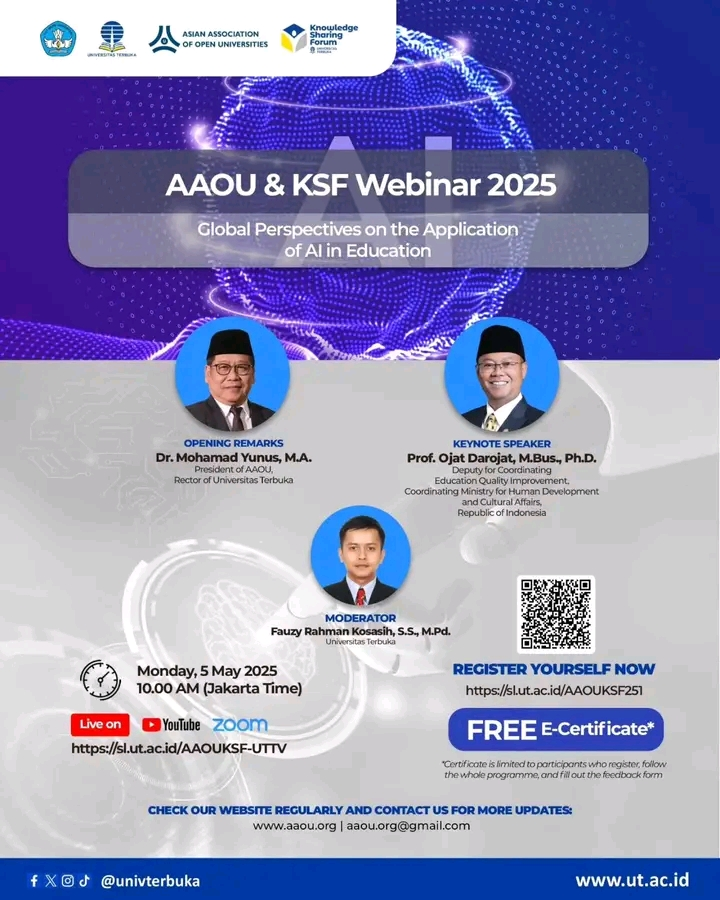

# 🌐 AAOU x KSF Webinar 2025: Global Perspectives on the Application of AI in Education

🗓 **Tanggal**: Senin, 5 Mei 2025  
⏰ **Waktu**: Pukul 10.00 WIB  
📍 **Platform**: Zoom & YouTube (Live)  
🔗 **Link Pendaftaran**: [Daftar Sekarang](https://sl.ut.ac.id/AAOUKSF251)

🎤 **Pembicara Kunci**:  
- **Prof. Ojat Darojat, M.Bus., Ph.D.**  
  Deputi Bidang Koordinasi Peningkatan Kualitas Pendidikan dan Moderasi Beragama, Kemenko PMK RI

🧑‍💼 **Moderator**:  
- **Fauzy Rahman Kosasih, S.S., M.Pd.**  
  Universitas Terbuka

🎙 **Sambutan Pembuka**:  
- **Dr. Mohamad Yunus, M.A.**  
  Presiden AAOU & Rektor Universitas Terbuka

---

## 📋 Deskripsi Acara:
Webinar ini akan membahas **peran Kecerdasan Buatan (AI)** dalam **transformasi pendidikan global**. Di tengah perubahan besar di dunia pendidikan, AI menawarkan potensi besar untuk meningkatkan kualitas pembelajaran, manajemen pendidikan, dan aksesibilitas pendidikan tinggi. Melalui kolaborasi AAOU dan KSF UT, acara ini mengundang para ahli untuk memberikan wawasan terkait penerapan AI dalam dunia pendidikan terbuka dan jarak jauh [^1] [^2] [^3] [^4] [^5].

---

## 📸 Gambar Acara

---

## 📅 Agenda:
1. **Pembukaan oleh Dr. Mohamad Yunus, M.A.**  
   Presiden AAOU & Rektor Universitas Terbuka  
2. **Keynote Speech oleh Prof. Ojat Darojat, M.Bus., Ph.D.**  
   Pembahasan tentang AI dalam Pendidikan  
3. **Diskusi Panel**  
   Mendalami perspektif global dalam implementasi AI di pendidikan  
4. **Tanya Jawab**  
   Sesi interaktif dengan peserta webinar

---

## 🎁 E-sertifikat:
Peserta yang mendaftar dan mengisi formulir umpan balik setelah acara akan mendapatkan **E-sertifikat**.

---

Kami mengundang Anda untuk bergabung dalam acara **webinar kolaboratif ini** yang memberikan pandangan mendalam tentang **AI dalam pendidikan**. Segera daftar dan jangan lewatkan kesempatan untuk memperluas wawasan Anda!

---

**Kontak**:  
- **Email**: [kemahasiswaan@ut.ac.id](mailto:kemahasiswaan@ut.ac.id)  
- **Website**: [www.ut.ac.id](https://www.ut.ac.id)

#AIinEducation #AAOUWebinar #KSFUT #UniversitasTerbuka

---

[^1]: "AAOU x KSF Webinar 2025: Global Perspectives on the Application of AI in Education," Universitas Terbuka, [Online]. Tersedia: [https://sl.ut.ac.id/AAOUKSF251](https://sl.ut.ac.id/AAOUKSF251). [Diakses: Apr. 30, 2025].  
[^2]: "Website Resmi Universitas Terbuka," Universitas Terbuka, [Online]. Tersedia: [https://www.ut.ac.id](https://www.ut.ac.id). [Diakses: Apr. 30, 2025].  
[^3]: "AAOU & KSF Webinar 2025 – Global Perspectives on the Application of AI in Education," Instagram, [Online]. Tersedia: [https://www.instagram.com/p/DJGh6H7ysP8/](https://www.instagram.com/p/DJGh6H7ysP8/). [Diakses: Apr. 30, 2025].  
[^4]: "AAOU & KSF Webinar 2025 – AI in Education," Instagram, [Online]. Tersedia: [https://www.instagram.com/p/DJGDcesyjfH/](https://www.instagram.com/p/DJGDcesyjfH/). [Diakses: Apr. 30, 2025].  
[^5]: "AI for Education Webinars," AI for Education, [Online]. Tersedia: [https://www.aiforeducation.io/webinars](https://www.aiforeducation.io/webinars). [Diakses: Apr. 30, 2025].

## Bagikan
<Share colorful />
<GitContributors />
<GitChangelog />
