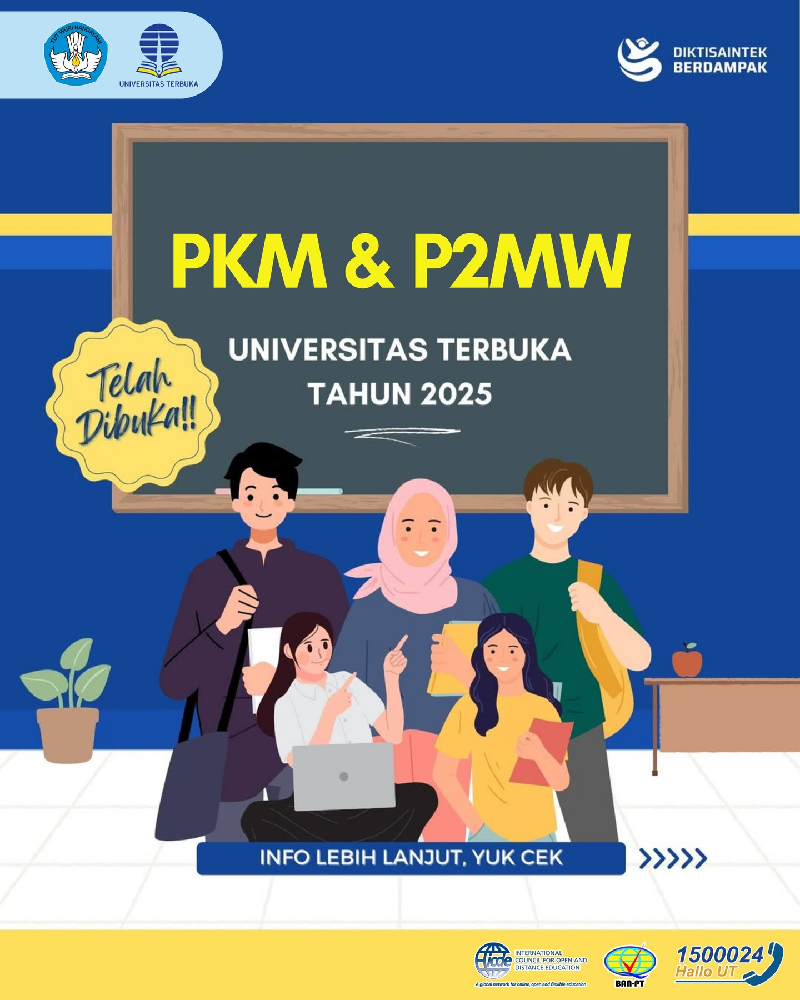

# 📚 PKM dan P2MW 2025

🌟 **Program Kreativitas Mahasiswa (PKM) dan Program Pembinaan Mahasiswa Wirausaha (P2MW) 2025**  
**Tanggal**: Mei – November 2025  
**Sosialisasi PKM**: 5 Mei 2025  
**Sosialisasi P2MW**: 6 Mei 2025  

Jangan lewatkan kesempatan untuk mengikuti **PKM 2025** dan **P2MW 2025** yang bertujuan untuk mengembangkan kreativitas dan keterampilan wirausaha mahasiswa Universitas Terbuka. Bergabunglah dalam acara yang membuka peluang besar untuk menambah wawasan dan pengalaman di dunia kewirausahaan [1^] [2^] [3^] [4^].

## Detail Kegiatan

### 📅 Tanggal Penting
- **PKM 2025**:  
  - **Sosialisasi**: 5 Mei 2025  
  - **Unggah Proposal**: 2 Mei – 2 Juni 2025  
  - **Pelaksanaan PKM Pendanaan**: 7 Juli – 3 November 2025  
  - **Pelaksanaan PIMNAS**: 23 – 28 November 2025  

- **P2MW 2025**:  
  - **Sosialisasi**: 6 Mei 2025  
  - **Penerimaan Proposal**: mulai 5 Mei  
  - **Unggah Proposal Terakhir**: 6 Juni 2025  
  - **Seleksi & Pengumuman**: Juni – Juli 2025  
  - **Pelaksanaan Program**: Juli – November 2025  

### 🎙 Pembicara
- **Ika Nur Laily Fitriana, M.Stat**: Dosen Program Studi Statistika, Fakultas Sains dan Teknologi, Universitas Terbuka.  

## Mengapa Acara Ini Penting?

Kegiatan ini sangat penting untuk mahasiswa yang ingin mengembangkan kreativitas melalui **PKM** dan memperdalam pengetahuan serta keterampilan di bidang kewirausahaan melalui **P2MW**. Jangan lewatkan kesempatan untuk mendapatkan pendanaan dan mentoring yang akan mendukung ide kreatif dan usaha Anda.

## Cara Mengikuti

1. **Melalui Website UT**:  
   - Kunjungi: [www.ut.ac.id](https://www.ut.ac.id) untuk informasi lebih lanjut.

2. **Melalui YouTube**:  
   - Tonton video sosialisasi PKM: [Tautan Video PKM](https://www.youtube.com/watch?v=4TKTG7RR1Gg)  
   - Tonton video sosialisasi P2MW: [Tautan Video P2MW](https://www.youtube.com/watch?v=wX_iJP-tKg0)

### 📝 Pendaftaran
- **Pendaftaran**: Klik [Link Pendaftaran PKM dan P2MW 2025](https://sl.ut.ac.id/PendaftaranPKMP2MW2025) untuk mengisi formulir dan mengunggah proposal.

## 📱 Kontak
- **Sarah Fadilla**: sarahf@ut.ac.id

## 📸 Poster Acara

---

**#PKM2025 #P2MW2025 #MahasiswaUT #Kewirausahaan #PKM #UniversitasTerbuka**

[1^]: "Program Kreativitas Mahasiswa (PKM) Universitas Terbuka 2025," Universitas Terbuka, [Online]. Tersedia: [https://www.ut.ac.id](https://www.ut.ac.id). [Diakses: Mei 5, 2025].  
[2^]: "Program Pembinaan Mahasiswa Wirausaha (P2MW) Universitas Terbuka 2025," Universitas Terbuka, [Online]. Tersedia: [https://www.ut.ac.id](https://www.ut.ac.id). [Diakses: Mei 5, 2025].  
[3^]: "Sosialisasi PKM dan P2MW 2025," YouTube, [Online]. Tersedia: [https://www.youtube.com/watch?v=4TKTG7RR1Gg](https://www.youtube.com/watch?v=4TKTG7RR1Gg). [Diakses: Mei 5, 2025].  
[4^]: "Sosialisasi P2MW 2025," YouTube, [Online]. Tersedia: [https://www.youtube.com/watch?v=wX_iJP-tKg0](https://www.youtube.com/watch?v=wX_iJP-tKg0). [Diakses: Mei 5, 2025].
[5^]: "Instagram Post PKM P2MW 2025," Instagram, [Online]. Tersedia: [https://www.instagram.com/p/DJ05-sgyQ26/](https://www.instagram.com/p/DJ05-sgyQ26/). [Diakses: Mei 5, 2025].

## Bagikan
<Share colorful />
<GitContributors />
<GitChangelog />