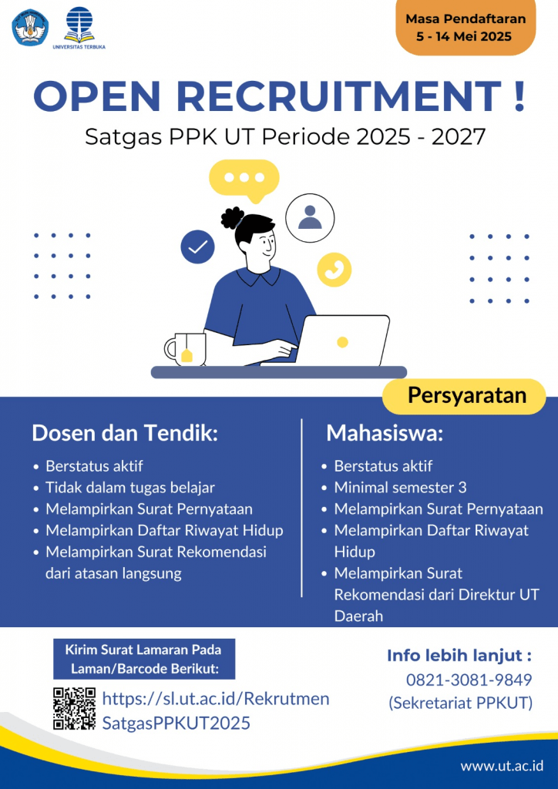

# Rekrutmen Satuan Tugas Pencegahan dan Penanganan Kekerasan (PPK) Universitas Terbuka 2025-2027

🎓 **Untuk Dosen, Tendik, dan Mahasiswa Universitas Terbuka**  

Kami mengundang Anda untuk bergabung dalam **Rekrutmen Satuan Tugas Pencegahan dan Penanganan Kekerasan (PPK)** di lingkungan Universitas Terbuka untuk periode **2025-2027**. Rekrutmen ini bertujuan untuk memperkuat upaya pencegahan dan penanganan kekerasan dalam perguruan tinggi [^1] [^2] [^3] [^4].

## Detail Kegiatan

### Tanggal Pendaftaran:
- **Periode Pendaftaran**: 5 – 14 Mei 2025

### Tahapan Seleksi:
1. **Sosialisasi & Penerimaan**: 5 – 14 Mei 2025  
   - Penerimaan formulir pendaftaran dan informasi lebih lanjut tentang proses rekrutmen.
   
2. **Seleksi Administrasi**: 15 – 20 Mei 2025  
   - Seleksi administratif dan penilaian dokumen yang diajukan oleh calon anggota Satgas PPK.
   
3. **Presentasi & Wawancara**: 26 – 28 Mei 2025  
   - Presentasi calon dan wawancara untuk menilai kelayakan calon sebagai anggota Satgas PPK.
   
4. **Pengumuman**: Juni 2025  
   - Pengumuman hasil seleksi dan penunjukan anggota Satgas PPK periode 2025-2027.

### Persyaratan Umum
- **Dosen dan Tendik**:
  - Berstatus aktif
  - Tidak dalam tugas belajar
  - Melampirkan surat pernyataan dan rekomendasi dari atasan langsung.
  
- **Mahasiswa**:
  - Berstatus aktif
  - Minimal semester 3
  - Melampirkan surat pernyataan dan rekomendasi dari Direktur UT Daerah.

## Cara Pendaftaran

1. **Daftar dan Unggah Dokumen**:  
   - Kunjungi [https://sl.ut.ac.id/RekrutmenSatgasPPKUT2025](https://sl.ut.ac.id/RekrutmenSatgasPPKUT2025) untuk mengunduh dan mengunggah formulir pendaftaran, surat pernyataan, dan dokumen lainnya.

2. **Proses Seleksi**:  
   - Setelah mengunggah dokumen, calon akan dipilih melalui seleksi administratif, presentasi, dan wawancara.

### Informasi Kontak:
- **Sekretariat PPK UT**: 0821-3081-9849

### Tautan Penting
- Halaman Rekrutmen:[https://sl.ut.ac.id/RekrutmenSatgasPPKUT2025](https://sl.ut.ac.id/RekrutmenSatgasPPKUT2025)
- Surat Lamaran: [https://sl.ut.ac.id/SuratLamaran](https://sl.ut.ac.id/SuratLamaran)
- Daftar Riwayat Hidup: [https://sl.ut.ac.id/DaftarRiwayatHidup](https://sl.ut.ac.id/DaftarRiwayatHidup)
- Surat Pernyataan Menjadi Anggota Satgas PPKUT 2025: [https://sl.ut.ac.id/SuratPernyataanMenjadiSatgasPPKUT2025](https://sl.ut.ac.id/SuratPernyataanMenjadiSatgasPPKUT2025)
- Surat Rekomendasi Menjadi Anggota Satgas PPKUT 2025 Bagi Dosen dan Tendik: [https://sl.ut.ac.id/SuratRekomendasiBagiDosenTendik1a](https://sl.ut.ac.id/SuratRekomendasiBagiDosenTendik1a)
- Surat Rekomendasi Menjadi Anggota Satgas PPKUT 2025 Bagi Mahasiswa: [https://sl.ut.ac.id/SuratRekomendasiMahasiswa1b](https://sl.ut.ac.id/SuratRekomendasiMahasiswa1b)

---

Untuk informasi lebih lanjut mengenai program Pencegahan dan Penanganan Kekerasan (PPK) di Perguruan Tinggi, silakan kunjungi [https://merdekadarikekerasan.kemdikbud.go.id/ppkpt/](https://merdekadarikekerasan.kemdikbud.go.id/ppkpt/).

---

Kami mengajak seluruh warga Universitas Terbuka untuk berpartisipasi dalam program ini dan bersama-sama menciptakan lingkungan akademik yang bebas dari kekerasan.

---

**#PPKUT2025 #RekrutmenSatgasPPK #UniversitasTerbuka #PencegahanKekerasan**

---

[^1]: "Rekrutmen Satuan Tugas Pencegahan dan Penanganan Kekerasan (PPK) Universitas Terbuka 2025-2027," Universitas Terbuka, [Online]. Tersedia: [https://www.ut.ac.id/pengumuman/2025/05/rekrutmen-satgas-ppk-ut-periode-2025-2027/](https://www.ut.ac.id/pengumuman/2025/05/rekrutmen-satgas-ppk-ut-periode-2025-2027/). [Diakses: Mei 5, 2025].
[^2]: "Rekrutmen Satuan Tugas PPK UT 2025 - Instagram Post," Universitas Terbuka, [Online]. Tersedia: [https://www.instagram.com/p/DJaicpxyRPS/](https://www.instagram.com/p/DJaicpxyRPS/). [Diakses: Mei 5, 2025].
[^3]: "Rekrutmen Satuan Tugas PPK UT 2025 - Facebook Video," Universitas Terbuka Majene, [Online]. Tersedia: [https://www.facebook.com/universitasterbuka.majene/videos/rekrutmen-satuan-tugas-pencegahan-dan-penanganan-kekerasan-ppk-di-lingkungan-per/1027473672245139/](https://www.facebook.com/universitasterbuka.majene/videos/rekrutmen-satuan-tugas-pencegahan-dan-penanganan-kekerasan-ppk-di-lingkungan-per/1027473672245139/). [Diakses: Mei 5, 2025].
[^4]: "Pemilihan Satuan Tugas PPK di Lingkungan Perguruan Tinggi Universitas Terbuka 2025-2027," Fakultas Hukum, Ilmu Sosial, dan Ilmu Politik Universitas Terbuka, [Online]. Tersedia: [https://fhisip.ut.ac.id/pemilihan-satuan-tugas-pencegahan-dan-penanganan-kekerasan-ppk-di-lingkungan-perguruan-tinggi-universitas-terbuka-periode-2025-2027/](https://fhisip.ut.ac.id/pemilihan-satuan-tugas-pencegahan-dan-penanganan-kekerasan-ppk-di-lingkungan-perguruan-tinggi-universitas-terbuka-periode-2025-2027/). [Diakses: Mei 5, 202]()

## Bagikan
<Share colorful />
<GitContributors />
<GitChangelog />