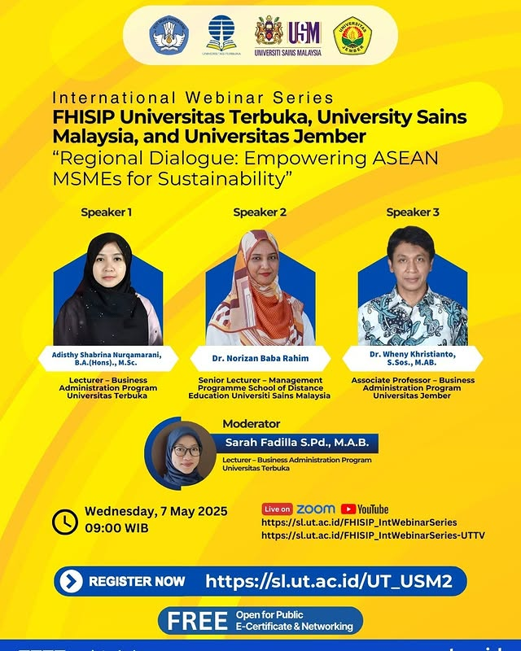

# 🌍 Webinar Internasional: Empowering ASEAN MSMEs for Sustainability 🌱

Bergabunglah dalam **Webinar Internasional** yang diselenggarakan oleh **FHISIP Universitas Terbuka**, **University Sains Malaysia**, dan **Universitas Jember**, yang akan membahas pemberdayaan UMKM ASEAN untuk keberlanjutan. Acara ini adalah kesempatan emas untuk mendapatkan wawasan dan perspektif dari para ahli di bidangnya [^1] [^2].

## 📅 Tanggal dan Waktu
- **Tanggal**: Rabu, 7 Mei 2025
- **Waktu**: 09.00 WIB
- **Platform**: Zoom & YouTube
- **Link Pendaftaran**: [Daftar sekarang](https://sl.ut.ac.id/UT_USM2)

## 🎙 Pembicara
- **Adisthy Shabrina Nurgamani**: Dosen – Program Studi Administrasi Bisnis Universitas Terbuka
- **Dr. Norizan Baba Rahim**: Dosen Senior – Program Manajemen, Universiti Sains Malaysia
- **Dr. Wheny Kristianto**: Profesor Madya – Program Studi Administrasi Bisnis Universitas Jember

## 🎁 Benefit
- ✅ E-Sertifikat
- ✅ Jaringan dengan para ahli
- ✅ Diskusi menarik tentang keberlanjutan dan UMKM di ASEAN

## 📱 Kontak
- **Sarah Fadilla**: sarahf@ut.ac.id

## 📝 Tentang Acara
Webinar ini bertujuan untuk memberikan wawasan penting mengenai peran UMKM dalam mendorong keberlanjutan di kawasan ASEAN. Pembicara akan berbagi strategi dan pendekatan untuk memberdayakan UMKM, meningkatkan potensi mereka untuk berkontribusi terhadap pembangunan berkelanjutan di ekonomi ASEAN.

## 📸 Gambar Acara

## 🔗 Tautan Terkait
Untuk informasi lebih lanjut dan pembaruan terkini, kunjungi:
- [Website Universitas Terbuka](https://www.ut.ac.id)
- [Website Universiti Sains Malaysia](https://www.usm.edu.my)
- [Website Universitas Jember](https://www.unej.ac.id)

## 📢 Sebarkan Berita Ini!
Bagikan acara ini kepada teman-teman dan kolega Anda, serta bantu sebarkan pengetahuan tentang praktik keberlanjutan di UMKM. Gunakan tagar resmi untuk tetap terhubung:
- `#EmpoweringASEANMSMEs`
- `#Keberlanjutan`
- `#ASEAN`
- `#UMKM`
- `#UniversitasTerbuka`
- `#UniversitiSainsMalaysia`
- `#UniversitasJember`

Kami menantikan kehadiran Anda di acara ini! 🌿

---

[^1]: "Empowering ASEAN MSMEs for Sustainability," Universitas Terbuka, [Online]. Tersedia: [https://sl.ut.ac.id/FHISIP_IntWebinarSeries](https://sl.ut.ac.id/FHISIP_IntWebinarSeries). [Diakses: Apr. 28, 2025].
[^2]:  "Webinar Internasional: Empowering ASEAN MSMEs for Sustainability," Universiti Sains Malaysia, [Online]. Tersedia: [https://sl.ut.ac.id/FHISIP_IntWebinarSeries-UTTV](https://sl.ut.ac.id/FHISIP_IntWebinarSeries-UTTV). [Diakses: Apr. 28, 2025].

## Bagikan
<Share colorful />
<GitContributors />
<GitChangelog />
