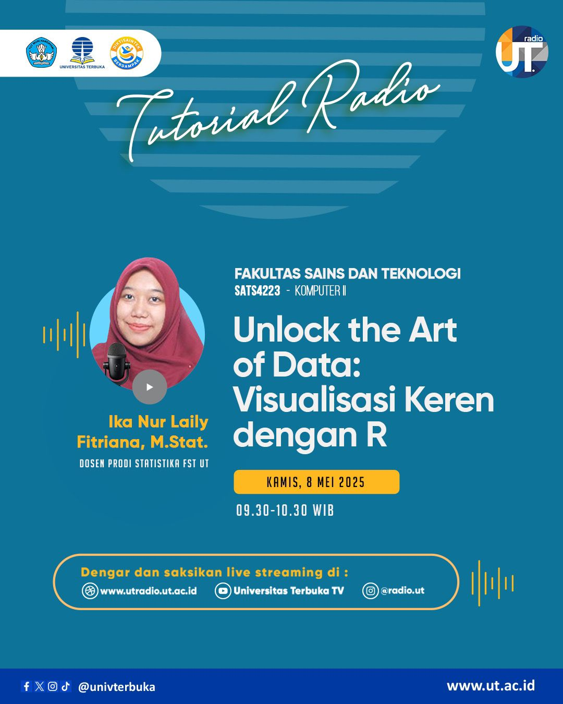

# Unlock the Art of Data: Visualisasi Keren dengan R - SATS4223 Komputer II

🎓 **Untuk Mahasiswa Statistika Universitas Terbuka**  

Kami mengundang seluruh mahasiswa Universitas Terbuka, khususnya mahasiswa Program Studi Statistika, untuk mengikuti **Tutorial Radio** dengan tema **"Unlock the Art of Data: Visualisasi Keren dengan R"**. Kegiatan ini akan diselenggarakan pada **Kamis, 8 Mei 2025**, dari pukul **09.30 – 10.30 WIB**. Acara ini bertujuan untuk memberikan wawasan dan keterampilan dalam visualisasi data menggunakan bahasa pemrograman R, khususnya dengan paket **ggplot2** dan **plotly**.[^1] [^2] [^3] [^4]:

## Detail Kegiatan
### Program Tutorial Radio: Unlock the Art of Data
**Topik**: *Visualisasi Keren dengan R*  
**Mata Kuliah**: SATS4223 - Komputer II  
**Hari/Tanggal**: Kamis, 8 Mei 2025  
**Waktu**: 09.30 – 10.30 WIB  
**Format**: Siaran Radio dan Live Streaming di YouTube  
**Penyelenggara**: Universitas Terbuka  

### Pembicara:
**Ika Nur Laily Fitriana, M.Stat**  
Dosen Program Studi Statistika, Fakultas Sains dan Teknologi, Universitas Terbuka.  
Topik yang dibahas: *Visualisasi Data dengan R: Menggunakan ggplot2 untuk Membuat Grafik yang Menarik dan Informatif.*

## Mengapa Acara Ini Penting?

Siaran ini sangat bermanfaat bagi mahasiswa Statistika Universitas Terbuka, khususnya bagi mereka yang tertarik pada teknik visualisasi data menggunakan **bahasa pemrograman R**. Topik yang dibahas akan mencakup:
- **Penggunaan R untuk Visualisasi**: Menggunakan paket **ggplot2** dan **plotly** untuk menciptakan grafik interaktif yang dapat menyampaikan informasi lebih efektif.
- **Praktik Visualisasi Data**: Pembicara akan memberikan tutorial langsung dan contoh penggunaan visualisasi data yang dapat langsung diterapkan oleh mahasiswa dalam proyek mereka.
- **Studi Kasus Visualisasi Data**: Menyajikan data dunia nyata untuk diolah dan divisualisasikan menggunakan R.

Acara ini juga merupakan kesempatan yang baik bagi mahasiswa untuk memperdalam pemahaman mereka dalam menggunakan R, terutama bagi mereka yang ingin menerapkan keterampilan ini dalam analisis data di masa depan.

## Cara Mengikuti Siaran
1. **Melalui Website UT Radio**:
   - Kunjungi: [www.utradio.ut.ac.id](https://utradio.ut.ac.id)  
   - Dengarkan langsung siaran Tutorial Radio UT.

2. **Melalui YouTube**:
   - Saksikan siaran langsung melalui [Universitas Terbuka TV YouTube Channel](https://www.youtube.com/live/Yy-j2RiefUk?si=_8jo2mumsJ8JP9-2).

3. **Berlangganan YouTube Channel**:
   - Jangan lupa untuk subscribe channel YouTube Universitas Terbuka TV di [sl.ut.ac.id/UT-TV](https://sl.ut.ac.id/UT-TV) untuk mendapatkan notifikasi siaran pendidikan berikutnya.

## Informasi Penting
- **Siaran langsung** akan berlangsung pada Kamis, 8 Mei 2025, dari pukul 09.30 – 10.30 WIB.
- **Platform siaran**: Melalui **UT Radio** di [www.utradio.ut.ac.id](https://utradio.ut.ac.id) dan **YouTube Universitas Terbuka TV**.

---

Kami mengajak seluruh mahasiswa Statistika UT untuk bergabung dalam siaran ini dan memanfaatkan kesempatan untuk meningkatkan keterampilan mereka dalam visualisasi data menggunakan R. Jangan lewatkan tutorial yang sangat berguna ini!

---

**#UTRadio #TutorialRadio #StatistikaUT #VisualisasiData #RProgramming #ggplot2 #UT #SATS4223**

[^1]: "Tutorial Radio - Unlock the Art of Data: Visualisasi Keren dengan R," Universitas Terbuka, [Online]. Tersedia: [https://www.ut.ac.id](https://www.ut.ac.id). [Diakses: Mei 7, 2025].  
[^2]: "Siaran Radio Universitas Terbuka," Universitas Terbuka, [Online]. Tersedia: [https://utradio.ut.ac.id](https://utradio.ut.ac.id). [Diakses: Mei 7, 2025].  
[^3]: "YouTube Universitas Terbuka TV," Universitas Terbuka, [Online]. Tersedia: [https://www.youtube.com/c/UniversitasTerbukaTV](https://www.youtube.com/c/UniversitasTerbukaTV). [Diakses: Mei 7, 2025].	
[^4]: "Siaran Langsung Tutorial Radio," Universitas Terbuka, [Online]. Tersedia: [https://www.youtube.com/live/Yy-j2RiefUk?si=_8jo2mumsJ8JP9-2](https://www.youtube.com/live/Yy-j2RiefUk?si=_8jo2mumsJ8JP9-2). [Diakses: Mei 7, 2025].

## Bagikan
<Share colorful />
<GitContributors />
<GitChangelog />