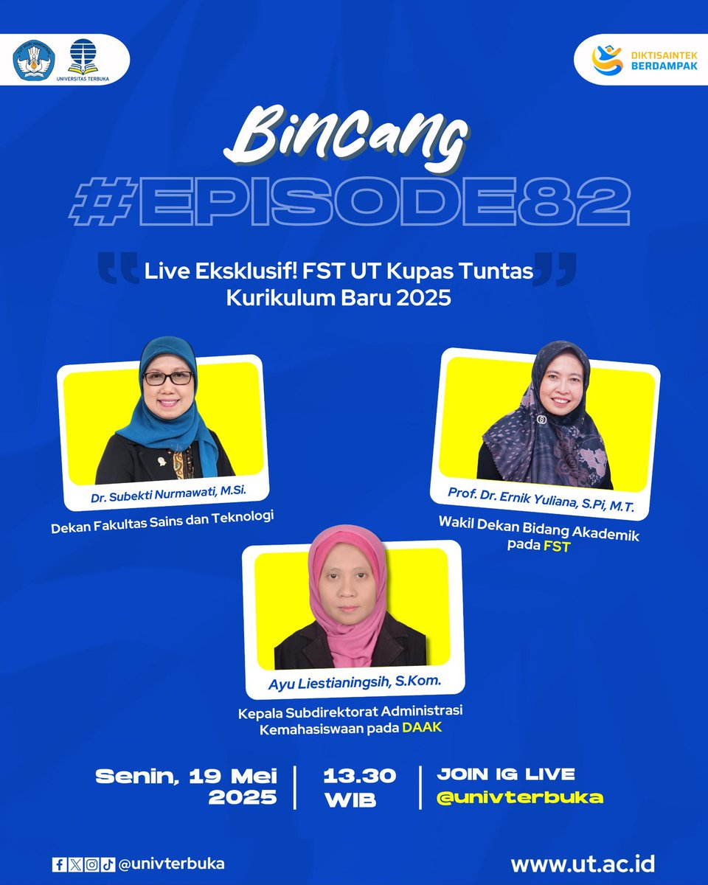

# 🎓 Bincang Episode 82 - FST UT Kupas Tuntas Kurikulum Baru 2025

📢 **Hai Sobat FST UT!** 📚✨

Siap-siap untuk bincang eksklusif di **Bincang Episode 82** dengan tema:

**"Live Eksklusif! FST UT Kupas Tuntas Kurikulum Baru 2025"**

## 📅 Tanggal & Waktu
- **Tanggal**: Senin, 19 Mei 2025
- **Waktu**: 13:30 WIB
- **Platform**: Instagram Live  
  👉 **Link Instagram**: [@univterbuka](https://www.instagram.com/univterbuka/)

## 🎙 Narasumber
- **Dr. Subekti Nurmawati, M.Si.** (Dekan FST)
- **Prof. Dr. Ernik Yuliana, S.Pi, M.T.** (Wakil Dekan Bidang Akademik FST)
- **Ayu Liestianingsih, S.Kom.** (Kepala Subdirektorat Administrasi Kemahasiswaan DAAK)

## 📋 Tentang Acara

Pada acara ini, **FST UT** akan mengupas tuntas **Kurikulum Baru 2025**, yang akan berlaku bagi seluruh mahasiswa Universitas Terbuka. Narasumber yang kompeten akan membahas perubahan, peraturan baru, serta strategi untuk menghadapi kurikulum yang lebih fleksibel dan berbasis teknologi. Acara ini sangat relevan bagi mahasiswa yang ingin memahami bagaimana perubahan ini akan berdampak pada studi mereka dan bagaimana mereka bisa memanfaatkannya untuk meningkatkan kualitas pendidikan [1^] [2^] [3^] [4^] [5^].

## 📌 Apa yang Akan Dibahas?
- **Perubahan Struktur Kurikulum**: Apa saja yang berubah dari kurikulum sebelumnya?
- **Sistem Ujian Baru**: Bagaimana cara ujian akan dilakukan dengan kurikulum baru?
- **Pembelajaran Berbasis Teknologi**: Bagaimana teknologi akan diintegrasikan dalam pembelajaran?
- **Tanya Jawab Interaktif**: Kesempatan bagi mahasiswa untuk bertanya langsung kepada Dekan dan Wakil Dekan FST.
- **Tips dan Trik**: Bagaimana cara menyesuaikan diri dengan kurikulum baru ini?

### Mengapa Anda Harus Bergabung?
- **Dapatkan Informasi Langsung**: Pelajari langsung dari Dekan dan Wakil Dekan FST UT mengenai perubahan terbaru dalam kurikulum.
- **Peluang Tanya Jawab**: Ikuti sesi tanya jawab interaktif yang memungkinkan Anda mendapatkan klarifikasi mengenai kurikulum dan cara menghadapinya.
- **Kurikulum yang Lebih Fleksibel**: Pahami berbagai perubahan dalam sistem pembelajaran, metode ujian, serta integrasi teknologi dalam pendidikan.

## 📸 Gambar Pengumuman

---

[1^] "Bincang FST UT: Kurikulum Baru 2025," Universitas Terbuka, [Online]. Tersedia: [https://www.ut.ac.id](https://www.ut.ac.id). [Diakses: Mei 19, 2025].
[2^] "Kurikulum Baru 2025 - Sosialisasi," Universitas Terbuka, [Online]. Tersedia: [https://sl.ut.ac.id/Sosialisasi-Kurikulum-Baru-FST-FSTTV](https://sl.ut.ac.id/Sosialisasi-Kurikulum-Baru-FST-FSTTV). [Diakses: Mei 19, 2025].
[3^] "FST UT - Fakultas Sains dan Teknologi," Universitas Terbuka, [Online]. Tersedia: [https://fst.ut.ac.id](https://fst.ut.ac.id). [Diakses: Mei 19, 2025].
[4^] "Bincang FST UT Episode 82," YouTube, [Online Video]. Tersedia: [https://www.youtube.com/watch?v=KsVqoPpfq-o](https://www.youtube.com/watch?v=KsVqoPpfq-o). [Diakses: Mei 19, 2025].
[5^] "Instagram Live FST UT," Instagram, [Online]. Tersedia: [https://www.instagram.com/univterbuka/](https://www.instagram.com/univterbuka/). [Diakses: Mei 19, 2025].
---

**#BincangFST #KurikulumBaru2025 #UniversitasTerbuka #FSTUT #Pendidikan #FST**

## Bagikan
<Share colorful />
<GitContributors />
<GitChangelog />