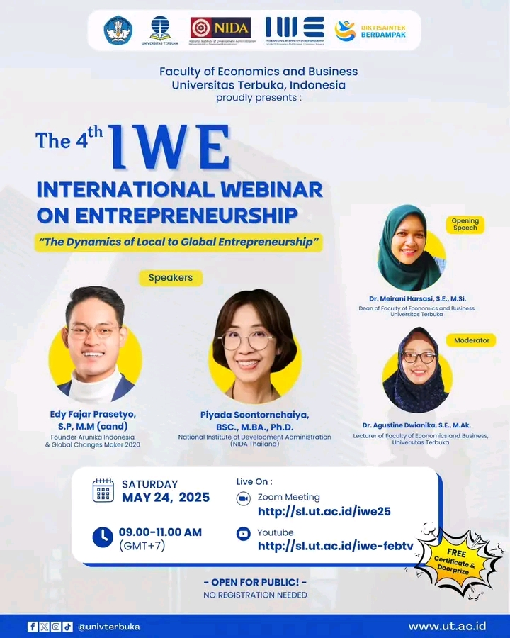

# The 4th IWE International Webinar on Entrepreneurship

🎓 **For all entrepreneurs and students interested in global entrepreneurship**  

We invite everyone to participate in **The 4th International Webinar on Entrepreneurship** with the theme **"The Dynamics of Local to Global Entrepreneurship"**. This event will be held on **Saturday, May 24, 2025**, from **09:00 AM to 11:00 AM WIB (GMT+7)**. It will provide valuable insights on how to grow businesses from a local scale to reaching international markets, including the latest strategies, trends, and innovations in global entrepreneurship [^1] [^2] [^3].

## Event Details
### International Webinar on Entrepreneurship: The Dynamics of Local to Global Entrepreneurship
**Date**: Saturday, May 24, 2025  
**Time**: 09:00 AM – 11:00 AM WIB (GMT+7)  
**Format**: Online via Zoom and YouTube  
**Organizer**: Universitas Terbuka, Faculty of Economics and Business  

### Speakers:
- **Edy Fajar Prasetyo, S.P., M.M (cand)**: Founder of Arunika Indonesia and Global Changes Maker 2020
- **Piyada Soontornchaiya, BSc., MBA., Ph.D.**: National Institute of Development Administration (NIDA), Thailand  

## Why is This Event Important?

This webinar is crucial for entrepreneurs, students, and professionals who want to explore how to expand their businesses globally. The topics discussed will include:
- **Local to Global Strategy**: Learn how local entrepreneurs can scale their businesses to international markets.
- **Global Market Trends**: Stay updated on the latest global trends in entrepreneurship.
- **Innovation in Entrepreneurship**: Discover the innovative practices that are driving the success of global entrepreneurs.

This event is a great opportunity to learn from industry experts, network with other entrepreneurs, and gain insights into global entrepreneurship.

## How to Join the Webinar
1. **Through Zoom**:
   - Join the meeting via this link: [Zoom Meeting - IWE 4th](http://sl.ut.ac.id/iwe25)
   
2. **Through YouTube**:
   - Watch the live stream on YouTube: [YouTube - IWE 4th](http://sl.ut.ac.id/iwe-febtv)

3. **Subscribe to YouTube**:
   - Don't forget to subscribe to the official Universitas Terbuka TV YouTube Channel at [sl.ut.ac.id/UT-TV](https://sl.ut.ac.id/UT-TV).

## Important Information
- **Live Stream** will take place on Saturday, May 24, 2025, from 09:00 – 11:00 WIB.
- **Streaming Platforms**: Zoom and YouTube.

---

We invite all students and entrepreneurs to join this valuable webinar and enhance your understanding of global entrepreneurship! Don't miss out on this great opportunity.

---

**#IWE2025 #EntrepreneurshipWebinar #GlobalEntrepreneurship #UniversitasTerbuka**

---

[^1]: "The 4th International Webinar on Entrepreneurship," Universitas Terbuka, [Online]. Available: [https://www.ut.ac.id](https://www.ut.ac.id). [Accessed: May 12, 2025].  
[^2]: "Zoom Meeting Link for IWE 4th," Universitas Terbuka, [Online]. Available: [http://sl.ut.ac.id/iwe25](http://sl.ut.ac.id/iwe25). [Accessed: May 12, 2025].  
[^3]: "YouTube Channel for IWE 4th," Universitas Terbuka, [Online]. Available: [http://sl.ut.ac.id/iwe-febtv](http://sl.ut.ac.id/iwe-febtv). [Accessed: May 12, 2025].

## Bagikan
<Share colorful />
<GitContributors />
<GitChangelog />
