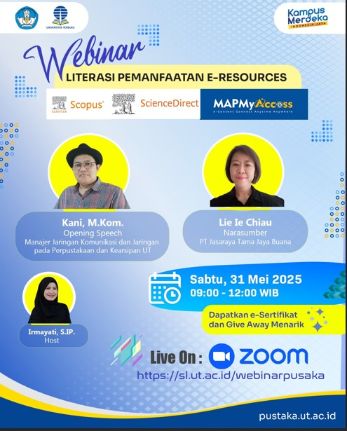

# 💻 Webinar Literasi Pemanfaatan E-Resources

🌟 Halo Sobat Universitas Terbuka!
Di era digital, akses terhadap sumber daya pengetahuan menjadi kunci keberhasilan akademik. Universitas Terbuka (UT), sebagai pelopor Pendidikan Tinggi Terbuka dan Jarak Jauh (PTTJJ) di Indonesia, berkomitmen menyediakan akses terbaik bagi mahasiswanya.[^2]

Untuk itu, Perpustakaan dan Kearsipan UT mengundang Anda untuk bergabung dalam **Webinar Literasi Pemanfaatan E-Resources**.[^3] Acara ini dirancang khusus untuk membantu Anda memaksimalkan platform riset kelas dunia untuk menunjang perkuliahan dan tugas akhir Anda![^1]

## Detail Kegiatan
### Webinar Literasi Pemanfaatan E-Resources
**Tanggal**: Sabtu, 31 Mei 2025[^1]
**Waktu**: 09:00 – 12:00 WIB[^1]
**Platform**: Live on Zoom[^1]
**Penyelenggara**: Perpustakaan dan Kearsipan Universitas Terbuka[^3]

### Pembicara & Host:
- **Opening Speech**:
  - **Kani, M.Kom.**
  - Manajer Jaringan Komunikasi dan Jaringan pada Perpustakaan dan Kearsipan UT[^1]
- **Narasumber**:
  - **Lie Ie Chiau**
  - PT Jasaraya Tama Jaya Buana[^1][^7]
- **Host**:
  - **Irmayati, S.IP.**[^1]

## Mengapa Acara Ini Penting?
Webinar ini akan mengupas tuntas tiga platform esensial yang membentuk alur kerja penelitian modern, dari akses, penemuan, hingga membaca materi.[^1]
- **MAPMyAccess**: Pelajari cara menggunakan gerbang akses ini untuk terhubung ke semua sumber daya digital yang dilanggan UT dari mana saja (di luar kampus).[^6]
- **Scopus**: Kuasai Scopus, basis data abstrak dan sitasi terbesar di dunia, untuk memetakan lanskap penelitian, menemukan artikel relevan, dan menganalisis tren riset terkini.[^4]
- **ScienceDirect**: Dapatkan akses ke ribuan jurnal dan buku elektronik teks penuh (full-text) dari Elsevier, tempat Anda dapat membaca dan mengunduh materi penelitian primer untuk tugas-tugas Anda.[^5]

## Cara Bergabung
Bergabunglah secara langsung melalui tautan Zoom di bawah ini pada waktu yang telah ditentukan.[^8]
- **Link Zoom**: [https://sl.ut.ac.id/webinarpusaka](https://sl.ut.ac.id/webinarpusaka)

## Benefit
- ✅ E-Sertifikat[^1]
- ✅ Wawasan mendalam tentang E-Resources[^1]
- ✅ Give Away Menarik[^1]

---

**#UniversitasTerbuka #LiterasiDigital #WebinarUT #Eresource #Scopus #ScienceDirect #BelajarMandiri**

[^1]: "Memberdayakan Cendekiawan Digital: Analisis Mendalam tentang Inisiatif Literasi E-Resource Universitas Terbuka," Laporan Internal, Mei 2025.
[^2]: "Situs Web Resmi Universitas Terbuka," Universitas Terbuka, [Online]. Tersedia: [https://www.ut.ac.id/](https://www.ut.ac.id/).
[^3]: "Portal Perpustakaan UT (Puslata)," Universitas Terbuka, [Online]. Tersedia: [https://pustaka.ut.ac.id/lib/](https://pustaka.ut.ac.id/lib/).
[^4]: "Scopus Product Page," Elsevier, [Online]. Tersedia: [https://www.elsevier.com/products/scopus](https://www.elsevier.com/products/scopus).
[^5]: "ScienceDirect Home Page," Elsevier, [Online]. Tersedia: [https://www.sciencedirect.com/](https://www.sciencedirect.com/).
[^6]: "MAPMyAccess Product Page," MAP Systems, [Online]. Tersedia: [https://mapsystemsindia.com/products/mapmyaccess.html](https://mapsystemsindia.com/products/mapmyaccess.html).
[^7]: "Situs Web PT Jasaraya Tama Jaya Buana," PT JTJB, [Online]. Tersedia: [https://www.jasatama.net/](https://www.jasatama.net/).
[^8]: "Tautan Pendaftaran Webinar Literasi Pemanfaatan E-Resources," Universitas Terbuka, [Online]. Tersedia: [https://sl.ut.ac.id/webinarpusaka](https://sl.ut.ac.id/webinarpusaka).

## Bagikan
<Share colorful />
<GitContributors />
<GitChangelog />