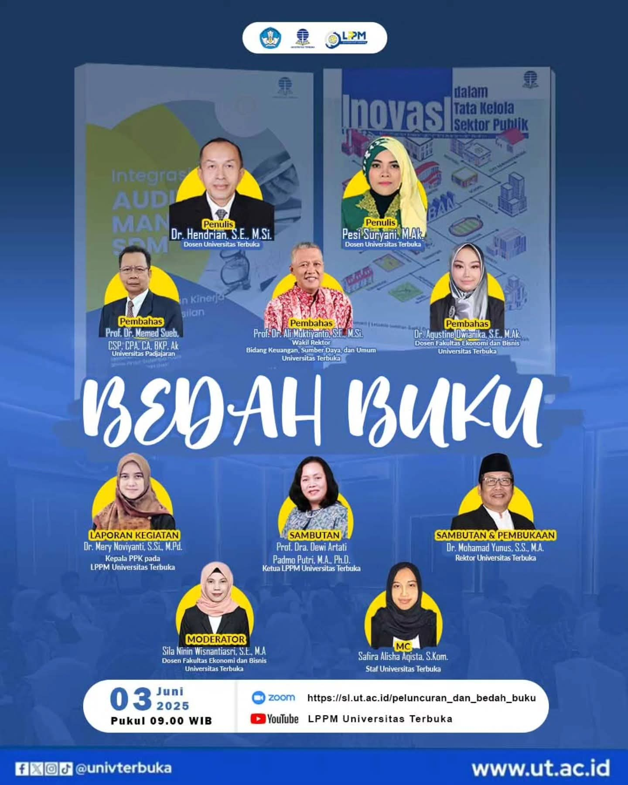

# 📚 Bedah Buku 2025: Inovasi Tata Kelola & Integrasi Audit SDM

Halo, Sahabat UT! 👋

Lembaga Penelitian dan Pengabdian kepada Masyarakat (LPPM) Universitas Terbuka dengan bangga mempersembahkan **Bedah Buku 2025**. Acara ini merupakan inisiatif strategis untuk menampilkan modal intelektual UT dan mendiseminasikan hasil riset yang relevan dengan tantangan nasional.[^1]

Mari bergabung untuk menambah wawasan akademik dan mendalami dua karya monumental terbaru dari para dosen Universitas Terbuka!

## Karya yang Dibedah

1.  **Inovasi dalam Tata Kelola Sektor Publik**[^2]
    -   **Penulis**: Pesi Suryani, M.Ak., dkk.
    -   Buku ini mengupas bagaimana inovasi dapat menjembatani kesenjangan antara harapan masyarakat dan realitas layanan publik, menawarkan kerangka kerja untuk modernisasi birokrasi.[^3]

2.  **Integrasi Audit dan Manajemen SDM**[^4]
    -   **Penulis**: Dr. Hendrian, S.E., M.Si., dkk.
    -   Karya ini membahas konvergensi krusial antara fungsi audit, sumber daya manusia (SDM), dan teknologi informasi dalam konteks organisasi modern untuk mencapai tata kelola yang efektif.[^4]

## Rangkaian Acara

**Sambutan & Pembukaan:**
-   **Dr. Mohamad Yunus, S.S., M.A.** (Rektor Universitas Terbuka)
-   **Prof. Dra. Dewi Artati Padmo Putri, M.A., Ph.D.** (Ketua LPPM Universitas Terbuka)

**Laporan Kegiatan:**
-   **Dr. Mery Noviyanti, S.Si., M.Pd.** (Ketua Pelaksana PPK pada LPPM Universitas Terbuka)

**Sesi Bedah Buku:**
-   **Pembahas Buku "Integrasi Audit dan Manajemen SDM"**:
    -   **Prof. Dr. Memed Sueb, S.E., M.S., Ak.** (Guru Besar FEB Universitas Padjadjaran)
-   **Pembahas Buku "Inovasi dalam Tata Kelola Sektor Publik"**:
    -   **Prof. Dr. Ari Mulyanto, S.E., M.Si.** (Dosen Universitas Terbuka)
    -   **Dr. Agustine Dwianika, S.E., M.Ak.** (Dosen Fakultas Ekonomi dan Bisnis Universitas Terbuka)

**Moderator & MC:**
-   **Moderator**: Sita Nitiputri Kusumastuti, S.E., M.A
-   **MC**: Safira Alisha Aqista, S.Kom.

## Detail Pelaksanaan

Catat tanggal dan waktunya agar tidak ketinggalan!
-   **Tanggal**: Selasa, 03 Juni 2025
-   **Waktu**: Pukul 09.00 WIB - Selesai
-   **Platform**:
    -   **Zoom**: [https://sl.ut.ac.id/peluncuran_dan_bedah_buku](https://sl.ut.ac.id/peluncuran_dan_bedah_buku)[^5]
    -   **YouTube**: [LPPM Universitas Terbuka](https://www.youtube.com/@lppmuniverstasterbuka9025)[^6]

Ayo perluas cakrawala pengetahuanmu dengan mengikuti diskusi mendalam bersama para pakar. Sampai jumpa di acara! 😉

---

**#BedahBukuUT #LPPMUT #UniversitasTerbuka #InovasiPublik #AuditSDM #LiterasiAkademik**

[^1]: "Menggali Inovasi Tata Kelola Sektor Publik dan Integrasi Audit SDM Lewat 2 Buku Terbitan Universitas Terbuka," Media Indonesia, [Online]. Tersedia: [https://mediaindonesia.com/humaniora/784211/menggali-inovasi-tata-kelola-sektor-publik-dan-integrasi-audit-sdm-lewat-2-buku-terbitan-universitas-terbuka](https://mediaindonesia.com/humaniora/784211/menggali-inovasi-tata-kelola-sektor-publik-dan-integrasi-audit-sdm-lewat-2-buku-terbitan-universitas-terbuka).
[^2]: "Inovasi dalam tata kelola sektor publik: menjembatani kesenjangan antara harapan dan realitas," UT Repository, [Online]. Tersedia: [https://repository.ut.ac.id/10686/7/24-BU014-full.pdf](https://repository.ut.ac.id/10686/7/24-BU014-full.pdf).
[^3]: "Inovasi dalam tata kelola sektor publik : menjembatani kesenjangan antara harapan dan realitas," UT Library, [Online]. Tersedia: [https://pustaka.ut.ac.id/lib/inovasi-dalam-tata-kelola-sektor-publik-menjembatani-kesenjangan-antara-harapan-dan-realitas/](https://pustaka.ut.ac.id/lib/inovasi-dalam-tata-kelola-sektor-publik-menjembatani-kesenjangan-antara-harapan-dan-realitas/).
[^4]: Informasi dari poster acara "Bedah Buku 2025", LPPM Universitas Terbuka, Juni 2025.
[^5]: "Tautan Zoom Acara Bedah Buku 2025," Universitas Terbuka, [Online]. Tersedia: [https://sl.ut.ac.id/peluncuran_dan_bedah_buku](https://sl.ut.ac.id/peluncuran_dan_bedah_buku).
[^6]: "Kanal YouTube LPPM Universitas Terbuka," YouTube, [Online]. Tersedia: [https://www.youtube.com/@lppmuniverstasterbuka9025](https://www.youtube.com/@lppmuniverstasterbuka9025).

## Bagikan
<Share colorful />
<GitContributors />
<GitChangelog />