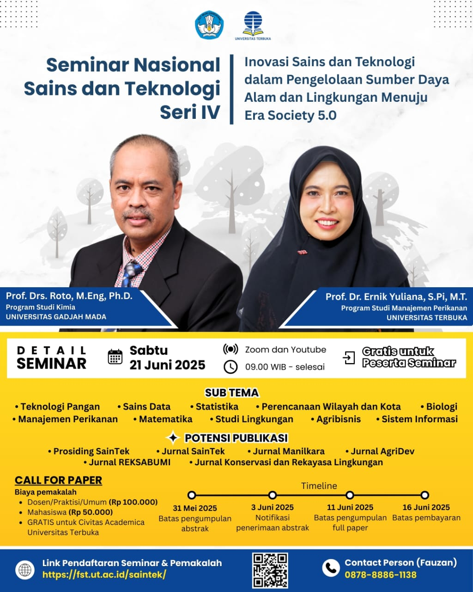

# 📚 Seminar Nasional Teknologi Energi 2025
## Tema: "Inovasi Teknologi Energi Terbarukan untuk Masa Depan Berkelanjutan"

Jangan lewatkan kesempatan berharga untuk mengikuti **Seminar Nasional Teknologi Energi 2025** yang bertemakan **"Inovasi Teknologi Energi Terbarukan untuk Masa Depan Berkelanjutan"**. Acara ini akan menghadirkan pembicara dan narasumber yang kompeten dalam bidangnya dan membahas topik-topik terkini yang relevan dengan pengembangan energi terbarukan serta peranannya dalam menciptakan masa depan yang lebih hijau dan berkelanjutan [^1] [^2] [^3] [^4] .

## 📅 Tanggal dan Waktu
- **Tanggal**: Senin, 15 Juni 2025
- **Waktu**: 09.00 WIB – Selesai
- **Platform**: Daring melalui Zoom dan YouTube
- **Link Zoom**: [https://sl.ut.ac.id/SEMNASTEK2025](https://sl.ut.ac.id/SEMNASTEK2025)
- **Link YouTube**: [https://sl.ut.ac.id/SEMNASTEK2025-YT](https://sl.ut.ac.id/SEMNASTEK2025-YT)

## 📝 Pendaftaran
- **Pendaftaran**: [Daftar sekarang](https://sl.ut.ac.id/DaftarSEMNASTEK2025)

## 🎙 Narasumber
- **Prof. Dr. Joko Santoso, M.T.**: Guru Besar Teknologi Energi Terbarukan, Universitas Indonesia
- **Dr. Arif Rahman, S.T., M.Sc.**: Kepala Departemen Energi Terbarukan, Universitas Terbuka

## 🎁 Benefit
- ✅ E-Sertifikat
- ✅ Wawasan Baru dalam bidang Teknologi Energi
- ✅ Koneksi dengan Akademisi dan Praktisi Energi

## 📱 Kontak
- **WhatsApp**: 08987654321 (Panitia SEMNASTEK 2025)
- **Website Resmi**: [https://fhisip.ut.ac.id/semnastek](https://fhisip.ut.ac.id/semnastek)

## 📝 Tentang Seminar
Seminar ini memberikan platform bagi akademisi, peneliti, dan praktisi untuk mendalami dan mendiskusikan perkembangan terbaru dalam kajian teknologi energi terbarukan. Jangan lewatkan kesempatan untuk memperluas wawasan dan memperdalam pengetahuan dalam bidang energi yang sangat penting bagi masa depan berkelanjutan.

## 📸 Poster Acara

## 🔗 Tautan Terkait
Untuk informasi lebih lanjut dan pembaruan terbaru, kunjungi:
- [Situs Web SEMNASTEK 2025](https://fhisip.ut.ac.id/semnastek)
- [Universitas Terbuka Website](https://www.ut.ac.id)

## 📢 Sebarkan Berita Ini!
Bagikan informasi ini kepada teman-teman Anda dan ajak mereka untuk bergabung dalam seminar ini. Gunakan tagar resmi kami untuk tetap terhubung:
- `#Semnastek2025`
- `#TeknologiEnergi`
- `#EnergiTerbarukan`
- `#UniversitasTerbuka`

Kami menantikan kehadiran Anda di seminar ini! 🌍

---

[^1]: "Call for Papers - Seminar Nasional Teknologi Energi SEMNASTEK 2025," Fakultas Teknologi, Universitas Terbuka, [Online]. Tersedia: [https://fst.ut.ac.id/seminar/semnas-saintek-iv/](https://fst.ut.ac.id/seminar/semnas-saintek-iv/). [Diakses: Apr. 30, 2025].
[^2]: "SEMNASTEK 2025 - Seminar Nasional Teknologi Energi," Fakultas Teknologi Universitas Terbuka, [Online]. Tersedia: [https://jurnal.ut.ac.id/index.php/saintek/index](https://jurnal.ut.ac.id/index.php/saintek/index). [Diakses: Apr. 30, 2025].
[^3]: "About SEMNASTEK 2025," Universitas Terbuka, [Online]. Tersedia: [hhttps://jurnal.ut.ac.id/index.php/saintek](hhttps://jurnal.ut.ac.id/index.php/saintek). [Diakses: Apr. 30, 2025].
[^4]: "SEMNASTEK 2025 - Website," Fakultas Teknologi Universitas Terbuka, [Online]. Tersedia: [https://fst.ut.ac.id/saintek/](https://fst.ut.ac.id/saintek/). [Diakses: Apr. 30, 2025].

