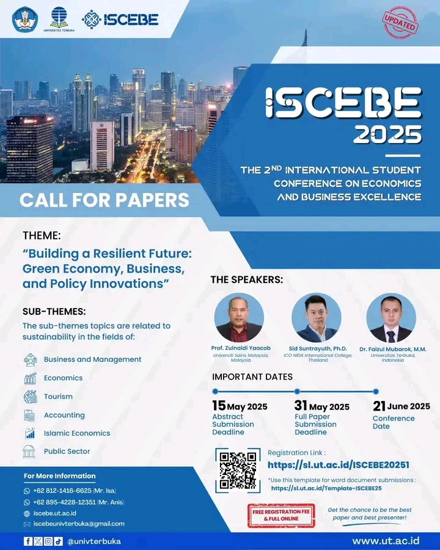

# 2nd International Student Conference on Economics and Business Excellence (ISCEBE) 2025

🌍 **Tema**: *"Building a Resilient Future: Green Economy, Business, and Policy Innovations"*

🎓 **Untuk Mahasiswa Internasional**  
Kami mengundang seluruh mahasiswa untuk berpartisipasi dalam **2nd International Student Conference on Economics and Business Excellence (ISCEBE) 2025**. Acara ini bertujuan untuk memberikan platform bagi mahasiswa di seluruh dunia untuk berbagi riset mereka yang berfokus pada **ekonomi hijau**, **inovasi bisnis**, dan **kebijakan masa depan** yang berkelanjutan. Konferensi ini akan diadakan pada **Sabtu, 21 Juni 2025**, dari **09:00 hingga 16:00 WIB** secara daring [^1] [^2].

## Detail Kegiatan
### Konferensi Internasional ISCEBE 2025
**Tanggal**: Sabtu, 21 Juni 2025  
**Waktu**: 09.00 – 16.00 WIB  
**Platform**: Daring  
**Penyelenggara**: Universitas Terbuka Indonesia

### Pembicara:
- **Prof. Zulnaidi Yaacob** (Universiti Sains Malaysia, Malaysia)  
- **Sid Suntrayuth, Ph.D.** (ICO NIDA International College, Thailand)  
- **Dr. Faizul Mubarak, M.M** (Universitas Terbuka, Indonesia)

## Mengapa Acara Ini Penting?
Konferensi ini sangat relevan bagi mahasiswa yang ingin mendalami dan berbagi ide mengenai masa depan yang berkelanjutan. Fokus utama acara ini adalah:
- **Green Economy**: Menyelidiki bagaimana ekonomi hijau dapat mempercepat pembangunan yang berkelanjutan.
- **Inovasi Bisnis**: Membahas inovasi bisnis yang dapat mendukung kebijakan pembangunan berkelanjutan.
- **Kebijakan Masa Depan**: Meneliti kebijakan yang diperlukan untuk mendorong keberlanjutan dalam ekonomi global.

## Langkah-langkah Pendaftaran
1. **Daftar untuk Abstrak**:  
   Kirimkan abstrak Anda sebelum **15 Mei 2025** melalui tautan berikut: [Pendaftaran Abstrak ISCEBE 2025](https://sl.ut.ac.id/ISCEBE20251)

2. **Pendaftaran Full Paper**:  
   Kirimkan full paper Anda sebelum **31 Mei 2025**.

3. **Konferensi**:  
   Hadiri konferensi pada **21 Juni 2025** di platform daring yang disediakan.

## Informasi Penting
- **Tanggal Abstrak**: 15 Mei 2025  
- **Tanggal Full Paper**: 31 Mei 2025  
- **Tanggal Konferensi**: 21 Juni 2025  
- **Pendaftaran**: [Daftar di sini](https://sl.ut.ac.id/ISCEBE20251)

---

**#ISCEBE2025 #GreenEconomy #BusinessInnovation #PolicyInnovation #UniversitasTerbuka #MahasiswaInternasional**

[^1]: "Call for Papers - ISCEBE 2025," ISCEBE, [Online]. Tersedia: [https://iscebe.ut.ac.id](https://iscebe.ut.ac.id). [Diakses: Mei 12, 2025].
[^2]: "International Student Conference on Economics and Business Excellence," Universitas Terbuka, [Online]. Tersedia: [https://iscebe.ut.ac.id](https://iscebe.ut.ac.id). [Diakses: Mei 12, 2025].

## Bagikan
<Share colorful />
<GitContributors />
<GitChangelog />
