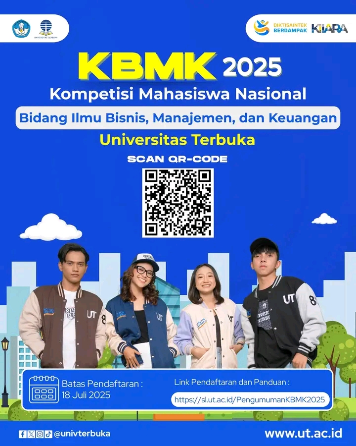

# 🏆 KBMK 2025: Saatnya Mahasiswa UT Unjuk Gigi di Panggung Nasional!

Mahasiswa Universitas Terbuka, saatnya tunjukkan potensi terbaikmu! 🙌

Universitas Terbuka (UT) dengan bangga mengundang seluruh mahasiswa untuk mengikuti **Kompetisi Mahasiswa Nasional Bidang Ilmu Bisnis, Manajemen, dan Keuangan (KBMK) 2025**. Ini adalah ajang talenta paling bergengsi di Indonesia yang diselenggarakan oleh **Kemendikbudristek** melalui **Pusat Prestasi Nasional (Puspresnas)** dan **Balai Pengembangan Talenta Indonesia (BPTI)**.[^1]

Kompetisi ini menjadi kesempatan emas untuk mengasah kemampuan, berinovasi, dan mengukir prestasi di tingkat nasional. Buktikan bahwa mahasiswa UT siap bersaing dan berprestasi! 🇮🇩

## Tentang KBMK 2025

KBMK adalah platform untuk mengevaluasi kemampuan akademik dan daya nalar mahasiswa, sekaligus mendekatkan kemitraan antara akademisi, dunia usaha, dan pemerintah.[^2] Dengan tema **"Hilirisasi dan Industrialisasi: Inovasi Mahasiswa dalam Meningkatkan Daya Saing Nasional di Tengah Gejolak Global"**, kompetisi ini menantangmu untuk memberikan solusi inovatif yang relevan dengan agenda prioritas nasional.[^3]

### Kategori Lomba
Kompetisi ini terbagi dalam lima kategori yang menantang:[^2]
1.  Perencanaan Bisnis
2.  Riset Investasi
3.  Keuangan Audit Investigatif
4.  Komersialisasi Riset & Teknologi Tepat Guna
5.  Penulisan Karya Tulis Ilmiah

## Jadwal dan Pendaftaran

Jangan sampai terlewatkan kesempatan emas ini!

-   **Batas Pendaftaran (Internal UT)**: **18 Juli 2025**
-   **Link Pendaftaran & Panduan Lengkap**: Kunjungi tautan resmi UT untuk mengunduh panduan dan melakukan pendaftaran tim.
    -   🔗 **[https://sl.ut.ac.id/PengumumanKBMK2025](https://sl.ut.ac.id/PengumumanKBMK2025)**

Proses seleksi akan dilakukan secara internal oleh UT untuk memilih delegasi terbaik yang akan mewakili almamater di tingkat nasional.[^4]

Ayo, segera bentuk tim-mu, siapkan proposal terbaik, dan daftarkan dirimu! Buktikan bahwa kemandirian dan fleksibilitas mahasiswa UT adalah modal kuat untuk menjadi juara! 🎓✨

---

**#KBMK2025 #UniversitasTerbuka #MahasiswaBerprestasi #KompetisiNasional #Puspresnas #Hilirisasi**

[^1]: "PEDOMAN Kompetisi Mahasiswa Nasional Bidang Ilmu Bisnis, Manajemen, dan Keuangan (KBMK) Perguruan Tinggi 2024," Puspresnas Kemdikbud, [Online]. Tersedia: [https://pusatprestasinasional.kemdikbud.go.id/uploads/lampiran/Pedoman%20KBMK%20DIKTI%202024.pdf](https://pusatprestasinasional.kemdikbud.go.id/uploads/lampiran/Pedoman%20KBMK%20DIKTI%202024.pdf).
[^2]: "Kompetisi Mahasiswa Nasional Bidang Ilmu Bisnis, Manajemen, dan Keuangan: KBMK," KBMK Kemdiktisaintek, [Online]. Tersedia: [https://kbmk.kemdiktisaintek.go.id/](https://kbmk.kemdiktisaintek.go.id/).
[^3]: "Surat-Pengantar-Panduan-KBMK-2025," Kemdiktisaintek, [Online]. Tersedia: [https://kemdiktisaintek.go.id/wp-content/uploads/2025/06/Surat-Pengantar-Panduan-KBMK-2025.pdf](https://kemdiktisaintek.go.id/wp-content/uploads/2025/06/Surat-Pengantar-Panduan-KBMK-2025.pdf).
[^4]: "Kompetisi Mahasiswa Nasional Bidang Ilmu Bisnis, Manajemen, dan Keuangan (KBMK) Perguruan Tinggi 2025," Universitas Terbuka, [Online]. Tersedia: [https://sl.ut.ac.id/PengumumanKBMK2025](https://sl.ut.ac.id/PengumumanKBMK2025).

## Bagikan
<Share colorful />
<GitContributors />
<GitChangelog />