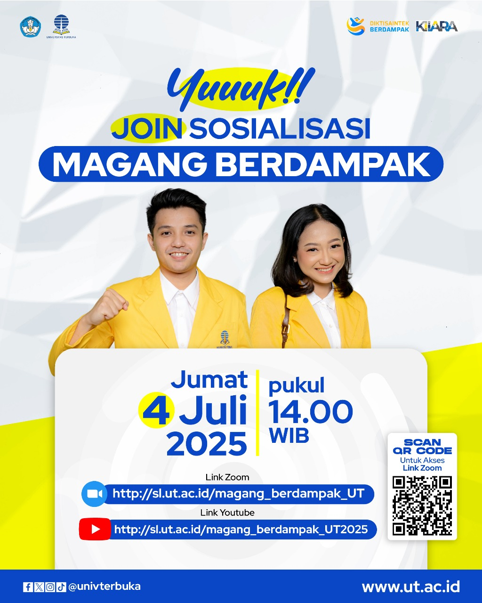

# 💼 Sosialisasi Magang Berdampak 2025

🎓✨ Halo Mahasiswa Universitas Terbuka!

Siap mengambil langkah nyata untuk masa depan kariermu? Program **Magang Berdampak 2025** dari Kementerian Pendidikan Tinggi, Sains, dan Teknologi (Kemdiktisaintek) telah resmi diluncurkan! Ini adalah evolusi strategis dari program MSIB sebelumnya, yang kini menjadi bagian dari kerangka kebijakan **"Diktisaintek Berdampak"**.[^1]

Untuk memastikan kamu tidak ketinggalan informasi, Universitas Terbuka menyelenggarakan sosialisasi khusus. Ini adalah kesempatanmu untuk memahami program yang bukan hanya memperkaya CV, tetapi juga dirancang untuk membentukmu menjadi agen perubahan yang kompeten dan berdaya saing global.[^2]

## Mengapa Sosialisasi Ini Penting?

Di acara ini, kamu akan mendapatkan semua informasi yang dibutuhkan:
-   **Info Lengkap Program**: Pahami konsep, misi, dan manfaat program, termasuk bantuan biaya hidup hingga **Rp2,8 juta per bulan** dan konversi hingga **20 SKS**.[^3]
-   **Alur Pendaftaran**: Pelajari langkah-langkah pendaftaran melalui portal SIMBELMAWA, persyaratan dokumen, hingga proses seleksi oleh mitra industri.[^4]
-   **Peluang Karier**: Kenali puluhan mitra nasional dari berbagai sektor strategis seperti perbankan, teknologi, ritel, dan pemerintahan yang siap merekrut talenta terbaik.[^5]

## Detail Acara

Jangan sampai terlewat, catat tanggal dan tautannya!
-   **Tanggal**: Jumat, 4 Juli 2025
-   **Waktu**: Pukul 14.00 WIB
-   **Platform**:
    -   **Link Zoom**: [http://sl.ut.ac.id/magang_berdampak_UT](http://sl.ut.ac.id/magang_berdampak_UT)
    -   **Link YouTube**: [http://sl.ut.ac.id/magang_berdampak_UT2025](http://sl.ut.ac.id/magang_berdampak_UT2025)

Siapkan dirimu untuk mengambil peran aktif dalam perubahan dan membangun karier yang berdampak. Sampai jumpa di acara sosialisasi! 💥

---

**#MagangBerdampak #UniversitasTerbuka #DiktisaintekBerdampak #SosialisasiUT #InfoMagang #KampusMerdeka**

[^1]: "Program Diktisaintek Berdampak Gantikan Kampus Merdeka," STIAB Smaratungga, [Online]. Tersedia: [https://spkb.smaratungga.ac.id/berita-view.php?t=program-diktisaintek-berdampak-gantikan-kampus-merdeka](https://spkb.smaratungga.ac.id/berita-view.php?t=program-diktisaintek-berdampak-gantikan-kampus-merdeka).
[^2]: "Resmi Diluncurkan! Magang Berdampak 2025: Siapkan Mahasiswa Jadi Agen Perubahan," Universitas Terbuka, [Online]. Tersedia: [https://www.ut.ac.id/berita/2025/06/resmi-diluncurkan-magang-berdampak-2025-siapkan-mahasiswa-jadi-agen-perubahan/](https://www.ut.ac.id/berita/2025/06/resmi-diluncurkan-magang-berdampak-2025-siapkan-mahasiswa-jadi-agen-perubahan/).
[^3]: "Program Magang Berdampak Diluncurkan, Apa Bedanya dengan Magang Merdeka?," Kompas.com, [Online]. Tersedia: [https://www.kompas.com/edu/read/2025/06/17/141845271/program-magang-berdampak-diluncurkan-apa-bedanya-dengan-magang-merdeka](https://www.kompas.com/edu/read/2025/06/17/141845271/program-magang-berdampak-diluncurkan-apa-bedanya-dengan-magang-merdeka).
[^4]: "Cara Daftar Magang Berdampak 2025 dan Syarat Lengkapnya," Tirto.id, [Online]. Tersedia: [https://tirto.id/cara-daftar-magang-berdampak-2025-dan-syarat-lengkapnya-hdc9](https://tirto.id/cara-daftar-magang-berdampak-2025-dan-syarat-lengkapnya-hdc9).
[^5]: "Daftar 17 Mitra Magang Berdampak 2025, Cek Lowongan yang Tersedia!," Detik.com, [Online]. Tersedia: [https://www.detik.com/sumut/berita/d-7968540/daftar-17-mitra-magang-berdampak-2025-cek-lowongan-yang-tersedia](https://www.detik.com/sumut/berita/d-7968540/daftar-17-mitra-magang-berdampak-2025-cek-lowongan-yang-tersedia).

## Bagikan
<Share colorful />
<GitContributors />
<GitChangelog />