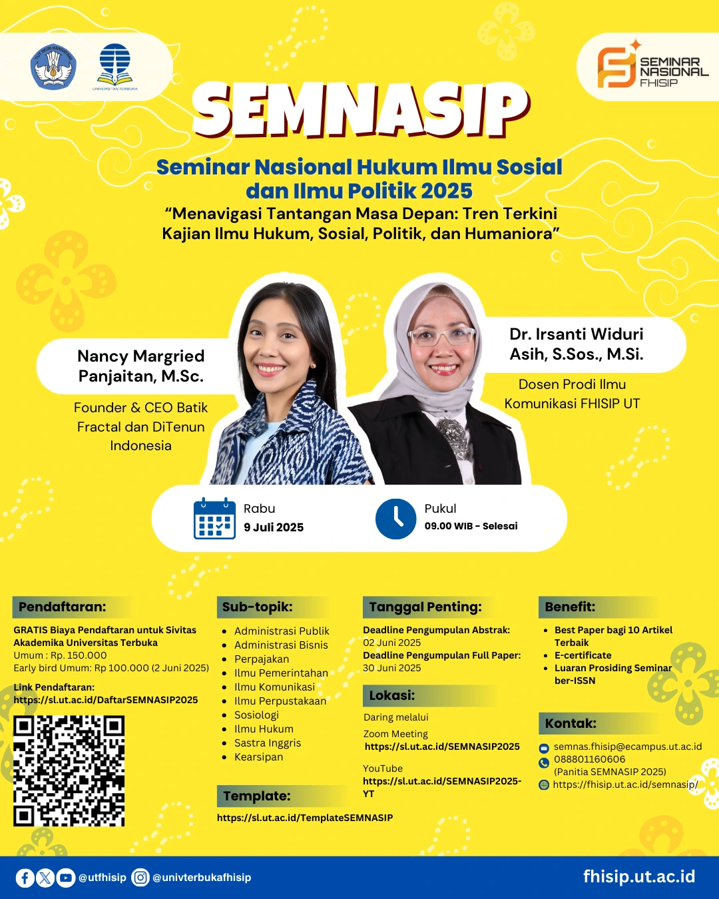

# 📚 Seminar Nasional Hukum Ilmu Sosial dan Ilmu Politik 2025
## Tema: "Menavigasi Tantangan Masa Depan: Tren Terkini Kajian Ilmu Hukum, Sosial, Politik, dan Humaniora"

Jangan lewatkan kesempatan berharga untuk mengikuti **Seminar Nasional Hukum Ilmu Sosial dan Ilmu Politik 2025** yang bertemakan **"Menavigasi Tantangan Masa Depan: Tren Terkini Kajian Ilmu Hukum, Sosial, Politik, dan Humaniora"**. Acara ini akan menghadirkan pembicara dan narasumber yang kompeten dalam bidangnya dan membahas topik-topik terkini yang relevan dengan perkembangan ilmu hukum, sosial, politik, dan humaniora [^1] [^2] [^3] [^4] .

## 📅 Tanggal dan Waktu
- **Tanggal**: Rabu, 9 Juli 2025
- **Waktu**: 09.00 WIB – Selesai
- **Platform**: Daring melalui Zoom dan YouTube
- **Link Zoom**: [https://sl.ut.ac.id/SEMNASIP2025](https://sl.ut.ac.id/SEMNASIP2025)
- **Link YouTube**: [https://sl.ut.ac.id/SEMNASIP2025-YT](https://sl.ut.ac.id/SEMNASIP2025-YT)

## 📝 Pendaftaran
- **Pendaftaran**: [Daftar sekarang](https://sl.ut.ac.id/DaftarSEMNASIP2025)

## 🎙 Narasumber
- **Nancy Margried Panjaitan, M.Sc.**: Founder & CEO Batik Fractal dan DiTenun Indonesia
- **Dr. Irsanti Widuri Asih, S.Sos., M.Si.**: Dosen Prodi Ilmu Komunikasi FHISIP UT

## 🎁 Benefit
- ✅ E-Sertifikat
- ✅ Wawasan Baru dalam bidang Ilmu Hukum, Sosial, dan Politik
- ✅ Koneksi dengan Akademisi dan Praktisi

## 📱 Kontak
- **WhatsApp**: 088801160606 (Panitia SEMNASIP 2025)
- **Website Resmi**: [https://fhisip.ut.ac.id/semnasip](https://fhisip.ut.ac.id/semnasip)

## 📝 Tentang Seminar
Seminar ini memberikan platform bagi akademisi, peneliti, dan praktisi untuk mendalami dan mendiskusikan perkembangan terbaru dalam kajian ilmu hukum, sosial, politik, dan humaniora. Jangan lewatkan kesempatan untuk memperluas wawasan dan memperdalam pengetahuan dalam bidang-bidang yang tengah berkembang pesat.

## 📸 Poster Acara

## 🔗 Tautan Terkait
Untuk informasi lebih lanjut dan pembaruan terbaru, kunjungi:
- [Situs Web SEMNASIP 2025](https://fhisip.ut.ac.id/semnasip)
- [Universitas Terbuka Website](https://www.ut.ac.id)

## 📢 Sebarkan Berita Ini!
Bagikan informasi ini kepada teman-teman Anda dan ajak mereka untuk bergabung dalam seminar ini. Gunakan tagar resmi kami untuk tetap terhubung:
- `#Semnasip2025`
- `#HukumSosialPolitik`
- `#IlmuSosial`
- `#UniversitasTerbuka`

Kami menantikan kehadiran Anda di seminar ini! 🌍

---

[^1]: "Call for Papers - Seminar Nasional Hukum Ilmu Sosial dan Ilmu Politik SEMNASIP 2025," Fakultas Hukum, Ilmu Sosial, dan Ilmu Politik Universitas Terbuka, [Online]. Tersedia: [https://fhisip.ut.ac.id/call-for-papers-seminar-nasional-hukum-ilmu-sosial-dan-ilmu-politik-semnasip-2025-menavigasi-tantangan-masa-depan-tren-terkini-kajian-ilmu-hukum-sosial-politik-dan-humaniora/](https://fhisip.ut.ac.id/call-for-papers-seminar-nasional-hukum-ilmu-sosial-dan-ilmu-politik-semnasip-2025-menavigasi-tantangan-masa-depan-tren-terkini-kajian-ilmu-hukum-sosial-politik-dan-humaniora/). [Diakses: Apr. 24, 2025].
[^2]: "SEMNASIP 2025 - Seminar Nasional Hukum Ilmu Sosial dan Ilmu Politik," Fakultas Hukum, Ilmu Sosial, dan Ilmu Politik Universitas Terbuka, [Online]. Tersedia: [https://fhisip.ut.ac.id/semnasip2025/](https://fhisip.ut.ac.id/semnasip2025/). [Diakses: Apr. 24, 2025].
[^3]: "About SEMNASIP 2025," Universitas Terbuka, [Online]. Tersedia: [https://conference.ut.ac.id/index.php/semnasip/about](https://conference.ut.ac.id/index.php/semnasip/about). [Diakses: Apr. 24, 2025].
[^4]: "SEMNASIP 2025 - Website," Fakultas Hukum, Ilmu Sosial, dan Ilmu Politik Universitas Terbuka, [Online]. Tersedia: [https://fhisip.ut.ac.id/semnasip2025/](https://fhisip.ut.ac.id/semnasip2025/). [Diakses: Apr. 24, 2025].

## Bagikan
<Share colorful />
<GitContributors />
<GitChangelog />
