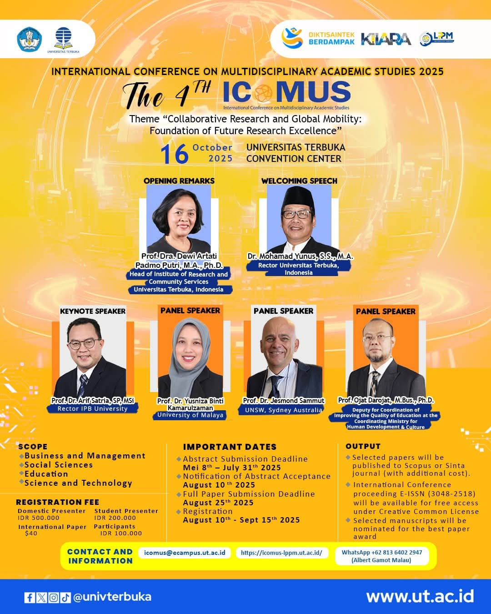

# 🌍 Call for Papers: The 4th ICoMUS 2025

Universitas Terbuka (UT) dengan bangga mempersembahkan **The 4th International Conference on Multidisciplinary Academic Studies (ICoMUS) 2025**. Konferensi ini merupakan instrumen strategis UT untuk mengakselerasi agenda internasionalisasi dan memperkuat posisinya sebagai universitas riset berkelas dunia.[^1]

Dengan tema **“Collaborative Research and Global Mobility: Foundation of Future Research Excellence”**, ICoMUS 2025 menjadi wadah bagi para akademisi, peneliti, dan praktisi dari berbagai disiplin ilmu untuk mempresentasikan hasil riset terkini serta berdiskusi tentang isu-isu multidisipliner.

## Detail Konferensi

-   **Tanggal**: Kamis, 16 Oktober 2025
-   **Lokasi**: Universitas Terbuka Convention Center (UTCC) & Online (Hybrid)
-   **Penyelenggara**: Lembaga Penelitian dan Pengabdian kepada Masyarakat (LPPM) Universitas Terbuka

### Pembicara Utama & Panelis
ICoMUS 2025 menghadirkan jajaran pemimpin institusional dan pakar dari berbagai negara, menjadikannya forum strategis untuk kemitraan antar-institusi.[^1]
-   **Welcoming Speech**: **Dr. Mohamad Yunus, S.S., M.A.** (Rektor, Universitas Terbuka)
-   **Opening Remarks**: **Prof. Dra. Dewi Artati Padmo Putri, M.A., Ph.D.** (Kepala LPPM, Universitas Terbuka)
-   **Keynote Speaker**: **Prof. Dr. Arif Satria, SP, MSi** (Rektor, IPB University)
-   **Panel Speakers**:
    -   **Prof. Dr. Yusniza Binti Kamarulzaman** (Dekan, University of Malaya, Malaysia)
    -   **Prof. Dr. Jesmond Sammut** (Wakil Dekan, UNSW Sydney, Australia)
    -   **Prof. Gjat Darojat, M.Bus., Ph.D.** (Deputi, Kemenko PMK, Indonesia)

## Lingkup Keilmuan (Scope)

Konferensi ini terbuka untuk berbagai bidang riset, antara lain:
-   Business and Management
-   Social Sciences
-   Education
-   Sciences and Technology

## Tanggal Penting

-   **Batas Akhir Pengumpulan Abstrak**: 31 Juli 2025
-   **Notifikasi Penerimaan Abstrak**: 10 Agustus 2025
-   **Batas Akhir Pengumpulan Makalah Penuh**: 25 Agustus 2025
-   **Periode Registrasi**: 10 Agustus – 15 September 2025

## Peluang Publikasi (Output)

Partisipasi dalam ICoMUS 2025 menawarkan jalur publikasi yang jelas dan bernilai tinggi untuk kemajuan karier akademik.[^1]
-   Semua paper yang diterima akan diterbitkan dalam **prosiding konferensi internasional (e-ISSN: 3048-2518)**.[^5]
-   Paper terpilih berkesempatan untuk dipublikasikan di **jurnal bereputasi terindeks Scopus atau Sinta** (dengan biaya tambahan), yang dapat dikonversi menjadi Angka Kredit (AK) signifikan untuk pengembangan jabatan fungsional dosen.[^6]

## Informasi & Pendaftaran

-   **Informasi Lengkap & Pendaftaran**: **[https://icomus-lppm.ut.ac.id](https://icomus-lppm.ut.ac.id)**
-   **Email**: `icomus@ecampus.ut.ac.id`
-   **WhatsApp**: +62 813 6402 2947 (Albert Gamot Malau)

Yuk, kirimkan karya ilmiah terbaikmu dan jadilah bagian dari komunitas riset global di ICoMUS 2025! ✍️

---

**#ICoMUS2025 #KonferensiInternasional #CallForPapers #UniversitasTerbuka #Riset #KolaborasiGlobal**

[^1]: Informasi dari poster dan laporan analisis "The 4th International Conference on Multidisciplinary Academic Studies (ICoMUS) 2025".
[^2]: "The 3rd International Conference on Multidisciplinary Academic Studies (ICoMUS) 2024," Universitas Terbuka, [Online]. Tersedia: [https://www.ut.ac.id/berita/2024/11/3rd-icomus-2024-ut-dongkrak-internasionalisasi-dan-kolaborasi-riset-multidisiplin-ilmu/](https://www.ut.ac.id/berita/2024/11/3rd-icomus-2024-ut-dongkrak-internasionalisasi-dan-kolaborasi-riset-multidisiplin-ilmu/).
[^3]: "Icomus 2022 - Universitas Terbuka," ICoMUS LPPM UT, [Online]. Tersedia: [https://icomus-lppm.ut.ac.id/Icomus-2022/icomus-2022.html](https://icomus-lppm.ut.ac.id/Icomus-2022/icomus-2022.html).
[^4]: "Universitas Terbuka – Making Higher Education Open to All," Universitas Terbuka, [Online]. Tersedia: [https://www.ut.ac.id/](https://www.ut.ac.id/).
[^5]: "Proceeding International Conference on Multidisciplinary Academic Studies (Online)," ISSN International Portal, [Online]. Tersedia: [https://portal.issn.org/?q=api/search&search[]=&search[]=MUST=medium=co,cr&facet[]=publisher=LPPM,%20Universitas%20Terbuka&size=50&search_id=50555168](https://portal.issn.org/?q=api/search&search[]=&search[]=MUST=medium=co,cr&facet[]=publisher=LPPM,%20Universitas%20Terbuka&size=50&search_id=50555168).
[^6]: "Angka Kredit Jurnal Nasional dan Internasional untuk Dosen," Dunia Dosen, [Online]. Tersedia: [https://duniadosen.com/angka-kredit-jurnal/](https://duniadosen.com/angka-kredit-jurnal/).

## Bagikan
<Share colorful />
<GitContributors />
<GitChangelog />