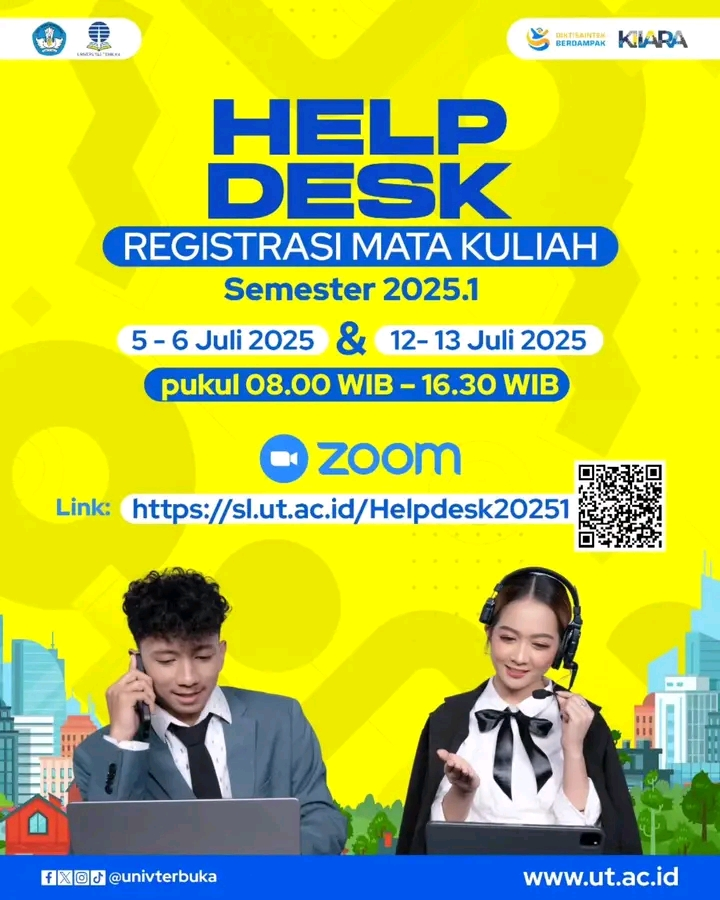

# 🎧 Bingung Soal Registrasi? UT Buka Layanan Help Desk Online!

🎓 Hai, Mahasiswa UT!

Mengalami kendala atau bingung saat melakukan registrasi mata kuliah untuk semester 2025.1, terutama dengan adanya **kurikulum baru**? Tenang, kamu tidak sendirian! Universitas Terbuka (UT) hadir untuk memberikan solusi.

Sebagai respons proaktif terhadap implementasi kurikulum baru 2025/2026, UT menyelenggarakan **Help Desk Registrasi Mata Kuliah** secara online.[^2] Ini adalah intervensi strategis untuk memastikan proses registrasi jutaan mahasiswa yang belajar mandiri dapat berjalan lancar tanpa hambatan.[^3]

## Jadwal dan Akses Layanan

Manfaatkan layanan bantuan real-time ini pada akhir pekan yang telah ditentukan. Di sini kamu bisa bertanya langsung kepada tim UT dan mendapatkan jawaban atas semua kebingunganmu. 🔍💬

-   **Jadwal Layanan**:
    -   Sabtu & Minggu, **5 - 6 Juli 2025**
    -   Sabtu & Minggu, **12 - 13 Juli 2025**
-   **Waktu**: Pukul **08.00 – 16.30 WIB**
-   **Platform**: Online via Zoom
-   **Tautan Akses**: **[https://sl.ut.ac.id/Helpdesk20251](https://sl.ut.ac.id/Helpdesk20251)**[^1]

Layanan ini dirancang khusus untuk memberikan dukungan sinkron (langsung) pada periode kritis registrasi, melengkapi sistem dukungan asinkron yang sudah ada seperti portal Hallo-UT.[^4]

Jangan biarkan kendala registrasi menghambat studimu. Manfaatkan layanan ini agar proses registrasimu lancar jaya! ✅✨

---

**#UniversitasTerbuka #HelpdeskUT #RegistrasiUT #KurikulumBaru #MahasiswaUT #KuliahFleksibel**

[^1]: Informasi dari poster acara "Help Desk Registrasi Mata Kuliah Semester 2025.1," Universitas Terbuka, Juli 2025. Tautan akses: [https://sl.ut.ac.id/Helpdesk20251](https://sl.ut.ac.id/Helpdesk20251).
[^2]: "Katalog Kurikulum Universitas Terbuka," Universitas Terbuka, [Online]. Tersedia: [https://www.ut.ac.id/katalog/](https://www.ut.ac.id/katalog/).
[^3]: "History - Universitas Terbuka," Universitas Terbuka, [Online]. Tersedia: [https://www.ut.ac.id/history/](https://www.ut.ac.id/history/).
[^4]: "FAQ - Layanan Informasi dan Bantuan," Hallo-UT, [Online]. Tersedia: [https://hallo-ut.ut.ac.id/informasi](https://hallo-ut.ut.ac.id/informasi).

## Bagikan
<Share colorful />
<GitContributors />
<GitChangelog />