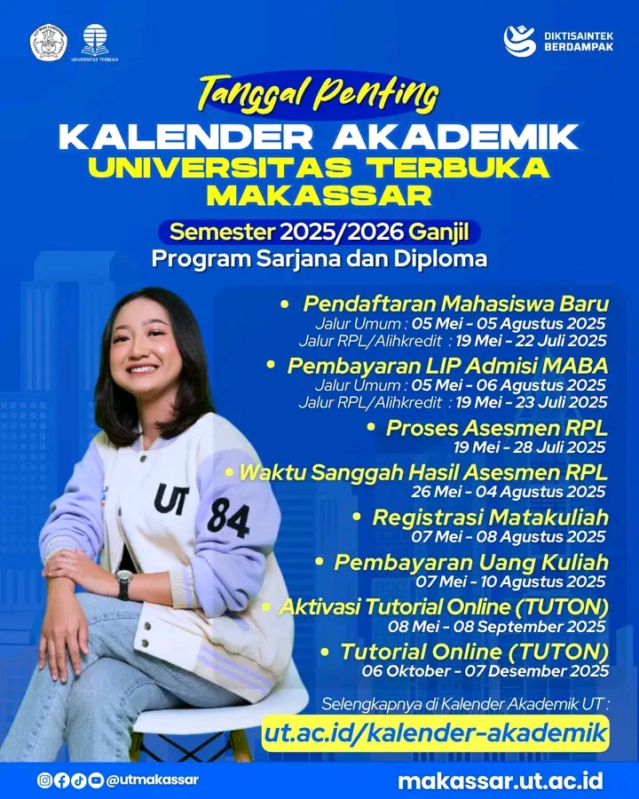

# 🗓️ Tanggal Penting: Kalender Akademik UT Semester Ganjil 2025/2026

Halo Sobat UT! 👋

Semester baru akan segera dimulai! Catat dan ingat baik-baik ya beberapa tanggal penting dalam kalender akademik Universitas Terbuka untuk semester ganjil 2025/2026. Jangan sampai ada yang terlewat, baik untuk kamu calon mahasiswa baru maupun mahasiswa aktif! [^2]

## 📌 Linimasa Pendaftaran & Registrasi

Berikut adalah jadwal kunci untuk program Sarjana dan Diploma yang perlu kamu perhatikan.[^1]

-   **Pendaftaran Mahasiswa Baru (MABA)**
    -   Jalur Umum (Non-RPL): **05 Mei – 05 Agustus 2025**
    -   Jalur Rekognisi Pembelajaran Lampau (RPL)/Alih Kredit: **19 Mei – 22 Juli 2025**
-   **Pembayaran LIP Admisi MABA**
    -   Jalur Umum (Non-RPL): **05 Mei – 06 Agustus 2025**
    -   Jalur RPL/Alih Kredit: **19 Mei – 23 Juli 2025**
-   **Registrasi Matakuliah (untuk semua mahasiswa)**: **07 Mei – 08 Agustus 2025**
-   **Pembayaran Uang Kuliah (untuk semua mahasiswa)**: **07 Mei – 10 Agustus 2025**

## 📚 Aktivitas Akademik Awal

Setelah proses registrasi selesai, persiapkan dirimu untuk kegiatan belajar berikut.[^4]

-   **Aktivasi Tutorial Online (TUTON)**: **08 Mei – 08 September 2025**
-   **Pelaksanaan Tutorial Online (TUTON)**: **06 Oktober – 07 Desember 2025**

## 💡 Memahami Istilah Penting

-   **Jalur RPL vs. Non-RPL**: Jalur Non-RPL adalah untuk lulusan SLTA sederajat, sedangkan Jalur RPL (Rekognisi Pembelajaran Lampau) ditujukan bagi mahasiswa pindahan atau lulusan Diploma yang ingin melanjutkan studi dengan pengakuan SKS dari pendidikan sebelumnya.[^3]
-   **LIP Admisi MABA**: Lembar Informasi Pembayaran Admisi Mahasiswa Baru adalah tagihan biaya pendaftaran yang harus dibayar untuk melanjutkan proses admisi.[^5]
-   **TUTON**: Tutorial Online adalah layanan bantuan belajar daring melalui `elearning.ut.ac.id` tempat mahasiswa berdiskusi dengan tutor dan mengerjakan tugas yang berkontribusi pada nilai akhir.[^6]

## Informasi & Kontak

-   Pantau selalu kalender akademik di situs resmi UT atau hubungi UT untuk informasi lebih lengkap.[^7]
-   Pendaftaran mahasiswa baru dilakukan melalui portal admisi resmi: **[https://admisi-sia.ut.ac.id/](https://admisi-sia.ut.ac.id/)**.[^8]

📣 Tag temanmu biar sama-sama siap! 💛

---

**#UniversitasTerbuka #UTMakassar #TanggalPentingUT #MahasiswaUT #KalenderAkademik #InfoPendaftaran**

[^1]: "Pengumuman Pembukaan Admisi Registrasi 2025 Ganjil dan Persyaratan Berkas Calon Mahasiswa Baru," Universitas Terbuka, [Online]. Tersedia: [https://registrasi.ut.ac.id/LandingPage/detailBerita/pengumuman-pembukaan-admisi-registrasi-2025-ganjil-dan-persyaratan-berkas-calon-mahasiswa-baru](https://registrasi.ut.ac.id/LandingPage/detailBerita/pengumuman-pembukaan-admisi-registrasi-2025-ganjil-dan-persyaratan-berkas-calon-mahasiswa-baru).
[^2]: "Kalender Akademik - Universitas Terbuka," Universitas Terbuka, [Online]. Tersedia: [https://www.ut.ac.id/kalender-akademik/](https://www.ut.ac.id/kalender-akademik/).
[^3]: "Universitas Terbuka Buka Pendaftaran Jalur RPL dan Non-RPL, Apa Itu?," Detik.com, [Online]. Tersedia: [https://www.detik.com/edu/seleksi-masuk-pt/d-6747027/universitas-terbuka-buka-pendaftaran-jalur-rpl-dan-non-rpl-apa-itu](https://www.detik.com/edu/seleksi-mask-pt/d-6747027/universitas-terbuka-buka-pendaftaran-jalur-rpl-dan-non-rpl-apa-itu).
[^4]: "Kalender - UT Banjarmasin," Universitas Terbuka Banjarmasin, [Online]. Tersedia: [https://banjarmasin.ut.ac.id/kalender/](https://banjarmasin.ut.ac.id/kalender/).
[^5]: "Panduan Pendaftaran Lengkap Universitas Terbuka Bogor," Universitas Terbuka Bogor, [Online]. Tersedia: [https://bogor.ut.ac.id/informasi-pendaftaran](https://bogor.ut.ac.id/informasi-pendaftaran).
[^6]: "Tutorial Online – Universitas Terbuka," Universitas Terbuka, [Online]. Tersedia: [https://www.ut.ac.id/tutorial-online/](https://www.ut.ac.id/tutorial-online/).
[^7]: "Beranda - Universitas Terbuka Makassar," Universitas Terbuka Makassar, [Online]. Tersedia: [https://makassar.ut.ac.id/](https://makassar.ut.ac.id/).
[^8]: "Sistem Informasi Akademik - Admisi Sia UT," Universitas Terbuka, [Online]. Tersedia: [https://admisi-sia.ut.ac.id/](https://admisi-sia.ut.ac.id/).

## Bagikan
<Share colorful />
<GitContributors />
<GitChangelog />