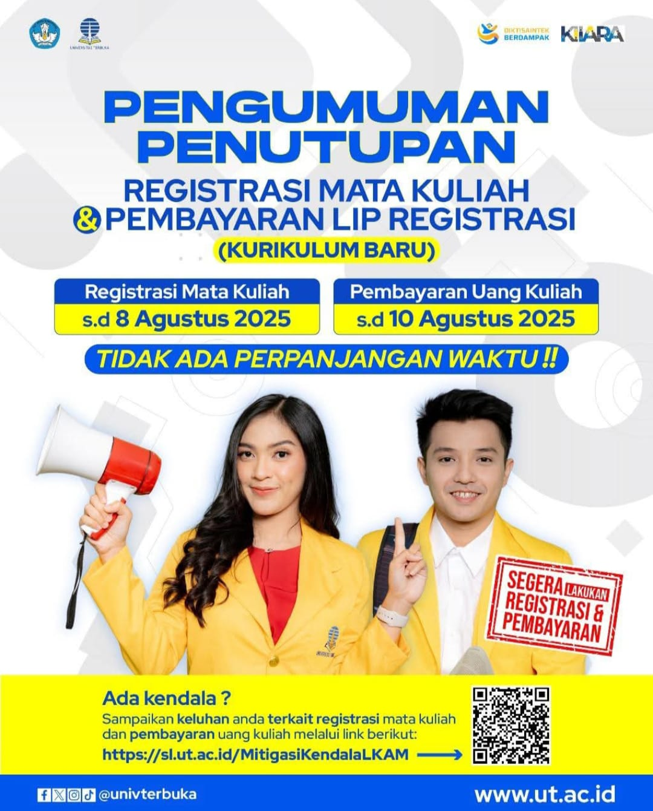

# 🚨 Pengumuman Penutupan Registrasi & Pembayaran Semester Ganjil 2025

Halo, Mahasiswa UT Program Diploma dan Sarjana!

Ini adalah pengumuman penting mengenai batas akhir registrasi mata kuliah dan pembayaran uang kuliah untuk **Semester Ganjil 2025 (Masa Registrasi 2025.1)**. Pengumuman ini secara khusus ditujukan bagi mahasiswa yang terdaftar dalam **Kurikulum Baru**.

## 🗓️ Batas Waktu Kritis yang Tidak Dapat Diubah

Pastikan Anda mencatat dan mematuhi jadwal berikut, karena ini adalah kebijakan operasional yang fundamental di Universitas Terbuka.

-   **Registrasi Mata Kuliah**: Batas akhir hingga **8 Agustus 2025**
-   **Pembayaran Uang Kuliah**: Batas akhir hingga **10 Agustus 2025**

> [!warning]
> **TIDAK ADA PERPANJANGAN WAKTU!**
> Kebijakan ini bersifat mutlak. Mengingat skala mahasiswa UT yang sangat masif, sistem administrasi berjalan secara terotomatisasi dengan jadwal yang ketat. Keterlambatan registrasi atau pembayaran akan menyebabkan efek domino yang mengganggu seluruh tahapan akademik berikutnya, mulai dari distribusi bahan ajar hingga penjadwalan ujian.

## Konteks Penting: Kurikulum Baru dan Proaktivitas Mahasiswa

Pengumuman ini sangat relevan karena UT sedang dalam proses implementasi **Kurikulum Baru** secara menyeluruh. Kurikulum ini dirancang untuk menyelaraskan pendidikan di UT dengan standar nasional (Permendikbudristek No. 53/2023) dan internasional (panduan AAOU & ICDE), yang membawa perubahan pada struktur mata kuliah, profil lulusan, dan penambahan mata kuliah praktik.

Dalam model pembelajaran mandiri UT, sikap proaktif adalah prasyarat kesuksesan. Oleh karena itu, mahasiswa diharapkan dapat mengelola jadwal akademiknya secara mandiri dan bertanggung jawab.

## 🚀 Langkah yang Harus Segera Diambil

1.  **Akses Pusat Kendali Anda**: Segera login ke portal **MyUT**, yang merupakan dasbor utama Anda untuk semua urusan administrasi akademik.
    -   **Portal Mahasiswa**: **[https://myut.ut.ac.id/](https://myut.ut.ac.id/)**
2.  **Lakukan Registrasi & Pembayaran**: Lakukan registrasi mata kuliah sesuai panduan dan segera selesaikan pembayaran uang kuliah untuk menghasilkan Lembar Informasi Pembayaran (LIP) Registrasi.
3.  **Verifikasi Status**: Setelah membayar, pastikan untuk login kembali ke MyUT untuk memeriksa apakah status registrasi Anda sudah diperbarui menjadi "LUNAS".

## 🔧 Mengalami Kendala Saat Registrasi?

UT telah mengantisipasi potensi kendala teknis atau administratif selama periode puncak registrasi. Jika Anda mengalami masalah, jangan panik. Gunakan kanal mitigasi khusus yang telah disediakan untuk mendapatkan bantuan.

-   **Lapor Kendala**: Segera sampaikan keluhan Anda terkait registrasi mata kuliah dan pembayaran melalui tautan berikut: **[https://sl.ut.ac.id/MitigasiKendalaLKAM](https://sl.ut.ac.id/MitigasiKendalaLKAM)**

Kanal ini dirancang untuk memberikan solusi yang lebih cepat dan efisien, sehingga masalah Anda dapat segera tertangani sebelum batas waktu berakhir. Jadilah mahasiswa yang "sat set sat set" dan selesaikan kewajibanmu sekarang juga!

---

**#UniversitasTerbuka #DeadlineUT #RegistrasiUT #InfoAkademik #MahasiswaUT #KurikulumBaru**

[^1]: "Pengumuman Pembukaan Admisi Registrasi 2025 Ganjil dan Persyaratan Berkas Calon Mahasiswa Baru," Universitas Terbuka, [Online]. Tersedia: [https://registrasi.ut.ac.id/LandingPage/detailBerita/pengumuman-pembukaan-admisi-registrasi-2025-ganjil-dan-persyaratan-berkas-calon-mahasiswa-baru](https://registrasi.ut.ac.id/LandingPage/detailBerita/pengumuman-pembukaan-admisi-registrasi-2025-ganjil-dan-persyaratan-berkas-calon-mahasiswa-baru).
[^2]: "Kurikulum Baru - Universitas Terbuka," Universitas Terbuka, [Online]. Tersedia: [https://www.ut.ac.id/kurikulum-baru/](https://www.ut.ac.id/kurikulum-baru/).
[^3]: "Pembelajaran - Universitas Terbuka," UT Makassar, [Online]. Tersedia: [https://makassar.ut.ac.id/pembelajaran/](https://makassar.ut.ac.id/pembelajaran/).
[^4]: "Kalender Akademik – Universitas Terbuka," Universitas Terbuka, [Online]. Tersedia: [https://www.ut.ac.id/kalender-akademik/](https://www.ut.ac.id/kalender-akademik/).

## Bagikan
<Share colorful />
<GitContributors />
<GitChangelog />