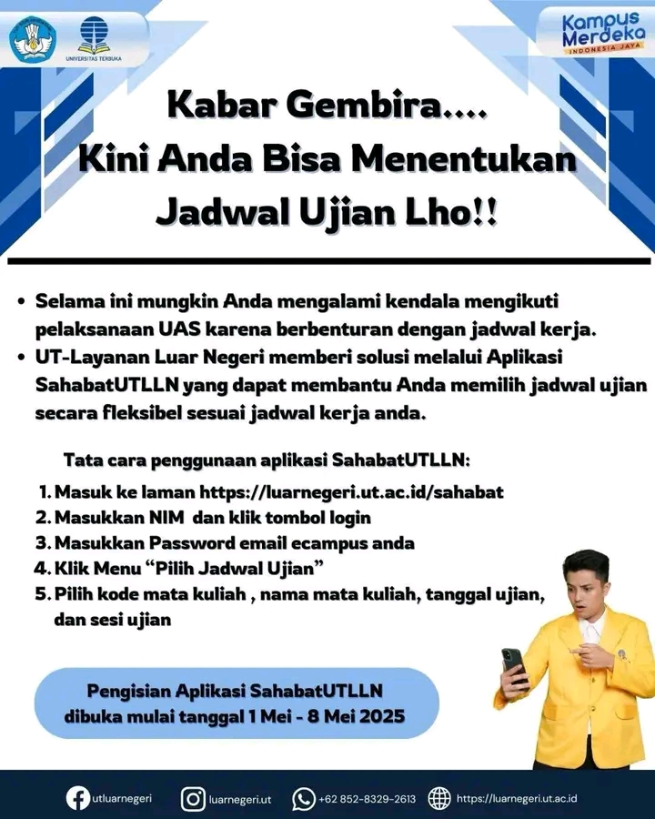

# Kabar Gembira! Kini Anda Bisa Menentukan Jadwal Ujian dengan Aplikasi SahabatUTLLN

✨ **Universitas Terbuka (UT) Layanan Luar Negeri** memberikan kabar gembira bagi mahasiswa yang mungkin mengalami kendala mengikuti pelaksanaan **Ujian Akhir Semester (UAS)** karena berbenturan dengan **jadwal kerja** [^1] [^2] [^3].

Dengan aplikasi **SahabatUTLLN**, mahasiswa dapat memilih jadwal ujian secara **fleksibel**, menyesuaikan dengan jadwal kerja atau kegiatan lainnya. Ini merupakan solusi inovatif untuk memberikan kenyamanan dan kemudahan bagi mahasiswa yang berada di luar negeri.

## 📸 Gambar Pengumuman

## Tata Cara Penggunaan Aplikasi SahabatUTLLN
Untuk memanfaatkan fitur **pilih jadwal ujian** di aplikasi SahabatUTLLN, berikut langkah-langkah yang harus diikuti:

1. **Masukkan ke laman**: [https://luarnegeri.ut.ac.id/sahabat](https://luarnegeri.ut.ac.id/sahabat)  
2. **Masukkan NIM** dan klik tombol **login**  
3. **Masukkan kata sandi** email **ecampus** Anda  
4. Klik menu **"Pilih Jadwal Ujian"**  
5. Pilih **kode mata kuliah**, **nama mata kuliah**, **tanggal ujian**, dan **sesi ujian** yang diinginkan  

## Pendaftaran Aplikasi SahabatUTLLN
Pendaftaran aplikasi **SahabatUTLLN** dibuka mulai **1 Mei 2025** hingga **8 Mei 2025**. Pastikan Anda mengakses aplikasi dalam periode ini untuk menentukan jadwal ujian yang sesuai dengan kebutuhan Anda.

## Catatan Penting
- **Jadwal ujian** yang dipilih melalui aplikasi ini akan **disesuaikan** dengan jadwal yang tersedia di sistem UT.
- **Penting untuk diperhatikan** bahwa aplikasi ini hanya berlaku bagi mahasiswa **Universitas Terbuka** yang terdaftar di program **Layanan Luar Negeri**.

---

**Informasi lebih lanjut** mengenai aplikasi SahabatUTLLN dan pengisian jadwal ujian dapat menghubungi **email**: [kemahasiswaan@ut.ac.id](mailto:kemahasiswaan@ut.ac.id)

Kami berharap aplikasi ini dapat membantu Anda mempersiapkan ujian dengan lebih fleksibel dan sesuai dengan jadwal pribadi.

---

#SahabatUTLLN #JadwalUjianUT #UniversitasTerbuka #UTLayananLuarNegeri #KampusBerdampak

---

[^1]: "Aplikasi SahabatUTLLN Universitas Terbuka," Universitas Terbuka, [Online]. Tersedia: [https://luarnegeri.ut.ac.id/sahabat](https://luarnegeri.ut.ac.id/sahabat). [Diakses: Mei 1, 2025].  
[^2]: "Informasi Pendaftaran Aplikasi SahabatUTLLN," Universitas Terbuka, [Online]. Tersedia: [https://luarnegeri.ut.ac.id](https://luarnegeri.ut.ac.id). [Diakses: Mei 1, 2025].  
[^3]: "Pengumuman Layanan Luar Negeri Universitas Terbuka," Universitas Terbuka, [Online]. Tersedia: [https://www.ut.ac.id](https://www.ut.ac.id). [Diakses: Mei 1, 2025].

## Bagikan
<Share colorful />
<GitContributors />
<GitChangelog />