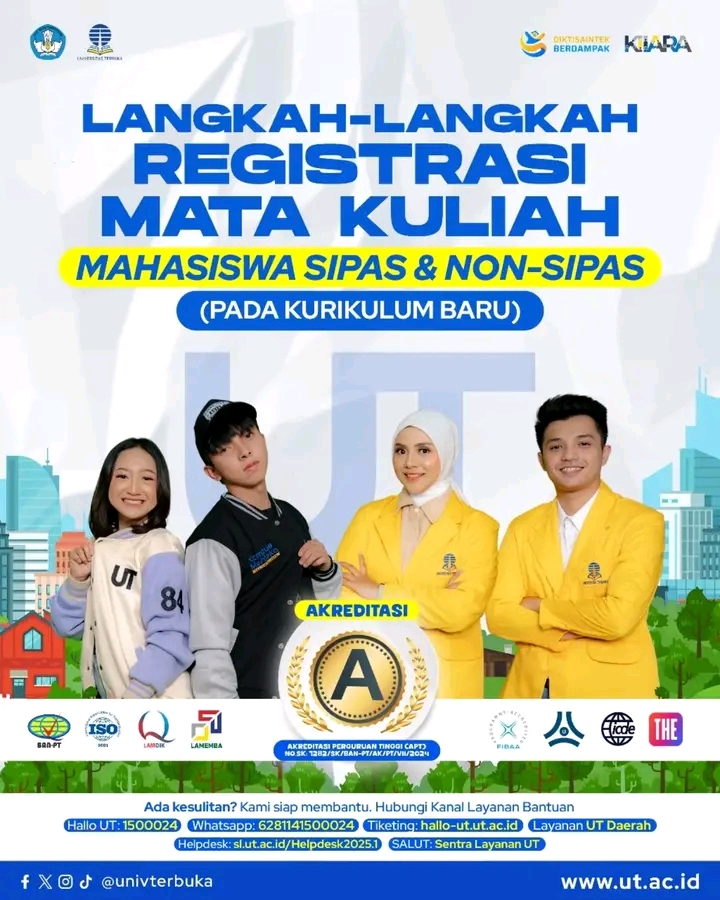
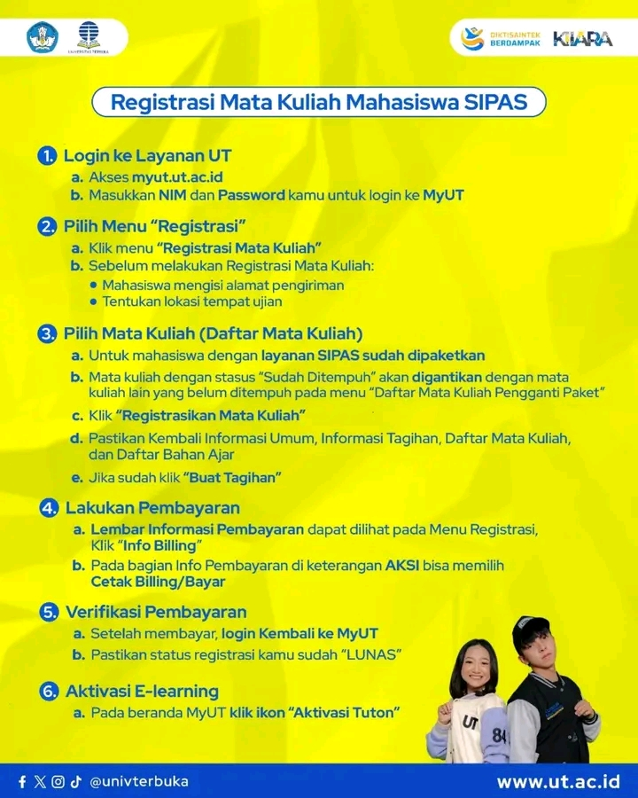
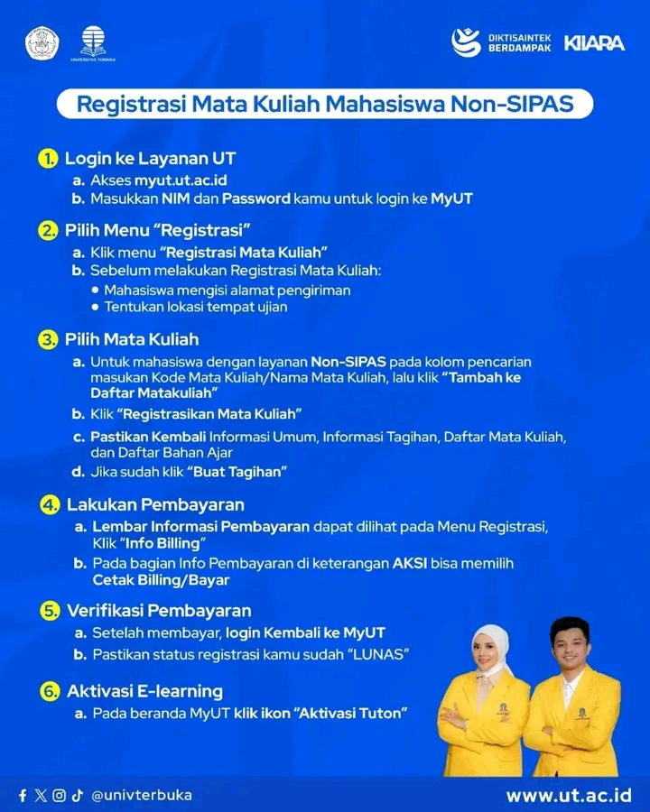
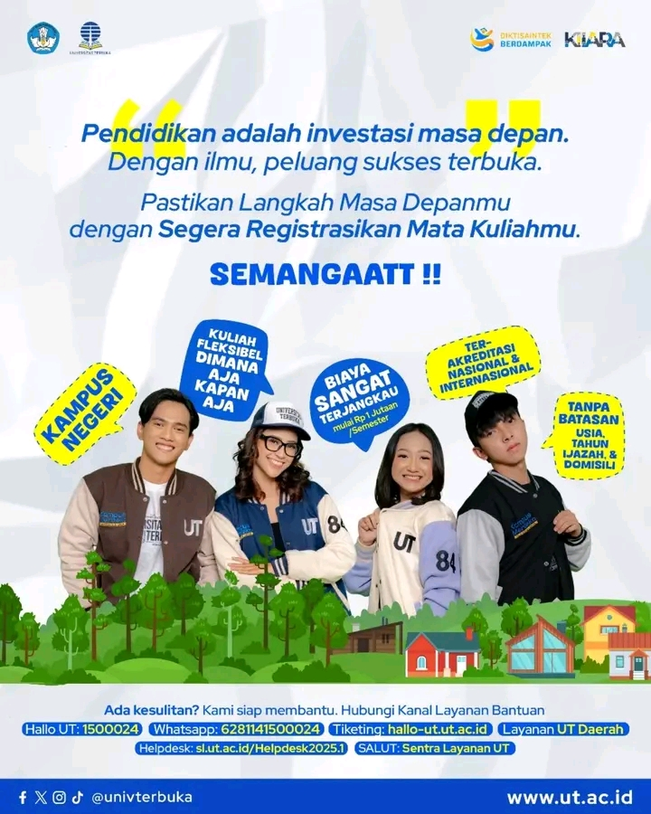

# 📝 Panduan Registrasi Mata Kuliah UT: SIPAS vs Non-SIPAS

🚨 Sudah registrasi mata kuliah pada **Kurikulum Baru** hari ini?

Hai, mahasiswa UT! Memasuki semester baru berarti saatnya melakukan registrasi mata kuliah. Tapi, tahu gak sih kalau ada dua jenis layanan registrasi di UT? 🤔 Yap, ada **SIPAS** dan **Non-SIPAS**, dan keduanya punya alur yang sedikit berbeda.

Memahami perbedaan ini adalah kunci untuk merencanakan studimu dengan lancar di Universitas Terbuka, sebuah Perguruan Tinggi Negeri (PTN) dengan **Akreditasi A** yang berkomitmen pada pendidikan fleksibel dan berkualitas.[^1] Yuk, kenali keduanya biar gak bingung pas mau daftar! 👇

## Kenali Dua Sistem Layanan di UT

Universitas Terbuka menawarkan dua skema layanan studi yang bisa disesuaikan dengan kebutuhan dan gaya belajarmu.[^2]

### 🟡 SIPAS (Sistem Paket Semester)

SIPAS adalah sistem di mana mata kuliah untuk setiap semester sudah ditentukan secara otomatis oleh universitas dalam satu paket, termasuk bahan ajar (modul).[^3]

-   **Untuk siapa?** Pas banget buat kamu yang suka sistematis, ingin jalur studi yang terstruktur, dan tidak mau ribet memilih mata kuliah satu per satu.
-   **Kelebihan**: Proses registrasi lebih sederhana dan biaya per semester sudah mencakup semua komponen utama.
-   **Jenis**: Terdapat beberapa variasi seperti SIPAS Non-TTM (tanpa tutorial tatap muka), SIPAS Semi, SIPAS Penuh, hingga SIPAS Plus, yang menawarkan tingkat bimbingan berbeda.[^4]

### 🟢 Non-SIPAS (Non Sistem Paket Semester)

Non-SIPAS memberikan kebebasan penuh bagi mahasiswa untuk memilih mata kuliah dan menentukan jumlah SKS yang akan diambil setiap semesternya (dengan batas maksimal 24 SKS per semester).[^5]

-   **Untuk siapa?** Cocok untuk kamu yang lebih fleksibel, mandiri, dan perlu menyesuaikan jadwal kuliah dengan pekerjaan atau komitmen lain.
-   **Kelebihan**: Kamu punya otonomi penuh atas laju dan beban studimu.
-   **Perlu Diperhatikan**: Mahasiswa bertanggung jawab penuh untuk membeli bahan ajar secara terpisah dan memastikan tidak ada jadwal ujian yang bentrok saat registrasi.[^6]

## Langkah-Langkah Registrasi di MyUT

Semua proses registrasi dilakukan secara online melalui portal mahasiswa di **[myut.ut.ac.id](https://myut.ut.ac.id/)**.[^7] Berikut adalah panduan ringkasnya.

| Registrasi Mahasiswa SIPAS                                         | Registrasi Mahasiswa Non-SIPAS                                     |
| :----------------------------------------------------------------- | :----------------------------------------------------------------- |
|  |  |

**Langkah Umum:**
1.  **Login ke MyUT**: Akses `myut.ut.ac.id` dengan NIM dan password atau akun email ecampus-mu.
2.  **Pilih Menu "Registrasi"**: Klik menu "Registrasi" lalu "Registrasi Mata Kuliah".
3.  **Isi Alamat & Lokasi Ujian**: Langkah ini wajib dilakukan sebelum bisa melanjutkan.
4.  **Pilih Mata Kuliah**: Mahasiswa **SIPAS** akan melihat paket otomatis, sedangkan mahasiswa **Non-SIPAS** memilih mata kuliah secara manual.
5.  **Buat Tagihan & Lakukan Pembayaran**: Setelah yakin, buat tagihan (billing) dan bayar melalui kanal yang tersedia (Bank, OVO, Tokopedia, dll).[^8]
6.  **Verifikasi & Aktivasi**: Login kembali untuk memastikan status pembayaran "LUNAS" dan jangan lupa klik "Aktivasi Tuton" di beranda MyUT.

## Butuh Bantuan?

Jika mengalami kesulitan, jangan ragu untuk menghubungi Kanal Layanan Bantuan resmi UT. Pendidikan adalah investasi masa depan, pastikan proses registrasimu berjalan lancar! SEMANGAAATT!!

---

**#UniversitasTerbuka #RegistrasiUT #SIPAS #NonSIPAS #KurikulumBaru #MahasiswaUT #KuliahFleksibel**

[^1]: Informasi dari poster promosi Universitas Terbuka, 2025.
[^2]: "SIPAS dan Non SIPAS – Website Official UT Medan," Universitas Terbuka Medan, [Online]. Tersedia: [https://medan.ut.ac.id/sipas-nonsipas/](https://medan.ut.ac.id/sipas-nonsipas/).
[^3]: "Registrasi Mata Kuliah di Kurikulum Baru? Gampang Banget!," TikTok @univterbuka, [Online]. Tersedia: [https://www.tiktok.com/@univterbuka/video/7522732652864998663](https://www.tiktok.com/@univterbuka/video/7522732652864998663).
[^4]: "Sistem Paket Semester (SIPAS) Non TTM," Universitas Terbuka Aceh, [Online]. Tersedia: [https://aceh.ut.ac.id/sipas-non-sipas/](https://aceh.ut.ac.id/sipas-non-sipas/).
[^5]: "Bagaimana cara Registrasi Matakuliah Mahasiswa On Going Non SIPAS?," KMS "Tanya MinUT", [Online]. Tersedia: [https://kms.ut.ac.id/kms-ut/bagaimana-cara-registrasi-mata-kuliah-mahasiswa-on-going-non-sipas/](https://kms.ut.ac.id/kms-ut/bagaimana-cara-registrasi-mata-kuliah-mahasiswa-on-going-non-sipas/).
[^6]: "Registrasi Mata Kuliah - Universitas Terbuka," Universitas Terbuka, [Online]. Tersedia: [https://www.ut.ac.id/registrasi-mata-kuliah-0/](https://www.ut.ac.id/registrasi-mata-kuliah-0/).
[^7]: "Tutorial Registrasi SIPAS Kurikulum Baru UT 2025," YouTube, [Online]. Tersedia: [https://www.youtube.com/watch?v=dybF3pOJ6pA](https://www.youtube.com/watch?v=dybF3pOJ6pA).
[^8]: "Rincian lengkap biaya kuliah di Universitas Terbuka," ANTARA News, [Online]. Tersedia: [https://www.antaranews.com/berita/4244723/rincian-lengkap-biaya-kuliah-di-universitas-terbuka](https://www.antaranews.com/berita/4244723/rincian-lengkap-biaya-kuliah-di-universitas-terbuka).

## Bagikan
<Share colorful />
<GitContributors />
<GitChangelog />