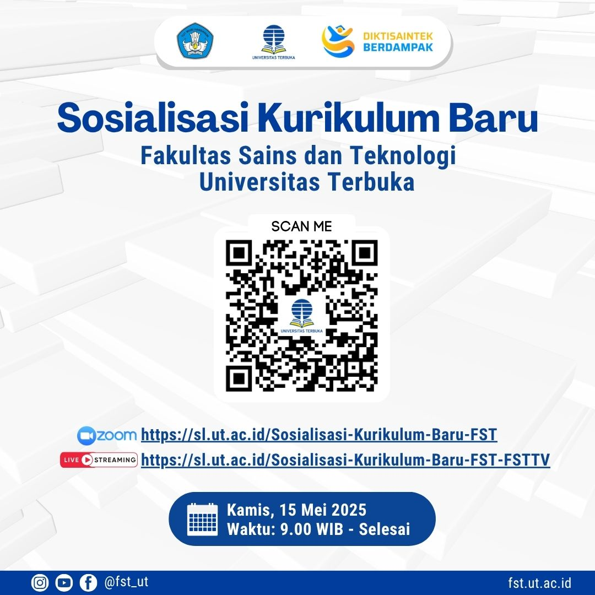
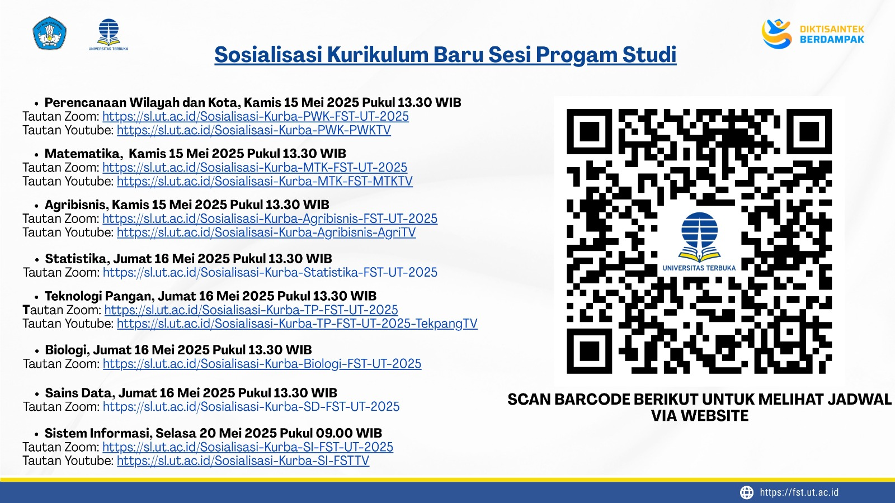

# 🎓 Sosialisasi Kurikulum Baru FST Universitas Terbuka 2025

Halo Rekan-rekan FST,

Bagi kamu yang tidak sempat menyaksikan **Sosialisasi Kurikulum Baru Mahasiswa FST**, kami memahami bahwa dengan berbagai kesibukan, tidak semua mahasiswa bisa mengikuti acara langsung. Namun, jangan khawatir, karena kami menyediakan rekaman lengkap dari acara sosialisasi yang dapat kamu saksikan kapan saja melalui link berikut:

👉 [Saksikan Rekaman Sosialisasi Kurikulum Baru FST](https://sl.ut.ac.id/Sosialisasi-Kurikulum-Baru-FST-FSTTV)

## 📅 Jadwal Sosialisasi Kurikulum Baru FST UT 2025

- **Tanggal Sosialisasi**: Kamis, 15 Mei 2025
- **Waktu Sosialisasi**: 09.00 WIB – Selesai
- **Platform**: Daring melalui Zoom dan YouTube

**Link Sosialisasi**: [https://sl.ut.ac.id/Sosialisasi-Kurikulum-Baru-FST-FSTTV](https://sl.ut.ac.id/Sosialisasi-Kurikulum-Baru-FST-FSTTV)

## 📚 Tentang Kurikulum Baru FST

Kurikulum baru Fakultas Sains dan Teknologi (FST) Universitas Terbuka yang akan diterapkan mulai tahun 2025 menawarkan pembaruan pada **struktur mata kuliah**, **sistem ujian**, dan **metode pembelajaran** yang semakin fleksibel. Sosialisasi ini sangat penting bagi mahasiswa yang baru ataupun yang telah lama berada di UT untuk mengetahui perbedaan dan cara menyesuaikan diri dengan kurikulum yang telah diperbarui.

## 📹 Tonton Rekaman Sosialisasi

Jika Anda tidak bisa hadir pada sesi sosialisasi langsung, Anda dapat menonton rekaman lengkapnya melalui tautan berikut:

🎥 **[Sosialisasi Kurikulum Baru FST UT 2025](https://sl.ut.ac.id/Sosialisasi-Kurikulum-Baru-FST-FSTTV)**

## 📌 Apa yang Baru di Kurikulum FST 2025?

### 1. **Peningkatan Pembelajaran Berbasis Teknologi**
   - Penerapan **teknologi terbaru** untuk mendukung pembelajaran praktikum yang lebih interaktif.
   - Pembaruan pada **mata kuliah berbasis data** dan **analisis statistik** yang lebih sesuai dengan perkembangan industri.

### 2. **Metode Ujian Fleksibel**
   - Ujian dapat dilakukan **online** dengan akses melalui portal resmi UT.
   - Terdapat **ujian buka buku** dengan modul resmi yang sudah tersedia bagi mahasiswa.

### 3. **Perubahan Struktur Mata Kuliah**
   - Mata kuliah diorganisir lebih sistematis, dengan adanya **mata kuliah wajib** dan **mata kuliah pilihan** yang lebih relevan.

## 🔗 Sumber Informasi

Untuk informasi lebih lanjut mengenai kurikulum, silakan kunjungi halaman resmi Universitas Terbuka di [https://www.ut.ac.id](https://www.ut.ac.id) atau hubungi fakultas terkait.

## 📸 Gambar Pengumuman

## Jadwal Sosialisasi Per Program Studi

---

### 📌 Referensi

[1^]: "Kurikulum Baru FST UT 2025," Universitas Terbuka, [Online]. Tersedia: [https://www.ut.ac.id](https://www.ut.ac.id). [Diakses: Mei 15, 2025].
[2^]: "Sosialisasi Kurikulum Baru FST 2025," Universitas Terbuka, [Online]. Tersedia: [https://sl.ut.ac.id/Sosialisasi-Kurikulum-Baru-FST-FSTTV](https://sl.ut.ac.id/Sosialisasi-Kurikulum-Baru-FST-FSTTV). [Diakses: Mei 15, 2025].
[3^]: "FST TV - Sosialisasi Kurikulum Baru FST UT 2025," YouTube, [Online]. Tersedia: [https://www.youtube.com/watch?v=XYgZu4_-3Mk](https://www.youtube.com/watch?v=XYgZu4_-3Mk). [Diakses: Mei 15, 2025].
[4^]: "Kurikulum FST UT 2025," Universitas Terbuka, [Online]. Tersedia: [https://www.ut.ac.id/wp-content/uploads/2025/05/KATALOG-FEB-FHISIP-FKIP-DAN-FST-2025-2026_SC_230525.pdf](https://www.ut.ac.id/wp-content/uploads/2025/05/KATALOG-FEB-FHISIP-FKIP-DAN-FST-2025-2026_SC_230525.pdf). [Diakses: Mei 15, 2025].

---

**#SosialisasiKurikulumFST #UniversitasTerbuka #UTFST #KurikulumBaru #PendidikanFleksibel**

## Bagikan
<Share colorful />
<GitContributors />
<GitChangelog />