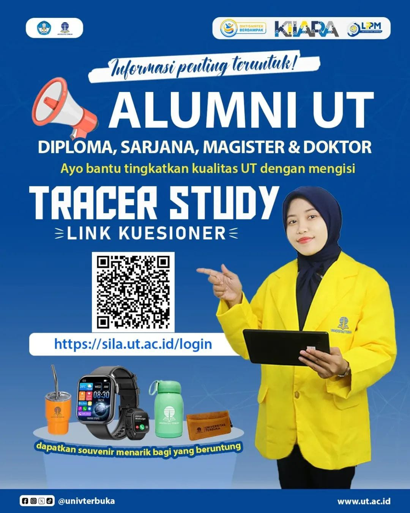

# 🎓 Panggilan untuk Seluruh Alumni Universitas Terbuka!

Hai Alumni UT! 👋

Baik kamu lulusan jenjang **Diploma, Sarjana, Magister, hingga Doktor**, peranmu sangat berharga untuk kemajuan almamater tercinta. Saat ini, Universitas Terbuka sedang melaksanakan **Tracer Study (Studi Pelacakan Alumni)** dan mengundangmu untuk berpartisipasi.

Tracer study adalah survei terstandar untuk menelusuri jejak karier alumni dan mendapatkan umpan balik berharga mengenai relevansi pendidikan UT dengan dunia kerja.[^3]

## Mengapa Partisipasi Anda Penting?

Partisipasi Anda bukan sekadar mengisi data, melainkan sebuah kontribusi strategis yang berdampak besar.

-   **Peningkatan Kualitas UT**: Umpan balik Anda akan menjadi masukan vital untuk evaluasi dan pengembangan kurikulum, metode pengajaran, serta layanan akademik agar lebih sesuai dengan kebutuhan industri.[^3]
-   **Pemenuhan Target Nasional**: Data tracer study sangat krusial untuk pemenuhan **Indikator Kinerja Utama (IKU) 1** dari Kemendikbudristek, yang mengukur tingkat keterserapan lulusan di dunia kerja. Partisipasimu secara langsung memengaruhi peringkat dan reputasi UT di tingkat nasional.[^4]

## Cara Mengisi Kuesioner

Luangkan waktu sejenak untuk memberikan kontribusimu melalui platform resmi **SILA (Sistem Informasi Lacak Alumni)**.[^2]

1.  **Akses Portal**: Buka laman **[https://sila.ut.ac.id/login](https://sila.ut.ac.id/login)**.[^1]
2.  **Login**:
    -   **Username**: Gunakan 9 digit **Nomor Induk Mahasiswa (NIM)** Anda.
    -   **Password**: Masukkan **tanggal lahir** Anda dengan format **DD/MM/YYYY** (contoh: 14/02/1983).
3.  **Isi Kuesioner**: Ikuti petunjuk dan isi kuesioner yang tersedia.

## 🎁 Apresiasi untuk Partisipan

Sebagai bentuk terima kasih, alumni yang berpartisipasi dan beruntung akan mendapatkan **souvenir menarik** dari Universitas Terbuka.

Jangan tunggu lagi, ayo bantu UT menjadi lebih baik dan berdaya saing global. Partisipasimu hari ini adalah investasi untuk masa depan almamater! 🙌

---

**#UniversitasTerbuka #AlumniUT #TracerStudyUT #SILA #KemajuanPendidikan #IKUUT**

[^1]: "SILA-UT - Universitas Terbuka," Universitas Terbuka, [Online]. Tersedia: [https://sila.ut.ac.id/login](https://sila.ut.ac.id/login).
[^2]: "Perubahan Laman Tracer Study Universitas Terbuka," Universitas Terbuka, [Online]. Tersedia: [https://www.ut.ac.id/pengumuman/2025/07/perubahan-laman-tracer-study-universitas-terbuka/](https://www.ut.ac.id/pengumuman/2025/07/perubahan-laman-tracer-study-universitas-terbuka/).
[^3]: "Tracer Study – Career Development Center Universitas Indonesia," CDC-UI, [Online]. Tersedia: [https://cdc.ui.ac.id/tracer-study/](https://cdc.ui.ac.id/tracer-study/).
[^4]: "Tracer Study Alumni Universitas Terbuka," Ikatan Alumni UT, [Online]. Tersedia: [https://alumni-ut.id/2021/07/tracer-study-alumni-universitas-terbuka/](https://alumni-ut.id/2021/07/tracer-study-alumni-universitas-terbuka/).

## Bagikan
<Share colorful />
<GitContributors />
<GitChangelog />