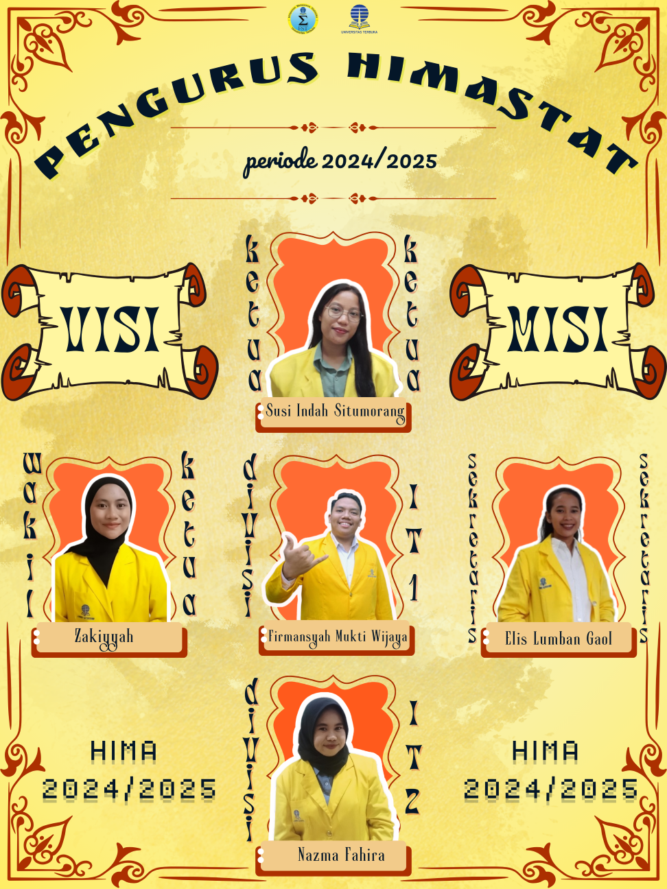

--- 
title: Pengurus HIMASTAT 2024/2025
index: true
icon: users
category:
  - Berita HIMASTAT
  - Info Dong
author:
  - name: "Firmansyah Mukti Wijaya"
    email: "ikimukti@gmail.com"
    url: "https://ikimukti.com"
  - name: "Himastatut Docs"
    email: "himastatut@gmail.com"
    url: "https://himastatut.my.id/article/"
--- 

# Pengurus HIMASTAT 2024/2025

✨ **Selamat datang untuk pengurus HIMASTAT 2024/2025!** ✨

Kepengurusan baru ini hadir dengan semangat yang tinggi, siap membawa HIMASTAT ke level berikutnya! Kepengurusan baru yang dipimpin oleh Kia, Susi, Elis, Mukti, dan Nazma akan terus melanjutkan perjalanan yang sudah luar biasa dari tim sebelumnya. Terima kasih kepada pengurus HIMASTAT 2023/2024 yang telah memberikan kontribusi besar dalam menguatkan HIMASTAT. 💥

Dengan dedikasi dan semangat baru, kami siap memberikan inovasi dan kebersamaan untuk HIMASTAT. Yuk, bersama-sama kita saksikan gebrakan dan warna baru dari tim 2024/2025! 💪💫

--- 

## 📸 Foto Pengurus 2024/2025

--- 

## 🌟 Kenali Pengurus HIMASTAT 2024/2025

Berikut adalah beberapa pengurus yang siap berkontribusi di tahun 2024/2025:

### 1. **Susi Indah Situmorang (Ketua HIMASTAT)**

Halo semua! Aku Susi, biasa dipanggil Susi atau Indah, dari UT Medan dan mulai kuliah di Universitas Terbuka sejak 2022 ✨. Tahun ini aku dipercaya sebagai Ketua HIMASTAT, dan pastinya aku siap melaksanakan tugas sebaik mungkin. Semoga setiap rencana setahun ke depan bisa terlaksana dengan lancar dan berdampak positif buat teman-teman mahasiswa Statistika UT 🌟

  
**Portofolio:** [Susi Indah Situmorang - Ketua HIMASTAT](/jepret/jepret2024/portofolio/MHS044845085.md)

### 2. **Kia Zakiyyah (Wakil Ketua HIMASTAT)**

Halo teman-teman! Aku Kia dari UT Jakarta, dipercaya menjadi Wakil Ketua HIMASTAT 2024/2025. Harapanku untuk tahun ini, HIMASTAT semakin solid dan bisa mencapai pencapaian yang lebih tinggi! Mari kita wujudkan semua program kerja bersama! 💫

  
**Portofolio:** [Kia Zakiyyah - Wakil Ketua HIMASTAT](/jepret/jepret2024/portofolio/MHS043164149.md)

### 3. **Elis Maria Lumban Gaol (Sekretaris HIMASTAT)**

Salam kenal, aku Elis dari UT Medan. Tahun ini, aku akan menjalankan tugas sebagai Sekretaris HIMASTAT. Harapanku, HIMASTAT semakin aktif dalam menjalankan program yang bermanfaat untuk kita semua. Terima kasih atas dukungannya! 🎯

  
**Portofolio:** [Elis Maria Lumban Gaol - Sekretaris HIMASTAT](/jepret/jepret2024/portofolio/MHS044875482.md)

### 4. **Mukti Firmansyah Wijaya (Divisi IT HIMASTAT)**

Halo, aku Mukti dari UT Malang, Divisi IT HIMASTAT 2024/2025! Dengan semangat baru, aku siap membantu HIMASTAT dalam menghadirkan inovasi teknologi yang bermanfaat. Mari bersama mewujudkan HIMASTAT yang lebih digital dan efektif! 💻🔥

  
**Portofolio:** [Mukti Firmansyah Wijaya - Divisi IT HIMASTAT](/jepret/jepret2024/portofolio/MHS050900568.md)

### 5. **Nazma Fahira (Divisi IT HIMASTAT)**

Hey, aku Nazma Fahira, mahasiswa dari UT Jakarta! Aku sangat excited bergabung di Divisi IT HIMASTAT 2024/2025. Harapanku, kita bisa berinovasi dan memberikan kontribusi positif bagi HIMASTAT melalui teknologi. Let’s make this year amazing! 🚀

  
**Portofolio:** [Nazma Fahira - Divisi IT HIMASTAT](/jepret/jepret2024/portofolio/MHS053284089.md)

--- 

## 🎯 Misi HIMASTAT 2024/2025

Dengan kepengurusan baru ini, HIMASTAT memiliki misi yang jelas untuk menjadikan HIMASTAT lebih baik dan relevan:

1. Meningkatkan kualitas dan kuantitas program studi Statistika 📈
2. Membangun komunitas Statistika yang lebih solid dan kolaboratif 🤝
3. Memudahkan akses belajar Statistika bagi semua mahasiswa 🎓
4. Memperkenalkan Statistika sebagai ilmu yang relevan dan bermanfaat 🌟
5. Menciptakan forum belajar interaktif yang seru untuk mahasiswa, alumni, dan dosen 👨‍🎓👩‍🏫

--- 

## 🔗 Tetap Terhubung dengan HIMASTAT

Jangan lewatkan update terbaru dari kami!

📧 **Email:** himastatut@gmail.com  
📷 **Instagram:** [@himastat_ut](https://instagram.com/himastat_ut)  
📺 **YouTube:** [himastatistikut2703](https://youtube.com/@himastat_ut)

<GitContributors />
<GitChangelog />