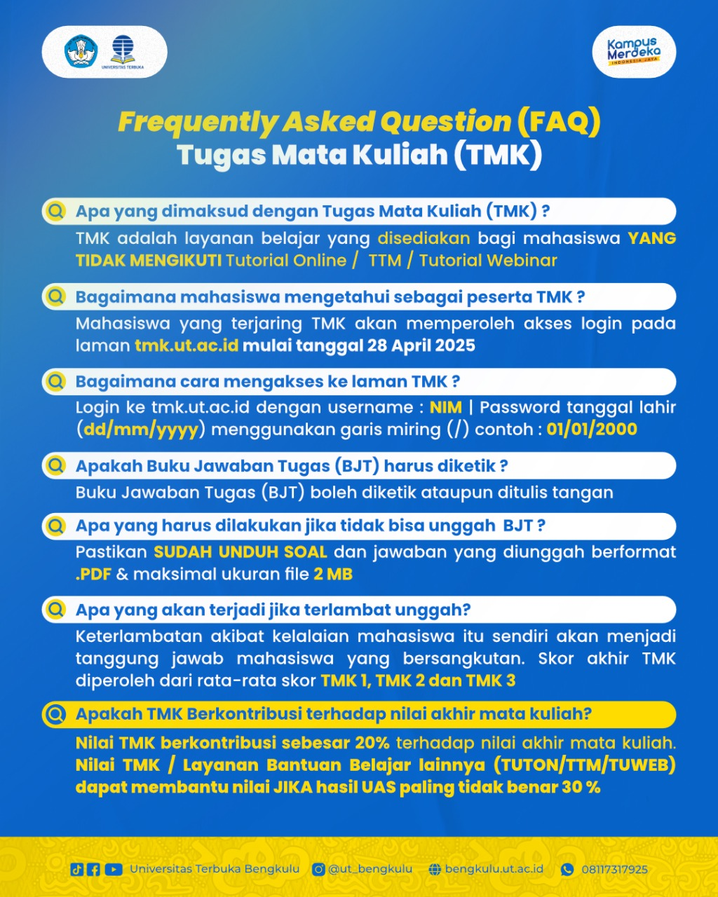
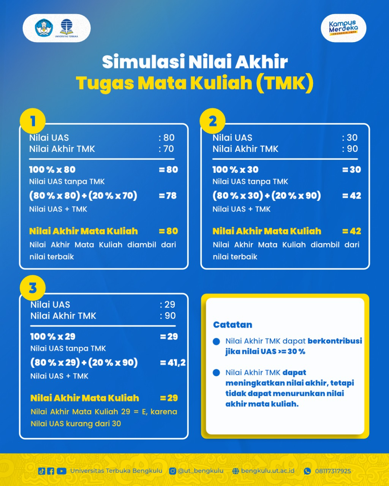

# Tugas Mata Kuliah (TMK) Semester 2024/2025 Genap

Halaman **FAQ Kuliah - Tugas Mata Kuliah (TMK)** ini dirancang untuk memberikan informasi terkait pelaksanaan tugas mata kuliah yang harus dikerjakan oleh mahasiswa Universitas Terbuka (UT). TMK adalah salah satu mekanisme yang digunakan bagi mahasiswa yang tidak mengikuti Tutorial Online (TUTON) atau Tutorial Webinar (TUWEB), dan ini sangat penting untuk kelancaran proses perkuliahan.

## Topik yang Akan Dibahas

- **Apa itu Tugas Mata Kuliah (TMK)?**
  
  Tugas Mata Kuliah (TMK) adalah tugas yang diberikan kepada mahasiswa Universitas Terbuka yang tidak mengisi formulir kesediaan untuk mengikuti Tutorial Online (TUTON) atau Tutorial Webinar (TUWEB). Mahasiswa yang tidak mengikuti keduanya akan otomatis masuk dalam TMK, yang merupakan bentuk tugas mandiri dalam pembelajaran.

- **Bagaimana cara mengakses TMK?**

  Untuk mengakses TMK, mahasiswa harus mengunjungi situs resmi TMK di [tmk.ut.ac.id](http://tmk.ut.ac.id). Di sana, mahasiswa dapat mengunduh soal TMK sesuai dengan jadwal yang telah ditentukan dan mengunggah jawaban mereka.

- **Jadwal Tugas Mata Kuliah (TMK)**

  Berikut adalah jadwal pengunduhan dan pengunggahan soal TMK untuk semester Genap 2024/2025 [^1]:

  - **TMK 1:**
    - Unduh: 28 April – 3 Mei 2025
    - Unggah: 29 April – 4 Mei 2025
  
  - **TMK 2:**
    - Unduh: 12 – 17 Mei 2025
    - Unggah: 13 – 18 Mei 2025
  
  - **TMK 3:**
    - Unduh: 26 – 31 Mei 2025
    - Unggah: 27 Mei – 1 Juni 2025
  
  Pastikan untuk mengunduh soal TMK pada tanggal yang ditentukan dan mengunggah jawaban sebelum batas waktu yang telah ditentukan.

- **Cara Login ke Portal TMK**
  
  Untuk login ke portal TMK, gunakan informasi berikut [^2]:
  
  - **Username:** Nomor Induk Mahasiswa (NIM)
  - **Password:** Tanggal Lahir (dalam format dd/mm/yyyy)
  
  Contoh:
  - **Username:** 041578988
  - **Password:** 11/05/2005 (gunakan garis miring, tanpa menambahkan "UT")

- **Pesan Semangat dari Admin**
  
  Jangan panik dalam mengerjakan TMK! Kerjakan tugas dengan sungguh-sungguh, manfaatkan waktu yang ada, dan pastikan untuk mengunggah tugas sebelum batas waktu yang ditentukan. Ingat, setiap usaha pasti akan berbuah hasil!

::: tabs

@tab Jadwal TMK Semester 2024/2025 Genap
## Jadwal TMK Semester 2024/2025 Genap

Jadwal pengunduhan dan pengunggahan soal TMK untuk semester Genap 2024/2025 adalah sebagai berikut:

- **TMK 1:**  
  Unduh: 28 April – 3 Mei 2025  
  Unggah: 29 April – 4 Mei 2025

- **TMK 2:**  
  Unduh: 12 – 17 Mei 2025  
  Unggah: 13 – 18 Mei 2025

- **TMK 3:**  
  Unduh: 26 – 31 Mei 2025  
  Unggah: 27 Mei – 1 Juni 2025

Pastikan untuk memeriksa jadwal di situs resmi TMK.

@tab FAQ Tugas Mata Kuliah (TMK)
## FAQ Tugas Mata Kuliah (TMK)

Berikut adalah beberapa pertanyaan yang sering ditanyakan (FAQ) terkait dengan TMK di Universitas Terbuka:

- **Apa yang dimaksud dengan Tugas Mata Kuliah (TMK)?**  
  TMK adalah layanan belajar yang disediakan bagi mahasiswa yang tidak mengikuti Tutorial Online (TUTON) atau Tutorial Webinar (TUWEB).
  
- **Bagaimana mahasiswa mengetahui sebagai peserta TMK?**  
  Mahasiswa yang terdaftar dalam TMK akan mendapatkan akses login pada laman [tmk.ut.ac.id](http://tmk.ut.ac.id) mulai tanggal 28 April 2025.
  
- **Bagaimana cara mengakses laman TMK?**  
  Login ke [tmk.ut.ac.id](http://tmk.ut.ac.id) dengan username: NIM dan password: tanggal lahir dalam format dd/mm/yyyy.

- **Apakah Buku Jawaban Tugas (BJT) harus diketik?**  
  Buku Jawaban Tugas (BJT) boleh diketik atau ditulis tangan, namun harus diunggah dalam format PDF dengan ukuran maksimal 2MB.

@tab:active Simulasi Nilai Akhir TMK
## Simulasi Nilai Akhir TMK

Berikut adalah simulasi perhitungan nilai akhir mata kuliah dengan kontribusi TMK:

1. **Nilai UAS:** 80, **Nilai Akhir TMK:** 70  
   - Nilai UAS tanpa TMK: 80  
   - Dengan TMK: (80% x 80) + (20% x 70) = 78  
   - **Nilai Akhir Mata Kuliah:** 80

2. **Nilai UAS:** 30, **Nilai Akhir TMK:** 90  
   - Nilai UAS tanpa TMK: 30  
   - Dengan TMK: (80% x 30) + (20% x 90) = 42  
   - **Nilai Akhir Mata Kuliah:** 42

3. **Nilai UAS:** 29, **Nilai Akhir TMK:** 90  
   - Nilai UAS tanpa TMK: 29  
   - Dengan TMK: (80% x 29) + (20% x 90) = 41.2  
   - **Nilai Akhir Mata Kuliah:** 29 (karena nilai UAS kurang dari 30)

Catatan:
- **Nilai Akhir TMK** dapat berkontribusi jika nilai UAS >= 30%.
- **Nilai Akhir TMK** dapat meningkatkan nilai akhir mata kuliah tetapi tidak dapat menurunkan nilai akhir mata kuliah.

:::

## Bagikan

<Share colorful />
<GitContributors />
<GitChangelog />

[^1]: "Tugas Mata Kuliah (TMK) Semester 2024/2025 Genap - UT Bengkulu," [Bengkulu UT](https://bengkulu.ut.ac.id/tmk-2024-2025-genap/), 2025. [Diakses: Apr. 24, 2025].
[^2]: "Informasi Mahasiswa: Cara Login Tugas Mata Kuliah, Informasi Jadwal dan Unduh TMK," [Pekanbaru UT](https://pekanbaru.ut.ac.id/informasi-mahasiswa-cara-login-tugas-mata-kuliah-informasi-jadwal-dan-unduh-tmk/), 2025. [Diakses: Apr. 24, 2025].
