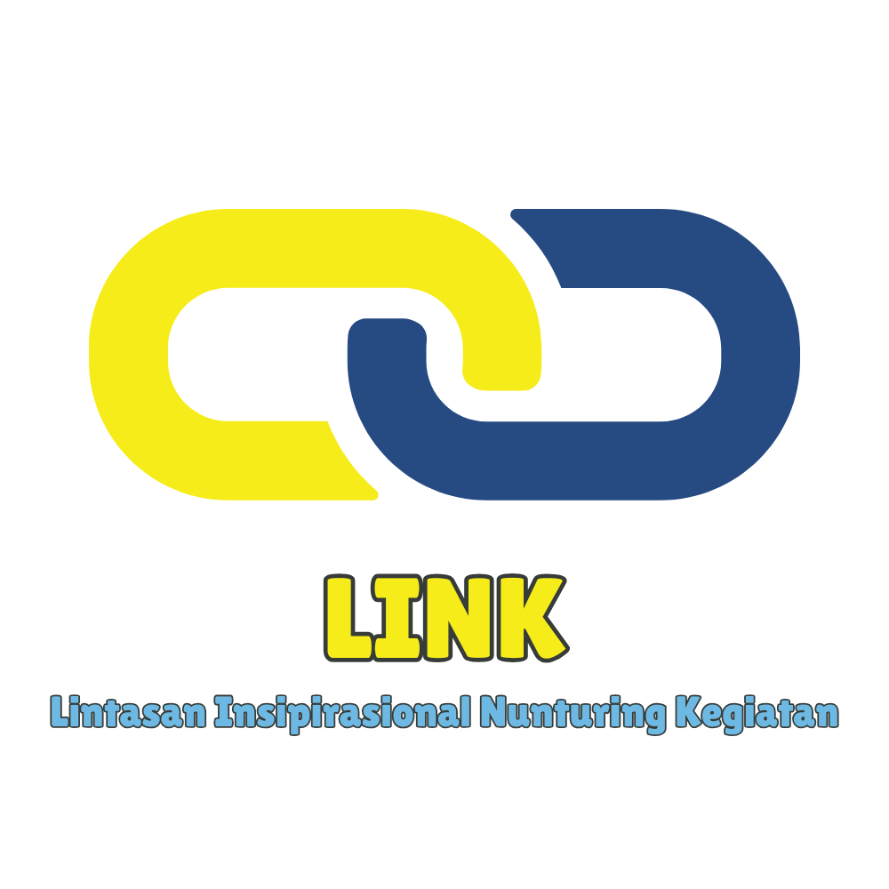

--- 
title: LINK (Lintasan Inspirasi Nurturing Kegiatan)
index: true
icon: users
category:
  - LINK
date: 2025-03-16
author:
  - name: "Firmansyah Mukti Wijaya"
    email: "ikimukti@gmail.com"
    url: "https://ikimukti.com"
  - name: "Himastatut Docs"
    email: "himastatut@gmail.com"
    url: "https://himastatut.my.id/article/"
--- 

# LINK - Lintasan Inspirasi Nurturing Kegiatan

Selamat datang di program **LINK**! Program ini didedikasikan untuk mengumpulkan mahasiswa dan mempersiapkan mereka untuk berpartisipasi dalam kompetisi yang berhubungan dengan statistik. Kami fokus pada pembentukan tim, memberikan pelatihan intensif, dan mendorong kolaborasi antar mahasiswa. Berikut adalah rincian dan struktur program ini.

## Gambaran Umum Program

**LINK** (Lintasan Inspirasi Nurturing Kegiatan) adalah program yang dirancang untuk menginspirasi dan membina mahasiswa dalam perjalanan mereka untuk berpartisipasi dalam berbagai kompetisi statistik. Dengan mengumpulkan mahasiswa dan memberikan pelatihan intensif, program ini bertujuan untuk menciptakan tim yang kuat yang dapat mewakili HIMASTAT dalam kompetisi akademik maupun ekstrakurikuler.

## Tujuan
- Menyatukan mahasiswa yang tertarik dalam kompetisi statistik.
- Membentuk tim untuk berpartisipasi dalam kompetisi lokal, nasional, dan internasional.
- Memberikan pelatihan dan bimbingan agar mahasiswa siap menghadapi kompetisi.
- Membangun rasa kebersamaan dan kerjasama dalam tim peserta.

## Rincian Program
- **Sasaran**: Mahasiswa Statistika yang tertarik mengikuti kompetisi.
- **Pembentukan Tim**: Mahasiswa dikelompokkan berdasarkan minat dan keterampilan mereka untuk membentuk tim yang efektif.
- **Sesi Pelatihan**: Sesi pelatihan intensif untuk mempersiapkan mahasiswa menghadapi kompetisi, mencakup topik relevan dan strategi pemecahan masalah.
- **Kompetisi**: Partisipasi dalam berbagai acara yang berhubungan dengan statistik, baik di tingkat regional, nasional, maupun internasional.

### Fitur Program
- **Kolaborasi**: Membentuk tim mahasiswa untuk berkolaborasi dan bersaing dalam acara kompetisi statistik.
- **Persiapan**: Menawarkan pelatihan dan pembimbingan untuk peserta, dengan fokus pada pemecahan masalah dan keunggulan akademik.
- **Pembangunan Komunitas**: Memperkuat ikatan antar mahasiswa melalui pengalaman dan tujuan yang sama.

## Struktur Program
### 1. **Pembentukan Tim**
- Mahasiswa akan dibentuk menjadi tim berdasarkan minat dan keterampilan mereka untuk memastikan efisiensi dalam kompetisi.

### 2. **Pelatihan Intensif**
- Pelatihan yang berfokus pada pengembangan keterampilan statistik dan strategi pemecahan masalah akan diberikan oleh mentor yang berpengalaman.

### 3. **Kompetisi dan Pengalaman**
- Tim akan mengikuti kompetisi di tingkat lokal hingga internasional untuk mengasah kemampuan mereka dan mewakili HIMASTAT.

### 4. **Jejaring dan Kolaborasi**
- Program ini juga memberikan kesempatan bagi mahasiswa untuk berjejaring dan berkolaborasi dengan mahasiswa dari berbagai universitas dan institusi.

## Visualisasi Program

> **Infografis**: Program LINK menampilkan pelatihan dan pencapaian yang diraih oleh peserta, dengan fokus pada keberhasilan kompetisi.


### Visualisasi Struktur Program
```mermaid
graph LR
A[Mahasiswa Tertarik Kompetisi] --> B{Pembentukan Tim}
B --> C{Tim Statistik}
B --> D{Pelatihan Intensif}
D --> E[Persiapan Kompetisi]
E --> F[Kompetisi Nasional]
F --> G[Jejaring Internasional]


## Bagikan
<Share colorful />
<GitContributors />
<GitChangelog />