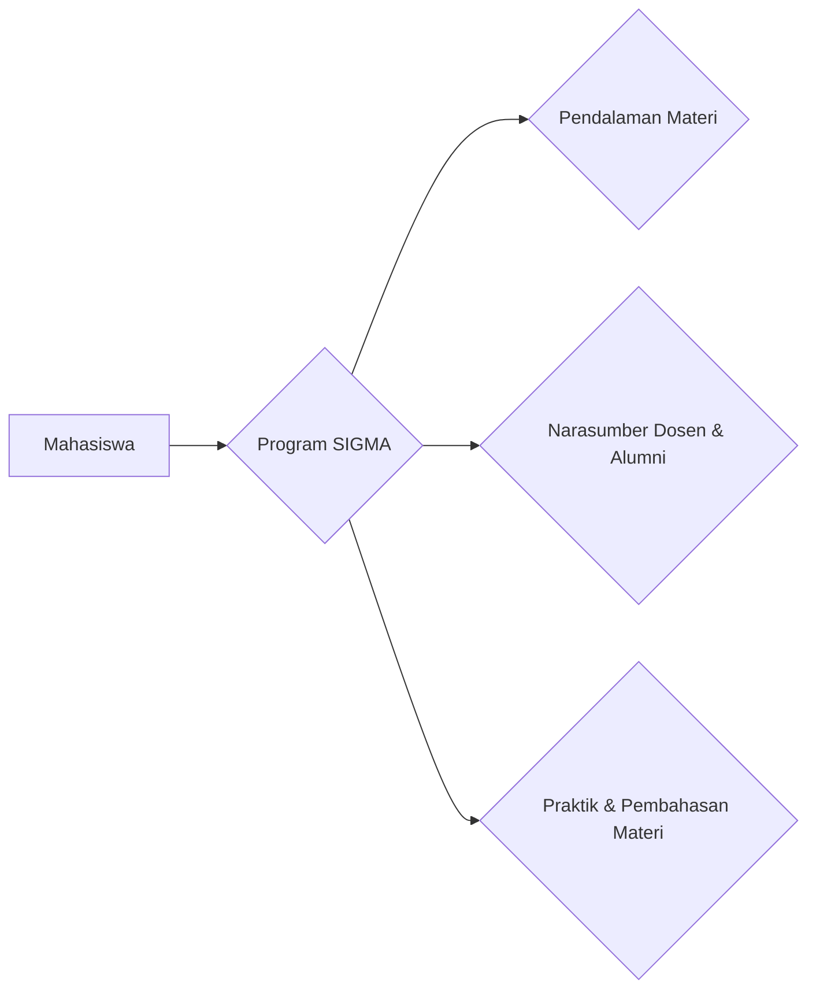

--- 
title: Solusi Program Studi Statistika Meningkatkan Akademik Mahasiswa (SIGMA)
index: true
icon: calculator
date: 2023-11-05
author:
  - name: "Firmansyah Mukti Wijaya"
    email: "ikimukti@gmail.com"
    url: "https://ikimukti.com"
  - name: "Himastatut Docs"
    email: "himastatut@gmail.com"
    url: "https://himastatut.my.id/article/"
category:
  - SIGMA
--- 

# SIGMA - Solusi Program Studi Statistika Meningkatkan Akademik Mahasiswa

**SIGMA** (Solusi Program Studi Statistika Meningkatkan Akademik Mahasiswa) adalah program yang diluncurkan oleh Program Studi Statistika Universitas Terbuka (UT) dengan tujuan untuk meningkatkan pemahaman dan capaian akademik mahasiswa dalam mata kuliah yang dianggap sulit. Program ini fokus pada pendalaman materi yang melibatkan matakuliah seperti **Matematika III** dan **pendukung TAP** (Tugas Akhir Program), seperti **Model Linear Terapan (SATS4312)**, **Pengantar Statistika Matematis I (SATS4410)**, **Pengantar Statistika Matematis II (SATS4420)**, dan **Metode Statistika Multivariat (SATS4421)**.

## Inisiasi Awal
Program SIGMA dimulai pada **5 November 2023** sebagai langkah konkret dari Program Studi Statistika UT untuk membantu mahasiswa yang menghadapi kesulitan dalam beberapa matakuliah, terutama **Matematika III**. Program ini bertujuan untuk meningkatkan capaian akademik mahasiswa dengan menggunakan berbagai metode pembelajaran yang lebih mendalam dan interaktif.

## Tujuan Utama
- **Meningkatkan pemahaman mahasiswa** dalam mata kuliah yang dianggap sulit.
- **Meningkatkan capaian akademik** mahasiswa dalam matakuliah Matematika III dan matakuliah pendukung TAP lainnya.
- **Memberikan pendalaman materi** yang lebih terstruktur untuk membantu mahasiswa mencapai kompetensi yang diinginkan.

Program ini diharapkan dapat membantu mahasiswa Statistika UT untuk berhasil dalam matakuliah sulit dan meraih tingkat kompetensi yang diharapkan oleh Program Studi Statistika FST UT.

## Keikutsertaan
Program SIGMA dapat diikuti oleh seluruh mahasiswa Program Studi Statistika Universitas Terbuka yang tertarik untuk memperdalam pemahaman mereka mengenai mata kuliah yang menjadi prioritas dalam program ini.

## Kegiatan Pendalaman Materi
SIGMA dimulai dengan **Matematika III** sebagai langkah pertama, diikuti dengan matakuliah lainnya yang juga memiliki tingkat kesulitan tinggi. Dalam setiap sesi, mahasiswa akan mendapatkan materi yang lebih mendalam dan kesempatan untuk bertanya langsung kepada narasumber yang kompeten di bidangnya.

### Narasumber
Para narasumber dalam program SIGMA terdiri dari dosen dan alumni yang berpengalaman dalam bidang statistika dan matematika. Mereka berbagi pengetahuan dan pengalaman untuk membantu mahasiswa memahami materi yang sulit dan meningkatkan pemahaman mereka.

### Topik yang Dibahas
- **Pendalaman Materi Matematika III**.
- **Model Linear Terapan (SATS4312)**.
- **Pengantar Statistika Matematis I dan II (SATS4410, SATS4420)**.
- **Metode Statistika Multivariat (SATS4421)**.

### Hasil Kegiatan
Program SIGMA bertujuan untuk memberikan pemahaman yang lebih mendalam tentang matakuliah yang sulit, serta meningkatkan capaian akademik mahasiswa di bidang Statistika.

### Akses Rekaman
Rekaman dari kegiatan SIGMA dapat diakses melalui kanal **YouTube Program Studi Statistika FST-UT** di [YouTube Statistika UT](https://www.youtube.com/@statistikafstut).

## Akses Pembelajaran
Semua sesi SIGMA dapat diakses secara daring melalui media sosial resmi **Instagram** dan **YouTube HIMASTAT UT**, memberikan fleksibilitas bagi mahasiswa untuk mengikuti kegiatan ini dari mana saja.

> **Catatan**: Untuk informasi lebih lanjut, Anda dapat menghubungi kami melalui **Instagram** dan **YouTube** yang terhubung dengan program ini.

## Diagram Pembelajaran SIGMA

> **Catatan**: Diagram di atas menggambarkan struktur umum dari kegiatan SIGMA. Sesi dan topik yang dibahas dapat bervariasi sesuai dengan kebutuhan mahasiswa dan dosen pengampu.

> **Fleksibilitas Program**: Program ini dirancang untuk memberikan pengalaman belajar yang dinamis, di mana setiap pertemuan memberikan peluang bagi peserta untuk menggali lebih dalam topik-topik tertentu sesuai dengan materi yang diperlukan.

<Catalog />

## Bagikan
<Share colorful />
<GitContributors />
<GitChangelog />