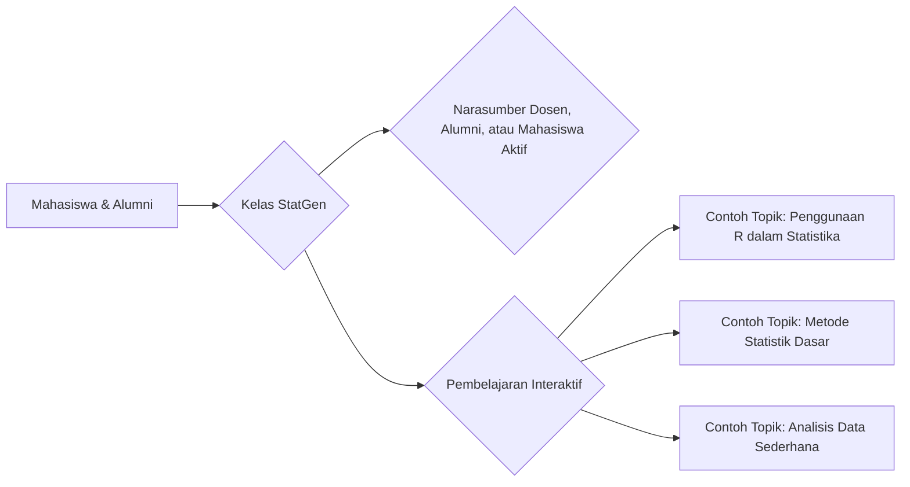

--- 
title: Statistics Genius (StatGen)
index: true
icon: calculator
tag:
  - Statgen
date: 2023-09-11
author:
  - name: "Firmansyah Mukti Wijaya"
    email: "ikimukti@gmail.com"
    url: "https://ikimukti.com"
  - name: "Himastatut Docs"
    email: "himastatut@gmail.com"
    url: "https://himastatut.my.id/article/"
category:
  - STATGEN
--- 

# StatGen - Statistics Genius Class

**StatGen** (Statistics Genius Class) adalah program yang diselenggarakan oleh Program Studi Statistika Universitas Terbuka (UT) dengan tujuan untuk meningkatkan pemahaman mahasiswa mengenai konsep-konsep statistika melalui kegiatan pembelajaran yang interaktif. Program ini bertujuan untuk mempererat hubungan antara mahasiswa, alumni, dan dosen melalui berbagai sesi yang melibatkan narasumber dari kalangan internal, baik mahasiswa, alumni, maupun dosen, yang memiliki kompetensi di bidangnya.

## Inisiasi Awal
Program StatGen dimulai pada tahun 2023 sebagai sebuah inisiatif dari Program Studi Statistika dan Himpunan Mahasiswa Statistika (HIMASTAT UT) untuk menciptakan sebuah forum pembelajaran yang tidak hanya bersifat akademik, tetapi juga membangun koneksi dan kolaborasi antara mahasiswa, alumni, dan dosen. Inisiatif ini diprakarsai oleh Kaprodi Statistika, **Siti Hadijah Hasanah, S.Si., M.Si.**, yang menginginkan adanya ruang yang lebih informal namun produktif untuk berbagi pengetahuan dan pengalaman dalam dunia statistika.

StatGen menawarkan sebuah pendekatan yang menggabungkan teori dan praktik secara langsung, dimana mahasiswa dapat belajar dari pengalaman nyata yang dibagikan oleh alumni dan dosen dalam sesi-sesi yang diadakan.

## Tujuan Utama
- **Meningkatkan pemahaman mahasiswa** dalam penerapan statistika melalui sesi interaktif.
- **Membangun hubungan erat** antara mahasiswa, alumni, dan dosen untuk menciptakan jaringan yang lebih solid.
- **Memberikan kesempatan berbagi pengalaman** antara mahasiswa dan alumni untuk membangun pemahaman praktis dan teoritis.

Program ini membuka peluang bagi mahasiswa untuk memperdalam pengetahuan statistika mereka melalui kegiatan yang tidak hanya bersifat pembelajaran tetapi juga membangun kolaborasi antar sesama mahasiswa, alumni, dan dosen.

## Keikutsertaan
StatGen Class dapat diikuti oleh seluruh mahasiswa, alumni, dan dosen dari Program Studi Statistika UT yang tertarik untuk berkolaborasi dan belajar bersama dalam memahami dan mengaplikasikan statistika dalam berbagai konteks kehidupan dan karir.

## Detail Kelas Pertama - StatGen Class 2023
Kelas pertama dari **StatGen Class 2023** diselenggarakan pada tanggal **11 September 2023** dengan tema **"Basic Komputer 1"**. Kegiatan ini dihadiri oleh mahasiswa dari berbagai angkatan yang sangat antusias untuk mempelajari dasar-dasar penggunaan komputer dalam analisis statistika.

### Narasumber
Kelas perdana ini menghadirkan **Ibu Siti Hadijah Hasanah, S.Si., M.Si.**, Kaprodi Statistika FST-UT, sebagai pemateri utama. Beliau membahas **pentingnya penggunaan komputer dan program R** dalam analisis data statistik, memberikan dasar yang kuat bagi mahasiswa untuk memahami dan mengimplementasikan konsep-konsep statistika dengan teknologi.

### Topik yang Dibahas
- **Pengenalan dasar penggunaan komputer** dalam konteks statistika.
- **Penggunaan program R** untuk analisis statistika dasar.
- **Praktik langsung** menggunakan R untuk menyelesaikan beberapa soal statistika sederhana.

### Hasil Kegiatan
Kegiatan ini memberikan pemahaman yang lebih dalam kepada mahasiswa mengenai **pentingnya teknologi dalam statistika** dan bagaimana alat seperti **R** dapat digunakan untuk menganalisis data secara efektif. Mahasiswa juga dapat langsung mempraktikkan apa yang dipelajari dalam sesi praktikum.

### Akses Rekaman
Rekaman dari **StatGen Class 2023 - Basic Komputer 1** dapat diakses oleh semua anggota Program Studi Statistika FST-UT melalui kanal **YouTube HIMASTAT UT** di link berikut: [YouTube HIMASTAT UT](https://www.youtube.com/@himastat_ut).

## Akses Pembelajaran
Semua sesi StatGen Class dapat diakses secara daring melalui media sosial resmi **Instagram** dan **YouTube HIMASTAT UT**, yang memungkinkan semua anggota Prodi Statistika untuk mengikuti pembelajaran secara fleksibel.

> **Catatan**: Untuk pertanyaan lebih lanjut, Anda dapat menghubungi kami melalui **Instagram** dan **YouTube** yang terhubung dengan program ini.

## Diagram Pembelajaran StatGen

> **Catatan**: Diagram di atas hanya merupakan contoh dan menggambarkan struktur umum kelas StatGen. Jumlah sesi dan topik dalam setiap kelas dapat bervariasi sesuai dengan kebutuhan dan keinginan narasumber yang terlibat. Kelas StatGen biasanya terdiri dari 3 hingga 4 sesi yang disesuaikan dengan materi yang ingin disampaikan oleh narasumber.

> **Narasumber**:Setiap sesi dapat dipandu oleh narasumber yang berasal dari berbagai kalangan, termasuk dosen, alumni, dan mahasiswa aktif. Narasumber akan mengarahkan diskusi dan memberikan materi sesuai dengan pengalaman mereka dalam bidang statistika. Oleh karena itu, topik yang dibahas dalam setiap sesi dapat berbeda-beda, tergantung pada keahlian dan perspektif masing-masing narasumber.

> **Keterbukaan Topik**: Beberapa topik yang mungkin dibahas antara lain adalah penggunaan software statistik seperti R, metode statistik dasar, analisis data melalui teknik tertentu, dan banyak lagi. Namun, topik-topik tersebut bersifat fleksibel dan dapat disesuaikan dengan perkembangan terbaru dalam dunia statistika serta minat dan kebutuhan peserta.

> **Fleksibilitas Program**: Program ini dirancang untuk memberikan pengalaman belajar yang dinamis, di mana setiap pertemuan memberikan peluang bagi peserta untuk menggali lebih dalam topik-topik statistika dengan berbagai pendekatan, baik dari segi teori maupun praktik langsung. Oleh karena itu, StatGen memberi kebebasan bagi narasumber dan peserta untuk mengeksplorasi berbagai aspek statistika dengan cara yang interaktif dan relevan.

<Catalog />