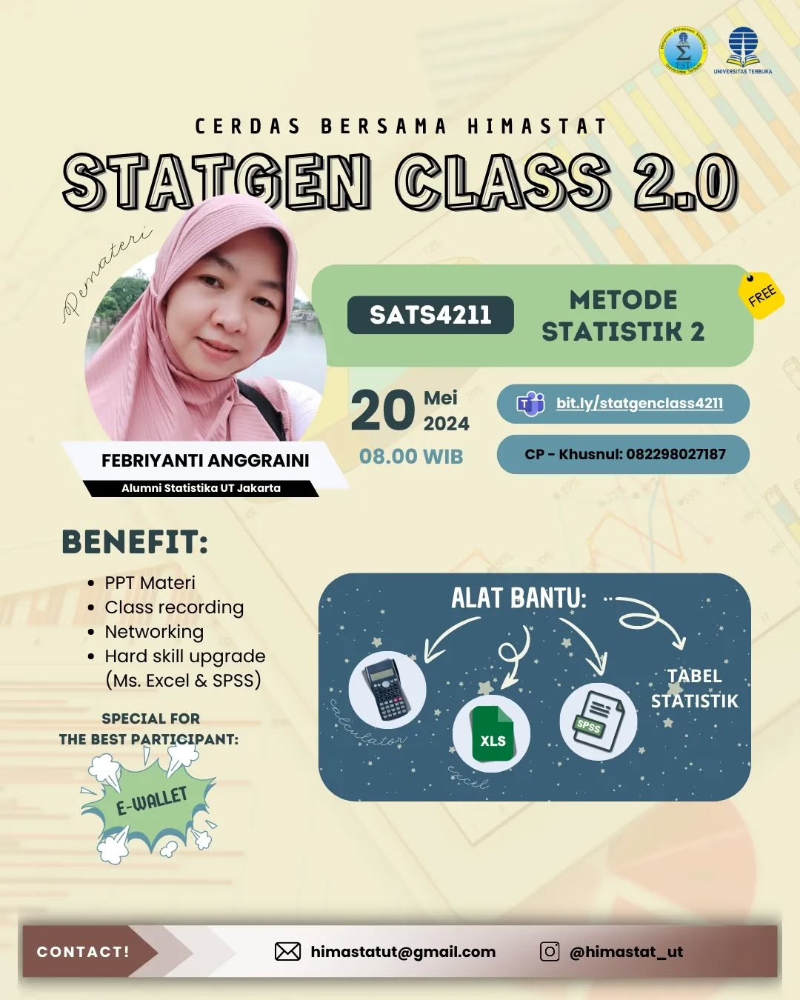

--- 
title: SATS4211 - Pertemuan 1
date: 2024-05-21
icon: chart-bar
author:
  - name: "Firmansyah Mukti Wijaya"
    email: "ikimukti@gmail.com"
    url: "https://ikimukti.com"
  - name: "Himastatut Docs"
    email: "himastatut@gmail.com"
    url: "https://himastatut.my.id/article/"
tags:
  - statistika
  - statgenclass2024
category: 
- STATGEN
--- 

# Metode Statistika II (SATS4211) Pertemuan 1

## Detil Pertemuan

- **Hari/Tanggal**: Senin, 20 Mei 2024  
- **Waktu**: 08.00 - Selesai WIB  
- **Topik**: Pengantar dan Konsep Dasar Metode Statistika II  
- **Moderator**: Kak Zalfa Talitha (Mahasiswi Statistika Universitas Terbuka)  
- **Pemateri**: Kak Febriyanti Anggraini (Alumni Statistika UT Jakarta)

### Ringkasan Materi
Pada pertemuan pertama ini, materi yang dibahas meliputi:
1. **Pengertian Metode Statistika II**: Konsep dasar statistik dalam analisis data dan penggunaannya untuk membuat inferensi dari sampel data.
2. **Metode Sampling**: Pembahasan tentang berbagai teknik sampling yang digunakan dalam penelitian.
3. **Distribusi Sampling**: Pemahaman tentang distribusi probabilitas dalam konteks sampling dan cara menganalisis data sampel.
4. **Uji Hipotesis**: Penjelasan tentang cara melakukan uji hipotesis untuk menguji asumsi atau klaim tentang populasi.
5. **Analisis Varians (ANOVA)**: Teknik untuk membandingkan rata-rata antar kelompok dalam suatu populasi untuk melihat perbedaan signifikan.

### Video Rekaman Kelas
Tonton rekaman **StatGen Class 2.0 - Metode Statistika II (SATS4211) Pertemuan 1** di bawah ini untuk pemahaman lebih lanjut:

<VidStack  
  src="https://www.youtube.com/watch?v=wPQBCldQQ2I"  
  title="StatGen Class 2.0 - Metode Statistika II (SATS4211) Pertemuan 1"
/>

--- 

## Update Instagram: StatGen Class Vol. 2.0

Siap-siap untuk mengikuti **StatGen Class Vol. 2.0** yang akan datang! Kali ini, kelas ini khusus untuk **Mata Kuliah Metode Statistika II (SATS4211)** yang pastinya sangat berguna untuk memperdalam materi perkuliahan.

### Informasi Kelas:

- **Pemateri**: Kak Febriyanti Anggraini
- **Tanggal**: 20 Mei 2024
- **Waktu**: 08.00 WIB
- **Topik**: Metode Statistika II

Jangan sampai ketinggalan, yuk! Daftarkan dirimu melalui link di bawah ini:

[Daftar Sekarang!](https://bit.ly/statgenclass4211)

Jangan lupa untuk melihat poster acara **StatGen Class Vol. 2.0** di Instagram dan ikut meramaikan dengan hashtag #statgenclass #kelasonline #webinar

[**Instagram Post - StatGen Class Vol. 2.0**](https://www.instagram.com/p/C7JSCMaS7_V/?img_index=1)

Ayo, gabung dan bawa pertanyaan seputar mata kuliah **SATS4211** ke kelas, kita belajar bareng! 💡

--- 

"Tidak ada kata terlambat untuk belajar. Maka dari itu, mari cerdas bersama Himastat!"

#statgenclass2024 #sigma
