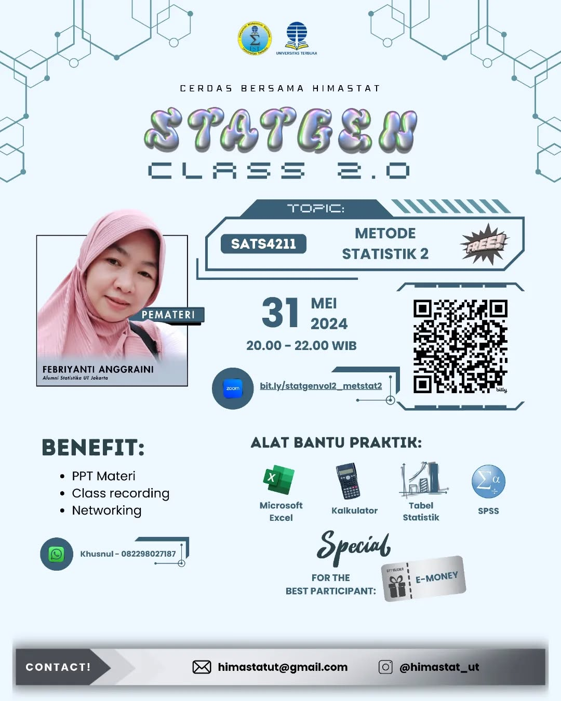

--- 
title: SATS4211 - Pertemuan 3
date: 2024-05-31
icon: chart-bar
author:
  - name: "Firmansyah Mukti Wijaya"
    email: "ikimukti@gmail.com"
    url: "https://ikimukti.com"
  - name: "Himastatut Docs"
    email: "himastatut@gmail.com"
    url: "https://himastatut.my.id/article/"
tags:
  - statistika
  - statgenclass2024
category: 
- STATGEN
--- 

# Metode Statistika II (SATS4211) Pertemuan 3

## Detil Pertemuan

- **Hari/Tanggal**: Jumat, 31 Mei 2024  
- **Waktu**: 20.00 - 22.00 WIB  
- **Topik**: Metode Statistika II  
- **Moderator**: Kak Febriyanti Anggraini (Alumni Statistika UT Jakarta)  
- **Pemateri**: Kak Febriyanti Anggraini (Alumni Statistika UT Jakarta)

### Permintaan Maaf
Kami mohon maaf karena informasi mengenai materi yang dibahas dalam **StatGen Class 2.0 - Metode Statistika II (SATS4211) Pertemuan 3** tidak dapat disediakan saat ini. Kami belum dapat menyediakan detail lengkap tentang apa saja yang dijelaskan dalam pertemuan ini. Terima kasih atas pengertian Anda dan kami akan berusaha untuk memberikan informasi lebih lanjut segera.

--- 

## Update Instagram: StatGen Class Vol. 2.0

Siap-siap untuk mengikuti **StatGen Class Vol. 2.0** yang akan datang! Kali ini, kelas ini khusus untuk **Mata Kuliah Metode Statistika II (SATS4211)** yang pastinya sangat berguna untuk memperdalam materi perkuliahan.

### Informasi Kelas:

- **Pemateri**: Kak Febriyanti Anggraini
- **Tanggal**: 31 Mei 2024
- **Waktu**: 20.00 WIB
- **Topik**: Metode Statistika II

Jangan sampai ketinggalan, yuk! Daftarkan dirimu melalui link di bawah ini:

[Daftar Sekarang!](https://bit.ly/statgenclassvol2_metstat2)

Jangan lupa untuk melihat poster acara **StatGen Class Vol. 2.0** di Instagram dan ikut meramaikan dengan hashtag #statgenclass #kelasonline #webinar

[**Instagram Post - StatGen Class Vol. 2.0**](https://www.instagram.com/p/C7oFcnJSzn7/?img_index=1)

Ayo, gabung dan bawa pertanyaan seputar mata kuliah **SATS4211** ke kelas, kita belajar bareng! 💡

--- 

"Tidak ada kata terlambat untuk belajar. Maka dari itu, mari cerdas bersama Himastat!"

#statgenclass2024 #sigma

<GitContributors />
<GitChangelog />