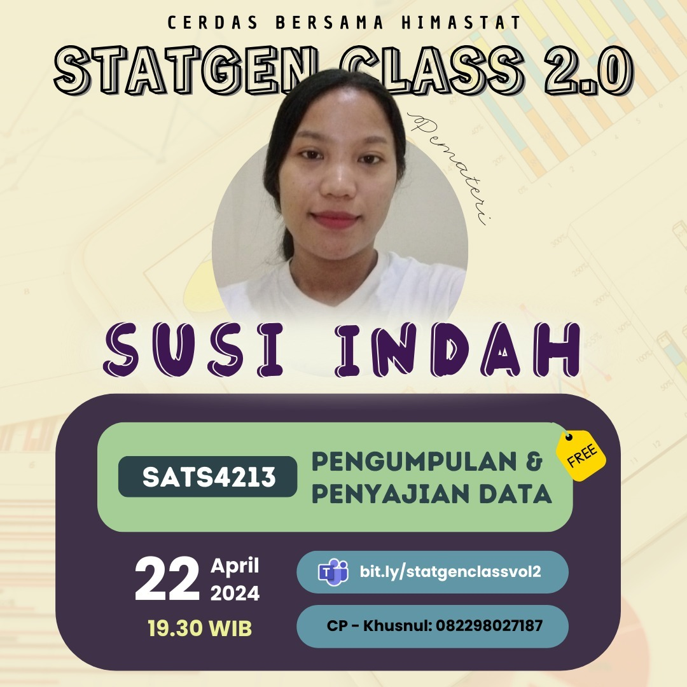

--- 
title: SATS4213 - Pertemuan 2
date: 2024-03-22
icon: chart-bar
author:
  - name: "Firmansyah Mukti Wijaya"
    email: "ikimukti@gmail.com"
    url: "https://ikimukti.com"
  - name: "Himastatut Docs"
    email: "himastatut@gmail.com"
    url: "https://himastatut.my.id/article/"
tags:
  - statistika
  - statgenclass2024
category: 
- STATGEN
--- 

# Pengumpulan & Penyajian Data (SATS4213) Pertemuan 2

## Detil Pertemuan

- **Hari/Tanggal**: Jum'at, 22 Maret 2024  
- **Waktu**: 20.30 - 22.00 WIB  
- **Topik**: Jenis-jenis Data dan Tahapan Pengumpulan Data  
- **Moderator**: Kak Susi Indah Situmorang (Mahasiswi Statistika Universitas Terbuka Medan)  
- **Pemateri**: Kak Susi Indah Situmorang (Mahasiswi Statistika Universitas Terbuka Medan)

### Ringkasan Materi
Pada pertemuan kedua ini, materi yang dibahas adalah:
1. **Jenis-jenis Instrumen Pengumpulan Data**: Kuisioner, wawancara, dan observasi sebagai metode pengumpulan data yang umum digunakan.
2. **Jenis-jenis Kuisioner**: Kuesioner terbuka dan tertutup, serta kuesioner dengan pilihan ganda, isian, ceklis, dan rating scale.
3. **Kelebihan dan Kekurangan Kuisioner**: Penggunaan kuesioner yang memungkinkan pengumpulan data tanpa memerlukan kehadiran peneliti langsung di lapangan.
4. **Proses Pengumpulan Data Secara Kualitatif**: Menggunakan instrumen yang membantu mengumpulkan data secara sistematis dan cermat untuk memudahkan analisis.

### Video Rekaman Kelas
Tonton rekaman **StatGen Class 2.0 - Pengumpulan & Penyajian Data (SATS4213) Pertemuan 2** di bawah ini untuk pemahaman lebih lanjut:

<VidStack  
  src="https://www.youtube.com/watch?v=AUxJLrAxnh4"  
  title="StatGen Class 2.0 - Pengumpulan & Penyajian Data (SATS4213) Pertemuan 2"
/>

--- 

## Update Instagram: StatGen Class Vol. 2.0

Siap-siap untuk mengikuti **StatGen Class Vol. 2.0** yang akan datang! Kali ini, kelas ini khusus untuk **Mata Kuliah Pengumpulan & Penyajian Data (SATS4213)** yang pastinya sangat berguna untuk memperdalam materi perkuliahan.

### Informasi Kelas:

- **Pemateri**: Kak Susi Indah Situmorang
- **Tanggal**: 22 April 2024
- **Waktu**: 19.30 WIB
- **Topik**: Pengumpulan dan Penyajian Data

Jangan sampai ketinggalan, yuk! Daftarkan dirimu melalui link di bawah ini:

[Daftar Sekarang!](https://bit.ly/statgenclassvol2)

Jangan lupa untuk melihat poster acara **StatGen Class Vol. 2.0** di Instagram dan ikut meramaikan dengan hashtag #statgenclass #kelasonline #webinar

[**Instagram Post - StatGen Class Vol. 2.0**](https://www.instagram.com/p/C6DL1EfSS4n/?img_index=1)

Ayo, gabung dan bawa pertanyaan seputar mata kuliah **SATS4213** ke kelas, kita belajar bareng! 💡

--- 

"Tidak ada kata terlambat untuk belajar. Maka dari itu, mari cerdas bersama Himastat!"

#statgenclass2024 #sigma

<GitContributors />
<GitChangelog />